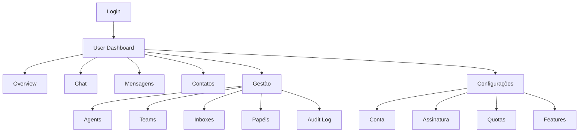

# Design Document: User Frontend Integration

## Overview

Este documento descreve o design técnico para integração das funcionalidades de gestão multi-usuário e controle de quotas/features no frontend do usuário do WUZAPI Manager. O backend já foi implementado nas specs `admin-user-management` e `multi-user-inbox-system`, e este design foca na criação dos componentes de UI e integração com os serviços existentes.

### Objetivos Principais
1. Criar seção de gestão de Agents, Teams e Inboxes no User Dashboard
2. Exibir informações de assinatura, quotas e features
3. Integrar controle de acesso baseado em permissões na UI
4. Conectar o sistema de chat com filtro por Inbox
5. Adicionar visualização de Audit Log para Account Owners

## Architecture

### Diagrama de Componentes

```mermaid
graph TB
    subgraph "User Dashboard"
        UserLayout[UserLayout.tsx]
        
        subgraph "Existing Pages"
            UserOverview[UserOverview]
            UserSettings[UserSettings]
            ChatInbox[ChatInboxPage]
        end
        
        subgraph "New Management Pages"
            AccountSettings[AccountSettingsPage]
            AgentManagement[AgentManagementPage]
            TeamManagement[TeamManagementPage]
            InboxManagement[InboxManagementPage]
            RoleManagement[RoleManagementPage]
            AuditLogPage[AuditLogPage]
        end
        
        subgraph "New Components"
            SubscriptionCard[SubscriptionCard]
            QuotaUsageCard[QuotaUsageCard]
            FeaturesList[FeaturesList]
            AgentListUser[AgentListUser]
            TeamListUser[TeamListUser]
            InboxListUser[InboxListUser]
            RoleListUser[RoleListUser]
            AuditLogUser[AuditLogUser]
            InboxSelector[InboxSelector]
            AvailabilityToggle[AvailabilityToggle]
        end
    end
    
    subgraph "Contexts"
        AgentContext[AgentContext]
        InboxContext[InboxContext]
        AuthContext[AuthContext]
    end
    
    subgraph "Services (Existing)"
        AgentAuthSvc[agent-auth.ts]
        AccountAgentsSvc[account-agents.ts]
        AccountTeamsSvc[account-teams.ts]
        AccountInboxesSvc[account-inboxes.ts]
        AccountRolesSvc[account-roles.ts]
        AccountAuditSvc[account-audit.ts]
        AdminQuotasSvc[admin-quotas.ts]
        AdminFeaturesSvc[admin-features.ts]
        AdminSubsSvc[admin-subscriptions.ts]
    end
    
    UserLayout --> AgentContext
    UserLayout --> InboxContext
    
    AccountSettings --> SubscriptionCard
    AccountSettings --> QuotaUsageCard
    AccountSettings --> FeaturesList
    
    AgentManagement --> AgentListUser
    TeamManagement --> TeamListUser
    InboxManagement --> InboxListUser
    RoleManagement --> RoleListUser
    AuditLogPage --> AuditLogUser
    
    ChatInbox --> InboxSelector
    ChatInbox --> InboxContext
    
    UserLayout --> AvailabilityToggle
    
    AgentListUser --> AccountAgentsSvc
    TeamListUser --> AccountTeamsSvc
    InboxListUser --> AccountInboxesSvc
    RoleListUser --> AccountRolesSvc
    AuditLogUser --> AccountAuditSvc
    
    SubscriptionCard --> AdminSubsSvc
    QuotaUsageCard --> AdminQuotasSvc
    FeaturesList --> AdminFeaturesSvc
```



### Fluxo de Navegação



## Components and Interfaces

### New Pages

#### AccountSettingsPage
```typescript
// src/pages/user/AccountSettingsPage.tsx
interface AccountSettingsPageProps {}

// Displays subscription info, quotas, and features
// Uses tabs for organization
```

#### AgentManagementPage
```typescript
// src/pages/user/AgentManagementPage.tsx
interface AgentManagementPageProps {}

// Full CRUD for agents
// Includes invite dialog and direct create dialog
```

#### TeamManagementPage
```typescript
// src/pages/user/TeamManagementPage.tsx
interface TeamManagementPageProps {}

// Full CRUD for teams
// Member management
```

#### InboxManagementPage
```typescript
// src/pages/user/InboxManagementPage.tsx
interface InboxManagementPageProps {}

// Full CRUD for inboxes
// Agent assignment
```

### New Components

#### SubscriptionCard
```typescript
// src/components/user/SubscriptionCard.tsx
interface SubscriptionCardProps {
  subscription: UserSubscription
}

// Displays plan name, status, billing cycle, dates
```

#### QuotaUsageCard
```typescript
// src/components/user/QuotaUsageCard.tsx
interface QuotaUsageCardProps {
  quotas: UserQuota[]
  onQuotaClick?: (quota: UserQuota) => void
}

// Displays all quotas with progress bars
// Warning state at 80%, error state at 100%
```

#### FeaturesList
```typescript
// src/components/user/FeaturesList.tsx
interface FeaturesListProps {
  features: UserFeature[]
}

// Displays features with enabled/disabled status
// Lock icon for disabled features
```

#### AgentListUser
```typescript
// src/components/user/AgentListUser.tsx
interface AgentListUserProps {
  onInvite: () => void
  onCreateDirect: () => void
  onEdit: (agent: Agent) => void
  onDeactivate: (agent: Agent) => void
  maxAgentsReached: boolean
}

// Reuses existing AgentList component logic
// Adapted for user context
```

#### InboxSelector
```typescript
// src/components/user/InboxSelector.tsx
interface InboxSelectorProps {
  inboxes: Inbox[]
  currentInbox: Inbox | null
  onSelect: (inbox: Inbox) => void
}

// Dropdown to switch between inboxes in chat
```

#### AvailabilityToggle
```typescript
// src/components/user/AvailabilityToggle.tsx
interface AvailabilityToggleProps {
  status: 'online' | 'busy' | 'offline'
  onChange: (status: 'online' | 'busy' | 'offline') => void
}

// Toggle for agent availability status
// Shows in header/sidebar
```

### Context Updates

#### AgentContext Enhancement
```typescript
// Already exists, needs enhancement
interface AgentContextValue {
  currentAgent: Agent | null
  account: Account | null
  permissions: string[]
  availability: AvailabilityStatus
  subscription: UserSubscription | null  // NEW
  quotas: UserQuota[]                     // NEW
  features: UserFeature[]                 // NEW
  setAvailability: (status: AvailabilityStatus) => Promise<void>
  hasPermission: (permission: string) => boolean
  isFeatureEnabled: (feature: string) => boolean  // NEW
  checkQuota: (quotaType: string) => QuotaStatus  // NEW
}
```

### API Integration

Os serviços já existem em `src/services/`:
- `account-agents.ts` - CRUD de agents
- `account-teams.ts` - CRUD de teams
- `account-inboxes.ts` - CRUD de inboxes
- `account-roles.ts` - CRUD de roles
- `account-audit.ts` - Audit log
- `admin-quotas.ts` - Quotas (adaptar para user context)
- `admin-features.ts` - Features (adaptar para user context)
- `admin-subscriptions.ts` - Subscriptions (adaptar para user context)

Novos endpoints necessários para contexto de usuário:
- `GET /api/user/subscription` - Obter assinatura do usuário atual
- `GET /api/user/quotas` - Obter quotas do usuário atual
- `GET /api/user/features` - Obter features do usuário atual

## Data Models

### TypeScript Interfaces (Existing)

Os tipos já existem em `src/types/`:
- `multi-user.ts` - Agent, Team, Inbox, CustomRole, Permission
- `admin-management.ts` - Plan, UserSubscription, UserQuota, UserFeature

### New Types

```typescript
// src/types/user-management.ts

// Quota status for UI
interface QuotaStatus {
  allowed: boolean
  current: number
  limit: number
  percentage: number
  warning: boolean  // >= 80%
  exceeded: boolean // >= 100%
}

// Navigation item with permission check
interface NavItem {
  name: string
  href: string
  icon: React.ComponentType
  permission?: string
  feature?: string
}

// Management section
interface ManagementSection {
  id: string
  name: string
  description: string
  icon: React.ComponentType
  href: string
  permission: string
  quotaType?: string
}
```

## Correctness Properties

*A property is a characteristic or behavior that should hold true across all valid executions of a system-essentially, a formal statement about what the system should do. Properties serve as the bridge between human-readable specifications and machine-verifiable correctness guarantees.*

### Property 1: Subscription Data Display Completeness
*For any* subscription data, the SubscriptionCard component SHALL render all required fields: plan name, status, billing cycle, and period dates.
**Validates: Requirements 1.1, 1.2**

### Property 2: Quota Progress Calculation Accuracy
*For any* quota with usage and limit values, the progress percentage SHALL be calculated as (usage / limit * 100) and the progress bar SHALL reflect this value.
**Validates: Requirements 1.3, 6.2**

### Property 3: Quota Warning Threshold
*For any* quota where usage >= 80% of limit, the UI SHALL display a warning indicator (yellow/orange color).
**Validates: Requirements 1.4, 6.3**

### Property 4: Quota Exceeded State
*For any* quota where usage >= 100% of limit, the UI SHALL display an error state (red color) and show upgrade options.
**Validates: Requirements 6.4**

### Property 5: Feature Display Completeness
*For any* set of features, the FeaturesList component SHALL render all features with correct enabled/disabled status and source indicator for overrides.
**Validates: Requirements 1.5, 7.1, 7.4**

### Property 6: Disabled Feature Lock Icon
*For any* disabled feature, the UI SHALL display a lock icon and upgrade prompt.
**Validates: Requirements 7.2**

### Property 7: Agent List Display Completeness
*For any* list of agents, the AgentListUser component SHALL render all agents with name, email, role, status, and last activity.
**Validates: Requirements 2.1**

### Property 8: Invitation Link Uniqueness
*For any* invitation created, the generated token SHALL be unique and the UI SHALL provide copy and WhatsApp share options.
**Validates: Requirements 2.2**

### Property 9: Role Change Permission Propagation
*For any* role change (direct or via custom role modification), the affected agent's permissions SHALL be updated without requiring re-authentication.
**Validates: Requirements 2.4, 5.4**

### Property 10: Quota Enforcement in Create Actions
*For any* create action (agent, team, inbox) when the corresponding quota is reached, the create button SHALL be disabled and an upgrade message SHALL be displayed.
**Validates: Requirements 2.6, 3.5, 4.5**

### Property 11: Team Membership Update
*For any* team membership change (add or remove), the team member list SHALL immediately reflect the change.
**Validates: Requirements 3.3, 3.4**

### Property 12: Inbox Membership Update
*For any* inbox membership change (add or remove), the inbox member list SHALL immediately reflect the change.
**Validates: Requirements 4.3, 4.4**

### Property 13: Role List Display
*For any* account, the RoleListUser component SHALL display both default roles and custom roles with their permission counts.
**Validates: Requirements 5.1**

### Property 14: Permission-Based Navigation
*For any* agent with limited permissions, navigation items for inaccessible features SHALL be hidden.
**Validates: Requirements 8.4**

### Property 15: Audit Log Display Completeness
*For any* audit log entry, the display SHALL include agent name, action type, timestamp, and affected resource.
**Validates: Requirements 9.1**

### Property 16: Audit Log Filter Functionality
*For any* filter combination (agent, action type, date range), the audit log SHALL return only matching entries.
**Validates: Requirements 9.2**

### Property 17: Audit Log Export
*For any* export request, the system SHALL generate a CSV file containing all filtered entries with correct data.
**Validates: Requirements 9.4**

### Property 18: Inbox-Based Conversation Filtering
*For any* agent accessing the chat page, only conversations from their assigned inboxes SHALL be visible.
**Validates: Requirements 10.1**

### Property 19: Multi-Inbox Switching
*For any* agent assigned to multiple inboxes, the InboxSelector SHALL allow switching between inboxes and update the conversation list accordingly.
**Validates: Requirements 10.2**

### Property 20: Real-Time Access Revocation
*For any* inbox access revocation, the affected conversations SHALL be immediately removed from the agent's view.
**Validates: Requirements 10.4**

## Error Handling

### UI Error States

- **Loading State**: Skeleton loaders for all data-fetching components
- **Empty State**: Friendly messages when lists are empty
- **Error State**: Toast notifications for API errors with retry option
- **Quota Exceeded**: Modal with upgrade options
- **Permission Denied**: Redirect to dashboard with toast message
- **Feature Disabled**: Modal explaining feature is not available on current plan

### Error Messages (Portuguese)

```typescript
const ERROR_MESSAGES = {
  QUOTA_EXCEEDED: 'Você atingiu o limite de {resource}. Faça upgrade do seu plano para continuar.',
  FEATURE_DISABLED: 'Esta funcionalidade não está disponível no seu plano atual.',
  PERMISSION_DENIED: 'Você não tem permissão para realizar esta ação.',
  AGENT_DEACTIVATED: 'Este usuário foi desativado.',
  SESSION_EXPIRED: 'Sua sessão expirou. Faça login novamente.',
  NETWORK_ERROR: 'Erro de conexão. Verifique sua internet e tente novamente.',
}
```

## Testing Strategy

### Dual Testing Approach

O sistema utilizará tanto testes unitários quanto testes baseados em propriedades.

#### Unit Tests
- Testes de renderização de componentes
- Testes de interação (clicks, forms)
- Testes de integração com contextos
- Testes de navegação

#### Property-Based Tests

A biblioteca **fast-check** será utilizada para testes baseados em propriedades.

Cada teste de propriedade deve:
1. Ser configurado para executar no mínimo 100 iterações
2. Incluir um comentário referenciando a propriedade do design document
3. Usar geradores inteligentes que constrainem o espaço de entrada

Formato do comentário:
```typescript
// **Feature: user-frontend-integration, Property 1: Subscription Data Display Completeness**
```

### Test Categories

1. **Component Rendering Tests**
   - SubscriptionCard renders all fields
   - QuotaUsageCard shows correct progress
   - FeaturesList shows all features

2. **Quota Logic Tests**
   - Warning threshold calculation
   - Exceeded state detection
   - Create button disabling

3. **Permission Tests**
   - Navigation hiding
   - Action blocking
   - Feature access

4. **Integration Tests**
   - Context data flow
   - API integration
   - Real-time updates
