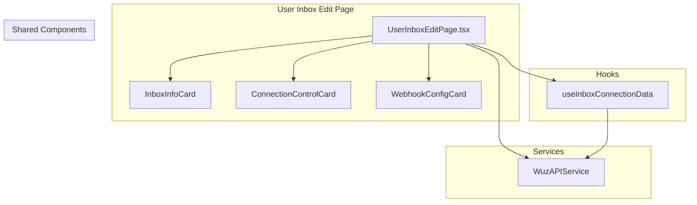
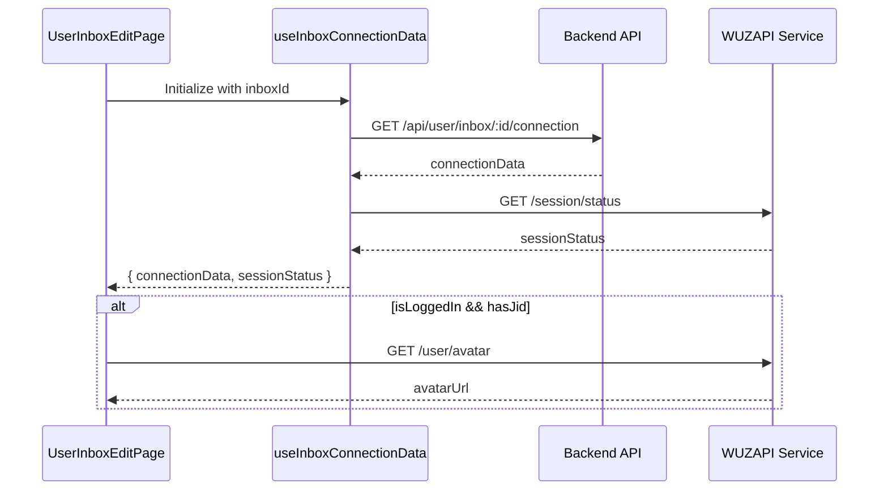
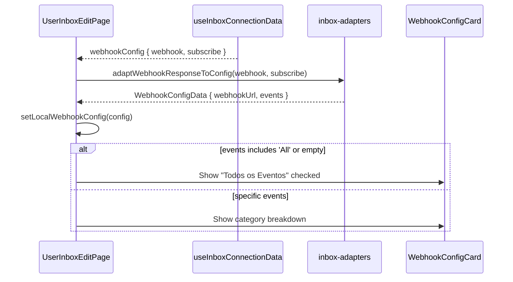

# Design Document: User Inbox Edit Improvements

## Overview

Este documento descreve o design técnico para melhorar a página de edição de inbox do usuário (`UserInboxEditPage.tsx`) para ter paridade de funcionalidades com a página admin. As melhorias focam em três áreas principais:

1. **Avatar Loading** - Carregamento automático da foto de perfil do WhatsApp
2. **Webhook Categories** - Exibição de eventos agrupados por categoria
3. **Visual Consistency** - Consistência visual com a página admin

A implementação reutiliza os componentes compartilhados existentes em `src/components/shared/inbox/` e faz ajustes mínimos no `UserInboxEditPage.tsx`.

## Architecture



## Components and Interfaces

### UserInboxEditPage Component

O componente principal que orquestra a página de edição. Já existe e será modificado para:

1. Melhorar a lógica de carregamento do avatar
2. Garantir que o `WebhookConfigCard` receba os props corretos
3. Manter consistência visual com a página admin

```typescript
// Existing component - modifications needed
const UserInboxEditPage = () => {
  // States
  const [avatarUrl, setAvatarUrl] = useState<string | null>(null)
  const [loadingAvatar, setLoadingAvatar] = useState(false)
  const [localWebhookConfig, setLocalWebhookConfig] = useState<WebhookConfigData | null>(null)
  
  // Hook for connection data
  const {
    connectionData,
    sessionStatus,
    webhookConfig,
    isLoading,
    refetch,
    refetchStatus,
    refetchWebhook
  } = useInboxConnectionData({ inboxId, enabled: !!inboxId })
  
  // Avatar fetch logic - needs improvement
  const fetchAvatar = useCallback(async () => {
    if (!connectionData?.wuzapiToken || !connectionData?.jid) return
    // ... fetch avatar from WUZAPI
  }, [connectionData?.wuzapiToken, connectionData?.jid])
  
  // Auto-load avatar when logged in
  useEffect(() => {
    const isLoggedIn = sessionStatus?.loggedIn ?? connectionData?.isLoggedIn
    if (isLoggedIn && connectionData?.jid && !avatarUrl) {
      fetchAvatar()
    }
  }, [sessionStatus?.loggedIn, connectionData?.isLoggedIn, connectionData?.jid, avatarUrl, fetchAvatar])
}
```

### WebhookConfigCard Props

O componente `WebhookConfigCard` já suporta categorias de eventos. A chave é garantir que:

1. `config.events` não contenha `['All']` quando queremos mostrar categorias
2. `availableEvents` seja passado corretamente com `DEFAULT_AVAILABLE_EVENTS`

```typescript
interface WebhookConfigCardProps {
  config: WebhookConfigData
  availableEvents: AvailableEvent[]
  onChange?: (config: WebhookConfigData) => void
  onSave?: () => void
  isLoading?: boolean
  readOnly?: boolean
  hasChanges?: boolean
  className?: string
}

interface WebhookConfigData {
  webhookUrl: string
  events: string[]  // ['All'] hides categories, specific events show categories
}
```

## Data Models

### Connection Status Flow



### Webhook Config Initialization



## Correctness Properties

*A property is a characteristic or behavior that should hold true across all valid executions of a system-essentially, a formal statement about what the system should do. Properties serve as the bridge between human-readable specifications and machine-verifiable correctness guarantees.*

### Property 1: Avatar Loading When Logged In

*For any* inbox that is logged in (isLoggedIn = true) and has a valid JID, the system should automatically attempt to fetch the avatar from WUZAPI on page load.

**Validates: Requirements 1.1, 1.2**

### Property 2: Category View Toggle

*For any* webhook configuration, if the events array contains 'All' or is empty, the category breakdown should be hidden. If the events array contains specific event names (not 'All'), the category breakdown should be visible.

**Validates: Requirements 2.1, 2.5**

### Property 3: Category Badge Counts

*For any* category with at least one selected event, the badge should display "X/Y" where X is the count of selected events in that category and Y is the total events in that category.

**Validates: Requirements 2.4**

### Property 4: Connection Status Badge Rendering

*For any* connection state, the badge should render correctly:
- If isLoggedIn = true → "Logado" badge with green color
- If isConnected = true AND isLoggedIn = false → "Conectado" badge with secondary color
- If isConnected = false AND isLoggedIn = false → "Offline" badge with outline style

**Validates: Requirements 4.4, 4.5, 4.6**

### Property 5: Webhook Config Initialization

*For any* server response with webhook configuration, the local state should be initialized correctly:
- webhookUrl should match the server's webhook value
- events should match the server's subscribe array
- If subscribe is empty or contains 'All', isAllSelected should be true

**Validates: Requirements 5.2, 5.3, 5.4**

### Property 6: Has Changes Detection

*For any* modification to the webhook configuration (URL or events), the hasChanges function should return true. If no modifications are made, it should return false.

**Validates: Requirements 5.5**

## Error Handling

### Avatar Fetch Errors

```typescript
const fetchAvatar = useCallback(async () => {
  if (!connectionData?.wuzapiToken || !connectionData?.jid) return
  
  setLoadingAvatar(true)
  try {
    const phone = connectionData.jid.split('@')[0].split(':')[0]
    if (phone) {
      const avatarData = await wuzapi.getAvatar(connectionData.wuzapiToken, phone, false)
      if (avatarData?.URL) {
        setAvatarUrl(avatarData.URL)
      }
    }
  } catch (error) {
    // Silently fail - avatar is optional
    console.error('Error fetching avatar:', error)
  } finally {
    setLoadingAvatar(false)
  }
}, [connectionData?.wuzapiToken, connectionData?.jid])
```

### Webhook Save Errors

```typescript
const handleSaveWebhook = async () => {
  if (!connectionData?.wuzapiToken || !localWebhookConfig) {
    toast.error('Token não disponível')
    return
  }
  
  setSavingWebhook(true)
  try {
    const { webhook, events } = adaptWebhookConfigToWuzapi(localWebhookConfig)
    await wuzapi.setWebhook(connectionData.wuzapiToken, webhook, events)
    toast.success('Webhook configurado com sucesso!')
    await refetchWebhook()
  } catch (error) {
    console.error('Error saving webhook:', error)
    toast.error('Erro ao configurar webhook')
  } finally {
    setSavingWebhook(false)
  }
}
```

## Testing Strategy

### Unit Tests

Unit tests should verify specific examples and edge cases:

1. **Avatar component rendering** - Test that Avatar shows correct fallback when no URL
2. **Copy button functionality** - Test that clipboard API is called with correct value
3. **Badge rendering** - Test that correct badge variant is used for each status

### Property-Based Tests

Property-based tests should verify universal properties using fast-check:

1. **Property 1: Avatar Loading** - Generate random connection states, verify avatar fetch is called only when logged in
2. **Property 2: Category View Toggle** - Generate random event arrays, verify category view visibility
3. **Property 4: Connection Status Badge** - Generate all combinations of isConnected/isLoggedIn, verify correct badge
4. **Property 5: Webhook Config Initialization** - Generate random server responses, verify correct local state
5. **Property 6: Has Changes Detection** - Generate random modifications, verify hasChanges returns correct value

### Testing Framework

- **Unit tests**: Vitest with React Testing Library
- **Property tests**: fast-check with Vitest
- **Minimum iterations**: 100 per property test
- **Tag format**: `Feature: user-inbox-edit-improvements, Property N: [property_text]`
