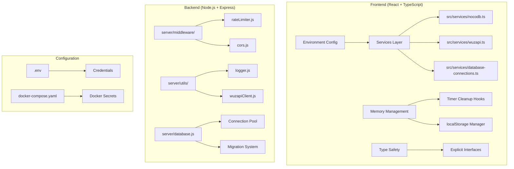

# WaSendGO Bug Fixes Design

## Overview

Este documento descreve a arquitetura e estratégias de correção para os 25 bugs identificados no projeto WaSendGO. As correções seguem as convenções do projeto: frontend em React/TypeScript com ES modules, backend em Node.js/Express com CommonJS, e SQLite em modo WAL.

## Architecture

As correções são organizadas em camadas que respeitam a arquitetura existente:



## Components and Interfaces

### 1. Environment Configuration Manager

```typescript
// src/lib/env-config.ts
interface EnvConfig {
  nocodbToken: string
  nocodbBaseUrl: string
  wuzapiBaseUrl: string
  wuzapiAdminToken: string
  corsAllowedOrigins: string[]
  apiTimeout: number
  rateLimitWindow: number
  rateLimitMax: number
}

function loadEnvConfig(): EnvConfig {
  const config = {
    nocodbToken: import.meta.env.VITE_NOCODB_TOKEN,
    nocodbBaseUrl: import.meta.env.VITE_NOCODB_BASE_URL,
    wuzapiBaseUrl: import.meta.env.VITE_WUZAPI_BASE_URL,
    wuzapiAdminToken: import.meta.env.VITE_ADMIN_TOKEN,
    corsAllowedOrigins: (import.meta.env.VITE_CORS_ALLOWED_ORIGINS || '').split(','),
    apiTimeout: parseInt(import.meta.env.VITE_API_TIMEOUT || '30000'),
    rateLimitWindow: parseInt(import.meta.env.VITE_RATE_LIMIT_WINDOW || '60000'),
    rateLimitMax: parseInt(import.meta.env.VITE_RATE_LIMIT_MAX || '100')
  }
  
  validateConfig(config)
  return config
}

function validateConfig(config: EnvConfig): void {
  if (!config.nocodbToken) throw new Error('VITE_NOCODB_TOKEN is required')
  if (!config.wuzapiAdminToken) throw new Error('VITE_ADMIN_TOKEN is required')
}
```

### 2. Memory Management Utilities

```typescript
// src/hooks/useCleanup.ts
interface CleanupManager {
  addTimer(id: NodeJS.Timeout): void
  addInterval(id: NodeJS.Timeout): void
  addSubscription(unsubscribe: () => void): void
  cleanup(): void
}

function useCleanup(): CleanupManager {
  const timers = useRef<Set<NodeJS.Timeout>>(new Set())
  const intervals = useRef<Set<NodeJS.Timeout>>(new Set())
  const subscriptions = useRef<Set<() => void>>(new Set())
  
  useEffect(() => {
    return () => {
      timers.current.forEach(clearTimeout)
      intervals.current.forEach(clearInterval)
      subscriptions.current.forEach(fn => fn())
    }
  }, [])
  
  return {
    addTimer: (id) => timers.current.add(id),
    addInterval: (id) => intervals.current.add(id),
    addSubscription: (fn) => subscriptions.current.add(fn),
    cleanup: () => { /* manual cleanup */ }
  }
}
```

```typescript
// src/lib/storage-manager.ts
interface StorageManager {
  set(key: string, value: unknown, ttl?: number): void
  get<T>(key: string): T | null
  remove(key: string): void
  clear(): void
  getSize(): number
}

const MAX_STORAGE_SIZE = 5 * 1024 * 1024 // 5MB

class LocalStorageManager implements StorageManager {
  private prefix = 'wasendgo_'
  
  set(key: string, value: unknown, ttl = 3600000): void {
    const entry = {
      value,
      expires: Date.now() + ttl,
      created: Date.now()
    }
    
    this.evictIfNeeded(JSON.stringify(entry).length)
    localStorage.setItem(this.prefix + key, JSON.stringify(entry))
  }
  
  get<T>(key: string): T | null {
    const raw = localStorage.getItem(this.prefix + key)
    if (!raw) return null
    
    const entry = JSON.parse(raw)
    if (Date.now() > entry.expires) {
      this.remove(key)
      return null
    }
    
    return entry.value as T
  }
  
  private evictIfNeeded(newSize: number): void {
    while (this.getSize() + newSize > MAX_STORAGE_SIZE) {
      this.evictOldest()
    }
  }
}
```

### 3. Cache with TTL

```typescript
// src/lib/cache.ts
interface CacheEntry<T> {
  value: T
  expires: number
  lastAccessed: number
}

class TTLCache<T> {
  private cache = new Map<string, CacheEntry<T>>()
  private maxSize: number
  private defaultTTL: number
  
  constructor(maxSize = 100, defaultTTL = 300000) {
    this.maxSize = maxSize
    this.defaultTTL = defaultTTL
    this.startCleanupInterval()
  }
  
  set(key: string, value: T, ttl = this.defaultTTL): void {
    if (this.cache.size >= this.maxSize) {
      this.evictLRU()
    }
    
    this.cache.set(key, {
      value,
      expires: Date.now() + ttl,
      lastAccessed: Date.now()
    })
  }
  
  get(key: string): T | undefined {
    const entry = this.cache.get(key)
    if (!entry) return undefined
    
    if (Date.now() > entry.expires) {
      this.cache.delete(key)
      return undefined
    }
    
    entry.lastAccessed = Date.now()
    return entry.value
  }
  
  private evictLRU(): void {
    let oldest: string | null = null
    let oldestTime = Infinity
    
    for (const [key, entry] of this.cache) {
      if (entry.lastAccessed < oldestTime) {
        oldest = key
        oldestTime = entry.lastAccessed
      }
    }
    
    if (oldest) this.cache.delete(oldest)
  }
  
  private startCleanupInterval(): void {
    setInterval(() => {
      const now = Date.now()
      for (const [key, entry] of this.cache) {
        if (now > entry.expires) {
          this.cache.delete(key)
        }
      }
    }, 60000)
  }
}
```

### 4. Rate Limiter

```javascript
// server/middleware/rateLimiter.js
const rateLimit = require('express-rate-limit')
const logger = require('../utils/logger')

const createRateLimiter = (options = {}) => {
  const {
    windowMs = 60000,
    max = 100,
    message = 'Too many requests, please try again later'
  } = options
  
  return rateLimit({
    windowMs,
    max,
    message: { error: message },
    handler: (req, res) => {
      logger.warn('Rate limit exceeded', {
        ip: req.ip,
        path: req.path,
        userId: req.user?.id
      })
      res.status(429).json({ error: message })
    },
    standardHeaders: true,
    legacyHeaders: false
  })
}

const apiLimiter = createRateLimiter({ max: 100 })
const authLimiter = createRateLimiter({ max: 10, windowMs: 900000 })
const wuzapiLimiter = createRateLimiter({ max: 30, windowMs: 60000 })

module.exports = { createRateLimiter, apiLimiter, authLimiter, wuzapiLimiter }
```

### 5. Timeout Configuration

```javascript
// server/utils/wuzapiClient.js (updated)
const axios = require('axios')
const logger = require('./logger')

const DEFAULT_TIMEOUT = 30000

const createWuzapiClient = (baseURL, token, timeout = DEFAULT_TIMEOUT) => {
  const client = axios.create({
    baseURL,
    timeout,
    headers: {
      'Authorization': `Bearer ${token}`,
      'Content-Type': 'application/json'
    }
  })
  
  client.interceptors.response.use(
    response => response,
    error => {
      if (error.code === 'ECONNABORTED') {
        logger.error('WuzAPI request timeout', {
          url: error.config?.url,
          timeout
        })
      }
      throw error
    }
  )
  
  return client
}

module.exports = { createWuzapiClient, DEFAULT_TIMEOUT }
```

### 6. Connection Management

```javascript
// server/database.js (updated)
const sqlite3 = require('sqlite3').verbose()
const logger = require('./utils/logger')

class DatabaseManager {
  constructor(dbPath) {
    this.dbPath = dbPath
    this.db = null
    this.busyTimeout = 5000
  }
  
  async initialize() {
    return new Promise((resolve, reject) => {
      this.db = new sqlite3.Database(this.dbPath, (err) => {
        if (err) {
          logger.error('Database connection failed', { error: err.message })
          reject(err)
          return
        }
        
        this.db.run('PRAGMA journal_mode = WAL')
        this.db.run('PRAGMA synchronous = NORMAL')
        this.db.run(`PRAGMA busy_timeout = ${this.busyTimeout}`)
        this.db.run('PRAGMA foreign_keys = ON')
        
        logger.info('Database initialized', { path: this.dbPath })
        resolve()
      })
    })
  }
  
  async runMigrations() {
    // Ensure database_connections table exists
    await this.run(`
      CREATE TABLE IF NOT EXISTS database_connections (
        id INTEGER PRIMARY KEY AUTOINCREMENT,
        user_id TEXT NOT NULL,
        name TEXT NOT NULL,
        connection_string TEXT NOT NULL,
        created_at DATETIME DEFAULT CURRENT_TIMESTAMP,
        updated_at DATETIME DEFAULT CURRENT_TIMESTAMP
      )
    `)
  }
  
  async close() {
    return new Promise((resolve, reject) => {
      if (!this.db) {
        resolve()
        return
      }
      
      this.db.close((err) => {
        if (err) {
          logger.error('Database close failed', { error: err.message })
          reject(err)
          return
        }
        
        logger.info('Database connection closed')
        resolve()
      })
    })
  }
}

module.exports = DatabaseManager
```

### 7. Error Handling Utilities

```javascript
// server/utils/errorHandler.js
const logger = require('./logger')

const sanitizeError = (error) => {
  const sensitivePatterns = [
    /token[=:]\s*['"]?[\w-]+['"]?/gi,
    /password[=:]\s*['"]?[\w-]+['"]?/gi,
    /secret[=:]\s*['"]?[\w-]+['"]?/gi,
    /api[_-]?key[=:]\s*['"]?[\w-]+['"]?/gi
  ]
  
  let message = error.message || 'Unknown error'
  sensitivePatterns.forEach(pattern => {
    message = message.replace(pattern, '[REDACTED]')
  })
  
  return message
}

const handleError = (error, context = {}) => {
  const sanitizedMessage = sanitizeError(error)
  
  logger.error(sanitizedMessage, {
    ...context,
    stack: process.env.NODE_ENV === 'development' ? error.stack : undefined
  })
  
  return {
    error: sanitizedMessage,
    code: error.code || 'INTERNAL_ERROR'
  }
}

module.exports = { sanitizeError, handleError }
```

## Data Models

### Environment Variables Schema

```typescript
// .env.example updates
interface RequiredEnvVars {
  // Frontend
  VITE_API_BASE_URL: string
  VITE_WUZAPI_BASE_URL: string
  VITE_ADMIN_TOKEN: string
  VITE_NOCODB_TOKEN: string
  VITE_NOCODB_BASE_URL: string
  VITE_CORS_ALLOWED_ORIGINS: string // comma-separated
  VITE_API_TIMEOUT: string // milliseconds
  
  // Backend
  NODE_ENV: 'development' | 'production'
  PORT: string
  WUZAPI_BASE_URL: string
  CORS_ORIGINS: string // comma-separated
  SQLITE_DB_PATH: string
  LOG_LEVEL: 'debug' | 'info' | 'warn' | 'error'
}
```

### Cache Entry Model

```typescript
interface CacheEntry<T> {
  key: string
  value: T
  expires: number
  created: number
  lastAccessed: number
  size: number
}
```

## Correctness Properties

*A property is a characteristic or behavior that should hold true across all valid executions of a system-essentially, a formal statement about what the system should do. Properties serve as the bridge between human-readable specifications and machine-verifiable correctness guarantees.*


**Property 1: Credential loading and validation**
*For any* environment configuration, credentials must be loaded from environment variables (not hardcoded), must be non-empty, and missing credentials must throw descriptive errors.
**Validates: Requirements 1.1, 1.2, 1.4, 1.5**

**Property 2: CORS configuration consistency**
*For any* HTTP request, CORS headers must be correctly applied based on the comma-separated allowed origins configuration, with allowed origins receiving proper headers and disallowed origins being rejected with 403.
**Validates: Requirements 2.1, 2.2, 2.3**

**Property 3: Memory management consistency**
*For any* component lifecycle, all timers (setTimeout/setInterval) must be tracked and cleared on unmount, localStorage must respect size limits with LRU eviction, and subscriptions must be cancelled.
**Validates: Requirements 3.1, 3.2, 3.3, 3.4**

**Property 4: Database reliability**
*For any* database operation, migrations must create required tables if missing, concurrent writes must be handled with retry logic, and error messages must be sanitized to remove sensitive data.
**Validates: Requirements 4.2, 4.3, 4.4**

**Property 5: Request timeout and rate limiting**
*For any* external API request, configurable timeouts must be applied, exceeded timeouts must return appropriate errors, rate limits must be enforced, and exceeded limits must return 429 with retry-after header.
**Validates: Requirements 5.1, 5.2, 5.3, 5.4**

**Property 6: Cache TTL and eviction**
*For any* cache entry, a TTL must be assigned, expired entries must be automatically removed, expiration must be checked before returning data, and LRU eviction must occur when size limits are exceeded.
**Validates: Requirements 6.1, 6.2, 6.3, 6.4**

**Property 7: Error sanitization**
*For any* error response, sensitive patterns (tokens, passwords, secrets, API keys) must be removed from error messages before logging or returning to clients.
**Validates: Requirements 7.2**

**Property 8: Connection lifecycle management**
*For any* database connection, connections must be tracked, closed when no longer needed, retried with exponential backoff on errors, and cleaned up when sessions expire.
**Validates: Requirements 8.1, 8.2, 8.3, 8.4**

**Property 9: Adaptive polling**
*For any* polling operation, intervals must adapt based on activity - increasing when idle and decreasing when active.
**Validates: Requirements 9.1, 9.2, 9.3**

**Property 10: Input validation**
*For any* API request, all input parameters must be validated, validation failures must return descriptive errors, inputs must be sanitized against injection attacks, and type mismatches must return 400 status.
**Validates: Requirements 10.1, 10.2, 10.3, 10.4**

**Property 11: Runtime type safety**
*For any* dynamic data handling, type guards must be used for runtime validation, and external data must be validated and cast to appropriate types.
**Validates: Requirements 11.2, 11.3**

## Error Handling

### Credential Errors
- **Missing Credentials**: Throw descriptive error with variable name
- **Invalid Format**: Validate token format before use
- **Empty Values**: Reject empty strings as invalid

### Network Errors
- **Timeout**: Cancel request, log context, return user-friendly error
- **Rate Limited**: Return 429 with retry-after header
- **Connection Failed**: Retry with exponential backoff

### Database Errors
- **Busy Timeout**: Retry with configurable delay
- **Missing Table**: Run migrations automatically
- **Constraint Violation**: Return descriptive validation error

### Memory Errors
- **Storage Full**: Evict LRU entries, log warning
- **Timer Leak**: Track and cleanup on unmount

## Testing Strategy

### Unit Testing
- **Environment Config**: Test loading and validation of env vars
- **Cache Operations**: Test TTL, eviction, and size limits
- **Error Sanitization**: Test removal of sensitive patterns
- **Input Validation**: Test rejection of invalid inputs

### Property-Based Testing
The system uses **fast-check** as the property-based testing library, with each test configured to run a minimum of 100 iterations.

Each property-based test is tagged with comments explicitly referencing the correctness property from this design document using the format: '**Feature: wasendgo-bug-fixes, Property {number}: {property_text}**'

### Integration Testing
- **CORS Middleware**: Test with various origins
- **Rate Limiter**: Test request throttling
- **Database Migrations**: Test table creation
- **Connection Pool**: Test concurrent access

### Security Testing
- **Credential Exposure**: Verify no hardcoded secrets
- **Error Leakage**: Verify sanitized error messages
- **Input Injection**: Test sanitization of malicious inputs
