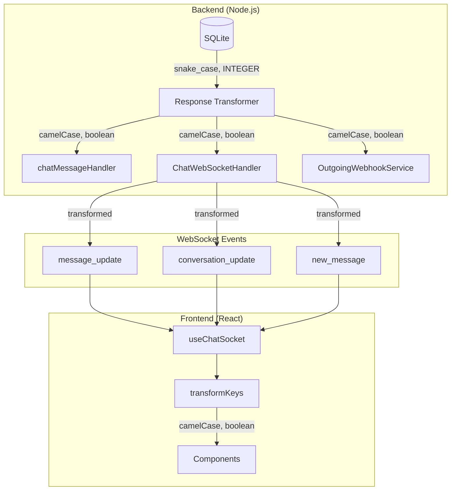

# Design Document: WebSocket Data Transformation Fix

## Overview

Este documento descreve o design para corrigir problemas críticos de transformação de dados em eventos WebSocket e conversões de booleanos inconsistentes. Os problemas causam bugs silenciosos onde a UI não reflete corretamente o estado do servidor em tempo real.

## Architecture



## Components and Interfaces

### 1. ChatWebSocketHandler Updates

Atualizar o handler para usar funções de transformação centralizadas:

```javascript
// server/websocket/ChatWebSocketHandler.js

const { transformConversation, toBoolean } = require('../utils/responseTransformer');

/**
 * Broadcast message update (edit/delete) to conversation room
 * FIXED: Transform data to camelCase before broadcasting
 */
broadcastMessageUpdate(conversationId, messageUpdate) {
  const room = `conversation:${conversationId}`;
  
  // Transform to camelCase
  const transformedUpdate = {
    id: messageUpdate.id,
    content: messageUpdate.content,
    isEdited: toBoolean(messageUpdate.is_edited),
    isDeleted: toBoolean(messageUpdate.is_deleted)
  };
  
  this.io.of('/chat').to(room).emit('message_update', {
    conversationId,
    ...transformedUpdate
  });
}

/**
 * Broadcast conversation update to all connected clients
 * FIXED: Use transformConversation for consistent format
 */
broadcastConversationUpdate(conversation) {
  // Transform to camelCase with proper boolean conversion
  const transformed = transformConversation(conversation);
  this.io.of('/chat').emit('conversation_update', { conversation: transformed });
}
```

### 2. chatMessageHandler Updates

Usar `toBoolean` para verificação de muted:

```javascript
// server/webhooks/chatMessageHandler.js

const { toBoolean } = require('../utils/responseTransformer');

// BEFORE (inconsistent):
// isMuted: conversation.is_muted === 1 || conversation.is_muted === true

// AFTER (consistent):
if (this.chatHandler) {
  this.chatHandler.broadcastNewMessage(conversation.id, message, { 
    isMuted: toBoolean(conversation.is_muted)
  });
}
```

### 3. OutgoingWebhookService Updates

Usar `toBoolean` para conversão de success:

```javascript
// server/services/OutgoingWebhookService.js

const { toBoolean } = require('../utils/responseTransformer');

// In getWebhookStats method:
recentDeliveries: deliveries.slice(0, 10).map(d => ({
  id: d.delivery_id,
  eventType: d.event_type,
  success: toBoolean(d.success), // FIXED: Use toBoolean instead of === 1
  attempts: d.attempts,
  responseStatus: d.response_status,
  error: d.error,
  durationMs: d.duration_ms,
  createdAt: d.created_at
}))
```

### 4. Frontend useChatSocket Updates

Aplicar transformKeys aos eventos que podem vir em snake_case:

```typescript
// src/hooks/useChatSocket.ts

// Message update events (edit/delete) - FIXED: Apply transformation
socket.on('message_update', (rawData: any) => {
  const data = transformKeys<{ 
    conversationId: number; 
    id: number; 
    content?: string; 
    isEdited?: boolean; 
    isDeleted?: boolean 
  }>(rawData);
  queryClient.invalidateQueries({ queryKey: ['messages', data.conversationId] });
});

// Conversation events - FIXED: Apply transformation
socket.on('conversation_update', (rawData: any) => {
  const data = transformKeys<{ conversation: Conversation }>(rawData);
  callbacksRef.current.onConversationUpdate?.(data.conversation);
  queryClient.invalidateQueries({ queryKey: ['conversations'] });
});
```

## Data Models

### Message Update Event

```typescript
// Backend sends (after fix):
interface MessageUpdateEvent {
  conversationId: number;
  id: number;
  content?: string;
  isEdited: boolean;  // camelCase, proper boolean
  isDeleted: boolean; // camelCase, proper boolean
}

// Frontend receives (same format after transformation)
```

### Conversation Update Event

```typescript
// Backend sends (after fix):
interface ConversationUpdateEvent {
  conversation: {
    id: number;
    userId: string;
    contactJid: string;
    contactName: string | null;
    isMuted: boolean;  // camelCase, proper boolean
    // ... other fields in camelCase
  }
}
```

## Correctness Properties

*A property is a characteristic or behavior that should hold true across all valid executions of a system-essentially, a formal statement about what the system should do. Properties serve as the bridge between human-readable specifications and machine-verifiable correctness guarantees.*

### Property Reflection

After analyzing the prework, the following consolidations were made:
- Properties 1.1 and 1.2 test the same transformation (snake_case to camelCase) - consolidated into Property 1
- Properties 1.3, 2.2, 3.1, 4.1, 4.2 all test boolean conversion - consolidated into Property 2
- Properties 2.1, 2.3, 5.1, 5.2, 5.3 all test output format consistency - consolidated into Property 3

### Final Properties

**Property 1: WebSocket message update key transformation**
*For any* message update object with snake_case keys (`is_edited`, `is_deleted`), the broadcast function SHALL return an object with camelCase keys (`isEdited`, `isDeleted`)
**Validates: Requirements 1.1, 1.2**

**Property 2: Boolean field conversion consistency**
*For any* SQLite boolean value (0, 1, null, undefined, "0", "1", true, false) in WebSocket events, the transformation layer SHALL convert to a proper JavaScript boolean (typeof === 'boolean')
**Validates: Requirements 1.3, 2.2, 3.1, 4.1**

**Property 3: WebSocket event format consistency**
*For any* WebSocket event (message_update, conversation_update), the data received by frontend components SHALL have all keys in camelCase format
**Validates: Requirements 2.1, 2.3, 5.1, 5.2, 5.3**

## Error Handling

### Transformation Errors

1. **Null/undefined input**: Return null/undefined without throwing
2. **Missing fields**: Only transform fields that exist, don't add missing fields
3. **Invalid boolean values**: Use `toBoolean` which handles all edge cases gracefully

## Testing Strategy

### Property-Based Testing

Utilizaremos **fast-check** como biblioteca de property-based testing.

### Test Annotations

Todos os testes de propriedade devem incluir:
```javascript
// **Feature: websocket-data-transformation-fix, Property {number}: {property_text}**
// **Validates: Requirements X.Y**
```

### Unit Tests

- Test `broadcastMessageUpdate` outputs camelCase keys
- Test `broadcastConversationUpdate` uses transformConversation
- Test `toBoolean` is used consistently in chatMessageHandler
- Test `toBoolean` is used in OutgoingWebhookService.getWebhookStats
- Test frontend `transformKeys` is applied to WebSocket events

### Integration Tests

- Test full flow: message edit → WebSocket → frontend receives camelCase
- Test full flow: conversation mute → WebSocket → frontend receives boolean
- Test webhook stats display correct boolean values

