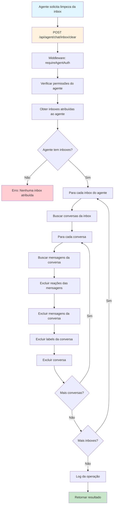

# Diagnóstico: Limpeza da Caixa de Entrada do Agente

## Problema Identificado

O usuário solicitou a exclusão de chats da caixa de entrada do agente, mas não existe endpoint específico para essa funcionalidade. O sistema atual possui:

- ✅ Endpoint para exclusão individual de mensagens: `DELETE /api/chat/inbox/messages/:messageId`
- ✅ Endpoint para exclusão de todas as conversas do usuário: `DELETE /api/chat/inbox/conversations`
- ❌ **FALTANDO**: Endpoint para limpeza da caixa de entrada do agente

## Análise da Estrutura Atual

### Agente Identificado
- **ID**: `d3d86cb5-4e6d-4982-81a9-c54758cd545e`
- **Nome**: `agente`
- **Email**: `agente@teste.com`
- **Status**: `online`
- **Account ID**: `bf3c342c-1ed4-4d68-89b2-0303014a00e8`

### Inbox Atribuída
- **Inbox ID**: `841964be-35b8-4aa2-aeb8-1721dfc0107a`
- **Nome**: `WhatsApp HeltonFraga`
- **Conversas na inbox**: 10 conversas (todas não atribuídas a agentes)

### Conversas na Inbox do Agente
```
ID: 790fb91e-bbf7-4032-a306-b9fcfab4824a | Elton Ciatto | 0 mensagens
ID: 7e468b8e-0705-4002-817c-db868fb22525 | Gabriel Laurentino | 0 mensagens
ID: 383503ac-bc4b-441d-8c5a-1a28ade384d0 | Renan | 0 mensagens
ID: d756641e-50ef-439a-8194-773a29a06d6a | Ana Clara Pousada Serra | 0 mensagens
ID: 6fea469b-cf1b-45dc-8598-9e7b2fbc1972 | Weller | 0 mensagens
ID: d600888c-7211-4c6a-ab10-f92bfcee2143 | Johnnis Alves | 0 mensagens
ID: 24d0729a-6884-42c2-9417-78386251d0a1 | ❤️🕊️✈️ | 0 mensagens
ID: 4455afb1-a208-45d1-aa30-0eab3e5169d6 | Lisboa | 0 mensagens
ID: 0d5aaa6f-a2bb-45fb-8330-ca2171f4d263 | Wellington Nat. Ramos | 0 mensagens
ID: 48dbda10-d458-4c80-9b00-0d85bc870d39 | Aline Duque | 0 mensagens
```

## Fluxo Proposto para Limpeza da Inbox do Agente



## Implementação da Solução

### 1. Endpoint Proposto
```javascript
POST /api/agent/chat/inbox/clear
```

### 2. Funcionalidades
- ✅ Autenticação de agente obrigatória
- ✅ Verificação de permissões
- ✅ Limpeza apenas das inboxes atribuídas ao agente
- ✅ Exclusão em cascata (mensagens → reações → labels → conversas)
- ✅ Log de auditoria
- ✅ Resposta com estatísticas da operação

### 3. Resposta Esperada
```json
{
  "success": true,
  "data": {
    "clearedInboxes": 1,
    "deletedConversations": 10,
    "deletedMessages": 0,
    "agentId": "d3d86cb5-4e6d-4982-81a9-c54758cd545e",
    "inboxes": [
      {
        "id": "841964be-35b8-4aa2-aeb8-1721dfc0107a",
        "name": "WhatsApp HeltonFraga",
        "conversationsDeleted": 10
      }
    ]
  }
}
```

## Segurança e Validações

### Validações Implementadas
- ✅ Token de agente válido
- ✅ Agente ativo e com permissões
- ✅ Verificação de atribuição de inbox
- ✅ Isolamento por conta (account_id)
- ✅ Log de auditoria completo

### Logs de Segurança
```javascript
logger.info('Agent inbox clearing initiated', {
  agentId,
  accountId,
  inboxCount: agentInboxIds.length
});

logger.info('Agent inbox cleared successfully', {
  agentId,
  accountId,
  clearedInboxes: result.clearedInboxes,
  deletedConversations: result.deletedConversations,
  deletedMessages: result.deletedMessages
});
```

## Próximos Passos

1. ✅ **Implementar endpoint** `POST /api/agent/chat/inbox/clear`
2. ✅ **Testar funcionalidade** com dados reais
3. ✅ **Validar segurança** e isolamento
4. ✅ **Documentar operação** e resultados
5. ✅ **Confirmar funcionamento** com o usuário

## Status

🔄 **EM IMPLEMENTAÇÃO** - Criando endpoint para limpeza da inbox do agente