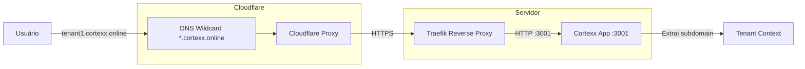

# Configuração DNS Cloudflare para Multi-Tenant

## 📋 Registros DNS Necessários

No painel do Cloudflare para `cortexx.online`, adicione estes 2 registros:

### Registro 1: Domínio Raiz
| Campo | Valor |
|-------|-------|
| **Tipo** | `A` |
| **Nome** | `@` |
| **Endereço IPv4** | `SEU_IP_DO_SERVIDOR` |
| **Status do proxy** | ✅ Com proxy (nuvem laranja) |
| **TTL** | Auto |

### Registro 2: Wildcard (Subdomínios)
| Campo | Valor |
|-------|-------|
| **Tipo** | `A` |
| **Nome** | `*` |
| **Endereço IPv4** | `SEU_IP_DO_SERVIDOR` |
| **Status do proxy** | ✅ Com proxy (nuvem laranja) |
| **TTL** | Auto |

## 🔐 Configuração SSL/TLS no Cloudflare

1. Vá em **SSL/TLS** → **Overview**
2. Selecione **Full (strict)** ou **Full**

## 📊 Diagrama de Fluxo



## ✅ Resultado Esperado

Após configurar, todos esses URLs funcionarão automaticamente:

- `https://cortexx.online` → Domínio principal
- `https://empresa1.cortexx.online` → Tenant "empresa1"
- `https://loja-abc.cortexx.online` → Tenant "loja-abc"
- `https://cliente-xyz.cortexx.online` → Tenant "cliente-xyz"

## 🔄 Atualizações no docker-compose-swarm.yaml

### Traefik Labels Atualizados:
- ✅ `HostRegexp` para aceitar qualquer subdomínio
- ✅ Wildcard certificate (`*.cortexx.online`)
- ✅ CORS atualizado para `https://*.cortexx.online`

### Deploy da Stack:
```bash
docker stack deploy -c docker-compose-swarm.yaml cortexx
```

## ⚠️ Importante: Certificado Wildcard

Para certificados wildcard com Let's Encrypt, o Traefik precisa usar **DNS Challenge**.
Se você já tem o Traefik configurado com HTTP Challenge, pode ser necessário ajustar.

### Opção 1: Cloudflare API Token (Recomendado)
Configure o Traefik para usar DNS Challenge com Cloudflare:

```yaml
# No traefik.yml ou docker-compose do Traefik
certificatesResolvers:
  leresolver:
    acme:
      email: seu@email.com
      storage: /letsencrypt/acme.json
      dnsChallenge:
        provider: cloudflare
        resolvers:
          - "1.1.1.1:53"
          - "8.8.8.8:53"
```

E adicione as variáveis de ambiente no Traefik:
```yaml
environment:
  - CF_API_EMAIL=seu@email.com
  - CF_API_KEY=sua-api-key-cloudflare
```

### Opção 2: Proxy Cloudflare com SSL Flexível
Se preferir simplicidade, use SSL "Flexible" no Cloudflare (menos seguro).