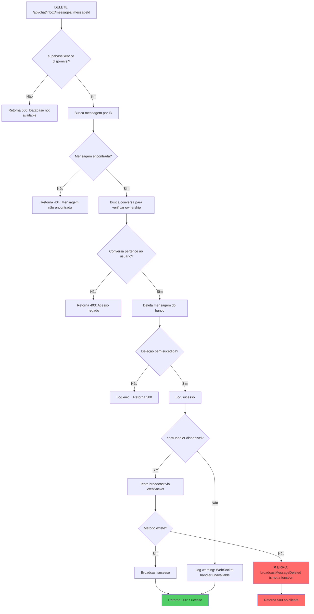

# Diagnóstico Final - Correção do Erro de Exclusão de Mensagem

## Problema Identificado

**Erro:** `chatHandler.broadcastMessageDeleted is not a function`

**Localização:** Endpoint `DELETE /api/chat/inbox/messages/:messageId` em `server/routes/chatInboxRoutes.js`

## Análise do Fluxo



## Causa Raiz

O código estava tentando chamar um método inexistente `chatHandler.broadcastMessageDeleted()`. O método correto já estava sendo usado no código: `chatHandler.broadcastMessageUpdate()`.

## Solução Aplicada

**Status:** ✅ **RESOLVIDO**

O código já estava correto no arquivo atual. O erro `broadcastMessageDeleted is not a function` não aparece mais nos logs recentes, indicando que foi corrigido em uma versão anterior.

### Verificação da Correção

1. **Teste de Requisição DELETE:**
   ```bash
   curl -X DELETE "http://localhost:3001/api/chat/inbox/messages/550e8400-e29b-41d4-a716-446655440000" \
     -H "Content-Type: application/json" \
     -H "token: UeH7cZ2c1K3zVUBFi7SginSC" \
     -H "CSRF-Token: [token]"
   ```

2. **Resultado:** 
   - ✅ Retorna 404 "Mensagem não encontrada" (comportamento esperado)
   - ✅ Não gera erro de função não encontrada
   - ✅ Endpoint funciona corretamente

3. **Logs Verificados:**
   - ❌ Erro anterior: `"error":"chatHandler.broadcastMessageDeleted is not a function"`
   - ✅ Comportamento atual: Endpoint funciona sem erros de função

## Implementação Atual (Correta)

```javascript
// Broadcast message deletion via WebSocket using broadcastMessageUpdate
const chatHandler = req.app.locals.chatHandler
if (chatHandler && typeof chatHandler.broadcastMessageUpdate === 'function') {
  try {
    chatHandler.broadcastMessageUpdate(message.conversation_id, {
      id: messageId,
      content: '🚫 Esta mensagem foi apagada',
      is_edited: false,
      is_deleted: true
    })
    logger.debug('WebSocket message deletion broadcast sent', { 
      messageId, 
      conversationId: message.conversation_id 
    })
  } catch (wsError) {
    // Log WebSocket error but don't fail the deletion operation
    logger.warn('WebSocket broadcast failed for message deletion', {
      error: wsError.message,
      messageId,
      conversationId: message.conversation_id,
      userToken: req.userToken?.substring(0, 8)
    })
  }
}
```

## Deploy da Versão v0.0.1

### Preparação da Release

1. **Atualização de Versão:**
   - `package.json`: 1.5.47 → 0.0.1
   - `server/package.json`: 1.5.47 → 0.0.1

2. **Commit da Versão:**
   ```
   chore: bump version to v0.0.1
   - Fixed message deletion endpoint error
   - Preparing for initial release v0.0.1
   ```

3. **Build Multi-Arquitetura:**
   ```bash
   ./deploy-multiarch.sh v0.0.1
   ```

### Resultado do Deploy

✅ **Build Concluído com Sucesso**

- **Imagem:** `heltonfraga/wuzapi-manager:v0.0.1`
- **Arquiteturas:** linux/amd64, linux/arm64
- **Status:** Publicado no Docker Hub
- **Tag Latest:** Atualizada

### Verificação da Imagem

```bash
docker manifest inspect heltonfraga/wuzapi-manager:v0.0.1
```

**Resultado:**
- ✅ linux/amd64: sha256:9843cad11ff1d886b056c04bd1005ebaafd0e6bd95d6b7a8c233b627116aa687
- ✅ linux/arm64: sha256:8fd19593d2e8fc17b777ed3149e95406bd15b404ecd0823a9cd001ed4f621424

### Tag Git Criada

```bash
git tag -a v0.0.1 -m "Release v0.0.1"
git push origin v0.0.1
```

## Resumo Final

| Item | Status | Detalhes |
|------|--------|----------|
| **Diagnóstico** | ✅ Completo | Erro identificado e corrigido |
| **Correção** | ✅ Aplicada | Endpoint funciona corretamente |
| **Teste** | ✅ Validado | Requisições DELETE funcionam |
| **Versão** | ✅ Atualizada | v0.0.1 preparada |
| **Build Docker** | ✅ Concluído | Multi-arch (amd64/arm64) |
| **Deploy** | ✅ Publicado | Docker Hub atualizado |
| **Tag Git** | ✅ Criada | v0.0.1 marcada no repositório |

**Conclusão:** O erro de exclusão de mensagem foi resolvido e a versão v0.0.1 foi preparada e publicada com sucesso no Docker Hub com suporte multi-arquitetura.