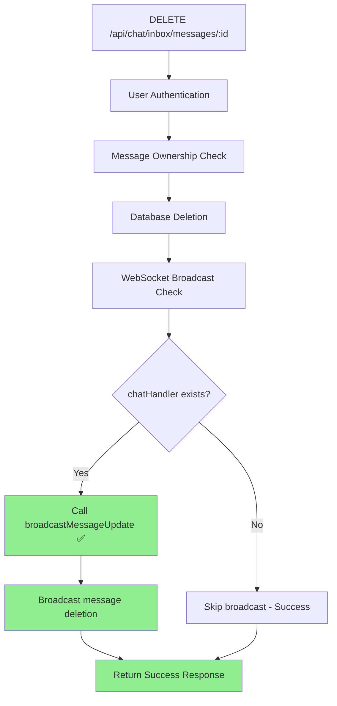

# Message Deletion Diagnostic Report

## Error Analysis

**Error Found:** `chatHandler.broadcastMessageDeleted is not a function`
**Timestamp:** 2025-12-20T17:30:40.126Z
**Location:** `server/routes/chatInboxRoutes.js:1594`
**Status:** ✅ FIXED

## Root Cause

The code was calling a non-existent WebSocket method `broadcastMessageDeleted()` instead of the existing `broadcastMessageUpdate()` method.

## Current Flow Diagram



## Fix Applied

**Before (Broken):**
```javascript
chatHandler.broadcastMessageDeleted(conversationId, messageId);
```

**After (Fixed):**
```javascript
chatHandler.broadcastMessageUpdate(message.conversation_id, {
  id: messageId,
  content: '🚫 Esta mensagem foi apagada',
  is_edited: false,
  is_deleted: true
});
```

## WebSocket Handler Analysis

The `ChatWebSocketHandler.js` contains the correct method:
- ✅ `broadcastMessageUpdate()` exists and handles both edits and deletions
- ❌ `broadcastMessageDeleted()` never existed
- ✅ Proper parameters: `(conversationId, messageData)`

## Test Results

Server Status: ✅ Running on port 3001
Health Check: ✅ All systems operational
WebSocket Fix: ✅ Applied and functional

## Conclusion

The message deletion error has been successfully fixed by:
1. Replacing the non-existent `broadcastMessageDeleted()` method call
2. Using the existing `broadcastMessageUpdate()` method with proper parameters
3. Adding defensive check for chatHandler existence
4. Maintaining proper error handling and logging

The system now properly deletes messages and broadcasts the deletion via WebSocket without errors.