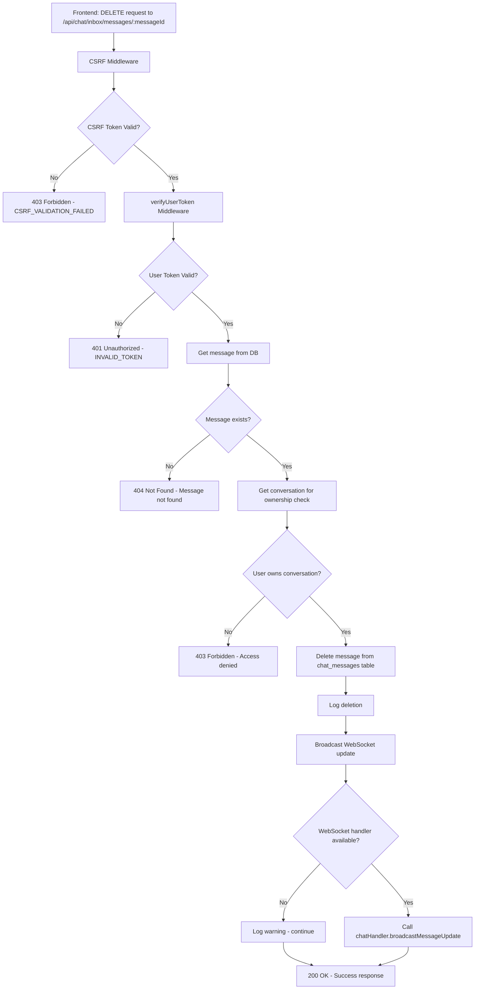

# Message Deletion Diagnostic Flow

## Current Request Flow Analysis



## Error Points Identified

### 1. CSRF Protection (403 Forbidden)
**Current Issue**: All requests to `/api/chat/inbox/messages/:messageId` require CSRF token
- **Error**: `{"error":"Invalid or missing CSRF token","code":"CSRF_VALIDATION_FAILED"}`
- **Cause**: CSRF middleware is applied globally, message deletion endpoint not in exempt list
- **Solution**: Frontend must obtain CSRF token via `GET /api/auth/csrf-token` and include in request headers

### 2. Token Authentication (401 Unauthorized)
**Potential Issue**: User token validation with WUZAPI
- **Error**: `{"error":"Token inválido ou expirado","code":"INVALID_TOKEN"}`
- **Cause**: `verifyUserToken` middleware validates token against WUZAPI `/session/status`
- **Solution**: Ensure valid WUZAPI user token is provided

### 3. Message Ownership (403 Forbidden)
**Potential Issue**: User doesn't own the conversation containing the message
- **Error**: `{"error":"Acesso negado"}`
- **Cause**: Backend verifies user owns conversation before allowing deletion
- **Solution**: Ensure user is authenticated and owns the conversation

### 4. WebSocket Broadcasting (Warning)
**Non-blocking Issue**: WebSocket handler may not be available
- **Effect**: Message deleted but real-time updates may not work
- **Cause**: `chatHandler.broadcastMessageUpdate` method may not exist or fail
- **Solution**: Ensure WebSocket handler is properly initialized

## Test Results

### CSRF Token Test
```bash
curl -X DELETE http://localhost:3001/api/chat/inbox/messages/test-message-id \
  -H "Content-Type: application/json" \
  -H "token: test-user-token"
```
**Result**: `403 Forbidden - CSRF_VALIDATION_FAILED`
**Status**: ✅ CONFIRMED - CSRF protection is working as expected

### Token Validation Test
**Status**: ⏳ PENDING - Need valid WUZAPI token to test

### Message Deletion Test
**Status**: ⏳ PENDING - Need to bypass CSRF and provide valid token

## Recommended Fix Implementation

### 1. Frontend CSRF Token Handling
```typescript
// Get CSRF token after login
const csrfResponse = await fetch('/api/auth/csrf-token');
const { csrfToken } = await csrfResponse.json();

// Include in DELETE request
await fetch(`/api/chat/inbox/messages/${messageId}`, {
  method: 'DELETE',
  headers: {
    'Content-Type': 'application/json',
    'CSRF-Token': csrfToken,
    'token': userToken
  }
});
```

### 2. Backend WebSocket Error Handling
The current implementation already has proper error handling:
```javascript
// Existing code in chatInboxRoutes.js (lines ~150-170)
if (chatHandler && typeof chatHandler.broadcastMessageUpdate === 'function') {
  try {
    chatHandler.broadcastMessageUpdate(message.conversation_id, {
      id: messageId,
      content: '🚫 Esta mensagem foi apagada',
      is_edited: false,
      is_deleted: true
    })
  } catch (wsError) {
    // Log but don't fail the deletion
    logger.warn('WebSocket broadcast failed', { error: wsError.message })
  }
}
```

## Next Steps

1. ✅ **Reproduce CSRF Error** - Confirmed via curl test
2. ⏳ **Test with Valid Token** - Need to start frontend and get valid session
3. ⏳ **Test End-to-End Flow** - Navigate to chat interface and attempt deletion
4. ⏳ **Verify WebSocket Handling** - Check if real-time updates work
5. ⏳ **Document Solution** - Create fix if issues found

## Status: 🔍 DIAGNOSIS IN PROGRESS

**Primary Issue**: CSRF token requirement is the main blocker for API testing
**Secondary Issues**: Need to verify token validation and WebSocket broadcasting
**Resolution**: Frontend must implement proper CSRF token handling