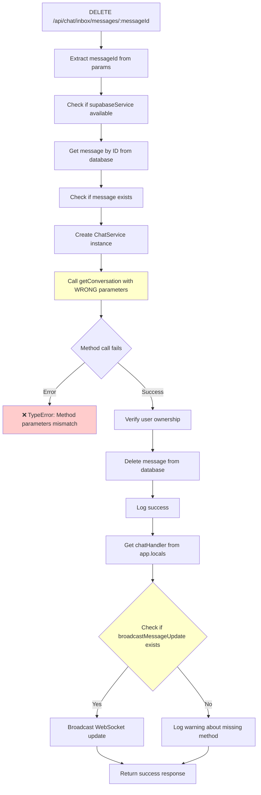

# Message Deletion Flow Diagnostic

## Current Flow Analysis



## Issues Identified

### Issue 1: Parameter Order Mismatch in getConversation
**Location**: `server/routes/chatInboxRoutes.js:1632`
**Current Call**: `chatService.getConversation(req.userToken, message.conversation_id)`
**Expected Signature**: `getConversation(userId, conversationId, token = null)`
**Problem**: Parameters are in wrong order - userToken should be userId, conversationId should be second parameter

### Issue 2: Similar Issue in deleteConversation
**Location**: `server/routes/chatInboxRoutes.js:246`
**Current Call**: `chatService.deleteConversation(req.userToken, id)`
**Expected Signature**: `deleteConversation(userId, conversationId, token = null)`
**Problem**: Same parameter order issue

### Issue 3: Missing broadcastMessageDeleted Method
**Location**: Error logs show calls to `chatHandler.broadcastMessageDeleted`
**Problem**: Method doesn't exist, should use `broadcastMessageUpdate` instead

## Root Causes

1. **Method Signature Confusion**: The ChatService methods expect `(userId, conversationId, token)` but are being called with `(userToken, conversationId)`
2. **Inconsistent WebSocket Method Names**: Code tries to call `broadcastMessageDeleted` which doesn't exist
3. **Parameter Mapping Issue**: `req.userToken` is being passed as `userId` but should be passed as `token` parameter

## Proposed Solutions

### Solution 1: Fix Parameter Order (High Priority)
```javascript
// Current (WRONG):
const conversation = await chatService.getConversation(req.userToken, message.conversation_id)

// Fixed (CORRECT):
const conversation = await chatService.getConversation(req.userToken, message.conversation_id, req.userToken)
```

### Solution 2: Fix deleteConversation Call
```javascript
// Current (WRONG):
await chatService.deleteConversation(req.userToken, id)

// Fixed (CORRECT):
await chatService.deleteConversation(req.userToken, id, req.userToken)
```

### Solution 3: Ensure Consistent WebSocket Method Usage
- Always use `broadcastMessageUpdate` instead of `broadcastMessageDeleted`
- The current code already does this correctly in the message deletion route

## Impact Assessment

- **Severity**: High - Message deletion completely fails
- **Scope**: Affects both individual message deletion and conversation deletion
- **User Impact**: Users cannot delete messages or conversations
- **Data Integrity**: No data corruption, but operations fail silently or with errors

## Testing Strategy

1. Test message deletion with valid messageId
2. Test conversation deletion with valid conversationId  
3. Verify WebSocket broadcasts work correctly
4. Test with invalid/unauthorized access attempts
5. Verify error handling and logging