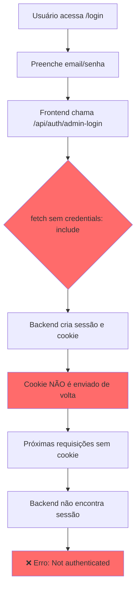
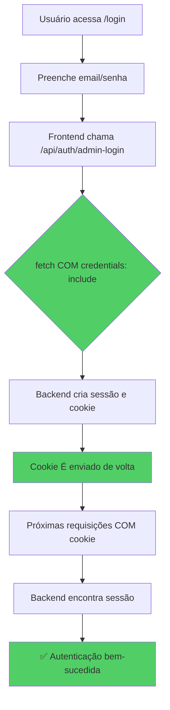

# Relatório de Correção: Autenticação de Sessão

## Problema Identificado

O sistema estava apresentando erros de autenticação após o login, com mensagens como:
- "Dashboard stats access denied - Not authenticated as admin"
- "User authentication failed - Corrupted session detected"

## Diagnóstico

### Fluxo do Problema



### Causa Raiz

O problema estava em três arquivos do frontend que faziam chamadas `fetch` sem a opção `credentials: 'include'`:

1. **`src/services/auth-service.ts`** - Função `loginAdmin()`
2. **`src/contexts/AuthContext.tsx`** - Função `checkAuth()`
3. **`src/lib/phone-utils.ts`** - Chamadas para CSRF token e verificação de contato

Sem `credentials: 'include'`, o navegador não envia os cookies de sessão nas requisições, fazendo com que o backend não consiga identificar o usuário autenticado.

## Solução Aplicada

### Fluxo Corrigido



### Arquivos Modificados

#### 1. `src/services/auth-service.ts`
```typescript
// ANTES
const response = await fetch('/api/auth/admin-login', {
  method: 'POST',
  headers: { 'Content-Type': 'application/json' },
  body: JSON.stringify({ email, password }),
});

// DEPOIS
const response = await fetch('/api/auth/admin-login', {
  method: 'POST',
  headers: { 'Content-Type': 'application/json' },
  credentials: 'include',  // ← ADICIONADO
  body: JSON.stringify({ email, password }),
});
```

#### 2. `src/contexts/AuthContext.tsx`
```typescript
// ANTES
const response = await fetch('/api/auth/status?t=' + Date.now());

// DEPOIS
const response = await fetch('/api/auth/status?t=' + Date.now(), {
  credentials: 'include'  // ← ADICIONADO
});
```

#### 3. `src/lib/phone-utils.ts`
```typescript
// ANTES
const csrfResponse = await fetch('/api/auth/csrf-token');
const response = await fetch('/api/chat/check', { ... });

// DEPOIS
const csrfResponse = await fetch('/api/auth/csrf-token', {
  credentials: 'include'  // ← ADICIONADO
});
const response = await fetch('/api/chat/check', {
  ...,
  credentials: 'include'  // ← ADICIONADO
});
```

## Verificação

Após as correções, o fluxo de autenticação funciona corretamente:

```bash
# Login bem-sucedido
curl -c cookies.txt -b cookies.txt http://localhost:8080/api/auth/admin-login \
  -X POST -H "Content-Type: application/json" \
  -d '{"email":"cortexx4@cortexx.com","password":"Admin@123456"}'
# Retorna: {"success":true,"user":{...}}

# Verificação de status com sessão
curl -c cookies.txt -b cookies.txt http://localhost:8080/api/auth/status
# Retorna: {"authenticated":true,"user":{...}}

# Acesso ao dashboard
curl -c cookies.txt -b cookies.txt http://localhost:8080/api/admin/dashboard-stats
# Retorna: {"success":true,"data":{...}}
```

## Recomendações

1. **Padrão de Código**: Sempre usar `credentials: 'include'` em todas as chamadas `fetch` que precisam de autenticação por sessão.

2. **Revisão de Código**: Verificar outros arquivos que fazem chamadas `fetch` para garantir que estão usando `credentials: 'include'`.

3. **Testes**: Adicionar testes de integração que verifiquem o fluxo completo de autenticação.

## Data da Correção

22 de Dezembro de 2025
