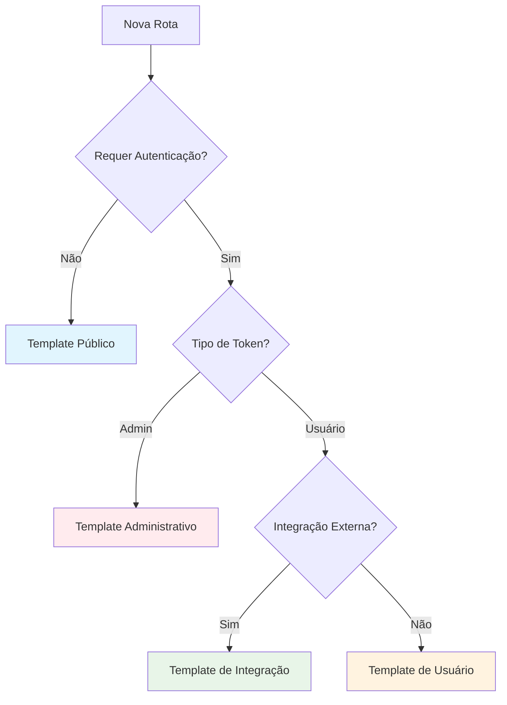

# 🛠️ Guia de Templates para Novos Endpoints - Backend

## Visão Geral

Este guia fornece templates prontos para uso e exemplos práticos para implementar novos endpoints no WUZAPI Manager. Os templates seguem os padrões estabelecidos e incluem todas as melhores práticas de validação, logging, tratamento de erros e documentação.

## 📋 Índice

- [Templates Disponíveis](#templates-disponíveis)
- [Como Usar os Templates](#como-usar-os-templates)
- [Exemplos Práticos](#exemplos-práticos)
- [Checklist de Implementação](#checklist-de-implementação)
- [Padrões de Nomenclatura](#padrões-de-nomenclatura)
- [Integração com o Servidor](#integração-com-o-servidor)
- [Validações Customizadas](#validações-customizadas)
- [Troubleshooting](#troubleshooting)

## Templates Disponíveis

### 1. 🔐 Template Administrativo
**Arquivo**: `templates/backend/adminRouteTemplate.js`  
**Uso**: Rotas que requerem token administrativo  
**Exemplos**: Gerenciamento de usuários, configurações do sistema, relatórios

### 2. 👤 Template de Usuário
**Arquivo**: `templates/backend/userRouteTemplate.js`  
**Uso**: Rotas para usuários autenticados  
**Exemplos**: Mensagens, configurações pessoais, dados do usuário

### 3. 🔗 Template de Integração
**Arquivo**: `templates/backend/integrationRouteTemplate.js`  
**Uso**: Rotas que fazem integração com serviços externos  
**Exemplos**: WUZAPI, NocoDB, APIs terceiras

### 4. 🌐 Template Público
**Arquivo**: `templates/backend/publicRouteTemplate.js`  
**Uso**: Rotas públicas sem autenticação  
**Exemplos**: Health checks, status, informações do sistema

## Como Usar os Templates

### Passo 1: Escolher o Template Apropriado



### Passo 2: Copiar e Personalizar

1. **Copie o template** para `server/routes/[domain]Routes.js`
2. **Substitua os placeholders** pelos valores específicos
3. **Implemente a lógica** específica da sua rota
4. **Teste** a implementação
5. **Integre** com o servidor principal

### Passo 3: Placeholders Obrigatórios

Todos os templates usam placeholders no formato `[PLACEHOLDER]` que devem ser substituídos:

| Placeholder | Descrição | Exemplo |
|-------------|-----------|---------|
| `[OPERATION_DESCRIPTION]` | Descrição da operação | "Listar mensagens do usuário" |
| `[HTTP_METHOD]` | Método HTTP | "GET", "POST", "PUT", "DELETE" |
| `[HTTP_METHOD_LOWERCASE]` | Método em minúsculo | "get", "post", "put", "delete" |
| `[ENDPOINT]` | Endpoint da rota | "messages", "send", "config" |
| `[OPERATION_NAME]` | Nome para logs | "listagem de mensagens" |
| `[SUCCESS_STATUS_CODE]` | Código de sucesso | "200", "201" |
| `[SUCCESS_MESSAGE]` | Mensagem de sucesso | "Mensagens listadas com sucesso" |

## Exemplos Práticos

### 1. Implementando Rota de Listagem de Mensagens

**Objetivo**: Criar endpoint para listar mensagens do usuário com paginação

**Template**: `userRouteTemplate.js`

**Implementação**:

```javascript
// server/routes/messagesRoutes.js
const express = require('express');
const sessionValidator = require('../validators/sessionValidator');
const errorHandler = require('../middleware/errorHandler');
const logger = require('../utils/logger');

const router = express.Router();

/**
 * Listar mensagens do usuário
 * GET /api/messages/list
 * 
 * Headers necessários:
 * - token: {user_token}
 * 
 * Query parameters opcionais:
 * - limit: number (1-100) - limite de mensagens por página
 * - offset: number - offset para paginação
 * - from: string - filtrar por remetente
 * - type: string - filtrar por tipo (text, media, etc.)
 * 
 * Responses:
 * - 200: Lista de mensagens retornada com sucesso
 * - 400: Parâmetros inválidos ou token mal formatado
 * - 401: Token inválido ou expirado
 * - 500: Erro interno do servidor
 */
router.get('/list',
  errorHandler.validateTokenFormat.bind(errorHandler),
  
  async (req, res) => {
    const startTime = Date.now();
    
    try {
      const token = req.headers.token;
      const { limit = 50, offset = 0, from, type } = req.query;
      
      // Validação de parâmetros
      const limitNum = parseInt(limit);
      const offsetNum = parseInt(offset);
      
      if (isNaN(limitNum) || limitNum < 1 || limitNum > 100) {
        return res.status(400).json({
          success: false,
          error: 'Limite deve ser um número entre 1 e 100',
          code: 400,
          timestamp: new Date().toISOString()
        });
      }
      
      if (isNaN(offsetNum) || offsetNum < 0) {
        return res.status(400).json({
          success: false,
          error: 'Offset deve ser um número não negativo',
          code: 400,
          timestamp: new Date().toISOString()
        });
      }

      // Validar formato do token
      if (!sessionValidator.isValidTokenFormat(token)) {
        logger.warn('Token com formato inválido em listagem de mensagens', {
          url: req.url,
          method: req.method,
          token_length: token ? token.length : 0,
          user_agent: req.get('User-Agent'),
          ip: req.ip
        });
        
        return res.status(400).json({
          success: false,
          error: 'Formato de token inválido',
          code: 400,
          timestamp: new Date().toISOString()
        });
      }

      // Validar token na WUZAPI
      const validationResult = await sessionValidator.validateUserToken(token);
      if (!validationResult.isValid) {
        return errorHandler.handleValidationError(validationResult, req, res);
      }

      logger.info('Iniciando listagem de mensagens', {
        url: req.url,
        method: req.method,
        limit: limitNum,
        offset: offsetNum,
        has_from_filter: !!from,
        has_type_filter: !!type,
        user_agent: req.get('User-Agent'),
        ip: req.ip
      });

      // Buscar mensagens do banco de dados
      const db = req.app.locals.db;
      const messages = await db.getUserMessages(token, {
        limit: limitNum,
        offset: offsetNum,
        from: from,
        type: type
      });
      
      const totalCount = await db.getUserMessagesCount(token, { from, type });
      
      const result = {
        messages: messages,
        pagination: {
          limit: limitNum,
          offset: offsetNum,
          total: totalCount,
          has_more: offsetNum + limitNum < totalCount
        },
        filters: {
          from: from || null,
          type: type || null
        }
      };
      
      const responseTime = Date.now() - startTime;
      
      logger.info('Listagem de mensagens realizada com sucesso', {
        url: req.url,
        method: req.method,
        response_time_ms: responseTime,
        messages_count: messages.length,
        total_count: totalCount,
        user_agent: req.get('User-Agent'),
        ip: req.ip
      });

      return res.status(200).json({
        success: true,
        code: 200,
        data: result,
        message: 'Mensagens listadas com sucesso',
        timestamp: new Date().toISOString()
      });
      
    } catch (error) {
      const responseTime = Date.now() - startTime;
      
      logger.error('Erro interno na listagem de mensagens', {
        url: req.url,
        method: req.method,
        response_time_ms: responseTime,
        error_message: error.message,
        error_stack: error.stack,
        user_agent: req.get('User-Agent'),
        ip: req.ip
      });

      return res.status(500).json({
        success: false,
        error: 'Erro interno na listagem de mensagens',
        code: 500,
        timestamp: new Date().toISOString()
      });
    }
  }
);

module.exports = router;
```

**Integração no servidor**:
```javascript
// server/index.js
app.use('/api/messages', require('./routes/messagesRoutes'));
```

### 2. Implementando Rota Administrativa de Criação

**Objetivo**: Criar endpoint para administradores criarem novos usuários

**Template**: `adminRouteTemplate.js`

**Implementação**:

```javascript
// server/routes/adminUsersRoutes.js
const express = require('express');
const adminValidator = require('../validators/adminValidator');
const errorHandler = require('../middleware/errorHandler');
const logger = require('../utils/logger');

const router = express.Router();

/**
 * Criar novo usuário no sistema
 * POST /api/admin/users/create
 * 
 * Headers necessários:
 * - Authorization: {admin_token}
 * 
 * Body:
 * - name: string (obrigatório) - Nome da instância
 * - token: string (obrigatório) - Token único do usuário
 * - webhook: string (opcional) - URL do webhook
 * - events: array (opcional) - Lista de eventos para webhook
 * 
 * Responses:
 * - 201: Usuário criado com sucesso
 * - 400: Dados inválidos ou token mal formatado
 * - 401: Token administrativo inválido ou expirado
 * - 403: Token não possui permissões administrativas
 * - 409: Usuário com este token já existe
 * - 500: Erro interno do servidor
 * - 502: Erro na comunicação com WUZAPI
 */
router.post('/create',
  errorHandler.validateAdminTokenFormat.bind(errorHandler),
  
  async (req, res) => {
    const startTime = Date.now();
    
    try {
      const token = req.headers.authorization;
      const userData = req.body;
      
      // Validação básica dos dados
      if (!userData || typeof userData !== 'object') {
        return res.status(400).json({
          success: false,
          error: 'Dados do usuário são obrigatórios',
          code: 400,
          timestamp: new Date().toISOString()
        });
      }
      
      if (!userData.name || !userData.token) {
        return res.status(400).json({
          success: false,
          error: 'Nome e token são obrigatórios',
          code: 400,
          timestamp: new Date().toISOString()
        });
      }
      
      // Validar formato do webhook se fornecido
      if (userData.webhook) {
        try {
          new URL(userData.webhook);
        } catch {
          return res.status(400).json({
            success: false,
            error: 'URL do webhook inválida',
            code: 400,
            timestamp: new Date().toISOString()
          });
        }
      }

      // Validar formato do token administrativo
      if (!adminValidator.isValidTokenFormat(token)) {
        logger.warn('Token administrativo com formato inválido na criação de usuário', {
          url: req.url,
          method: req.method,
          token_length: token ? token.length : 0,
          user_agent: req.get('User-Agent'),
          ip: req.ip
        });
        
        return res.status(400).json({
          success: false,
          error: 'Formato de token administrativo inválido',
          code: 400,
          timestamp: new Date().toISOString()
        });
      }

      // Validar token administrativo na WUZAPI
      const validationResult = await adminValidator.validateAdminToken(token);
      if (!validationResult.isValid) {
        return errorHandler.handleValidationError(validationResult, req, res);
      }

      logger.info('Iniciando criação de usuário', {
        url: req.url,
        method: req.method,
        user_name: userData.name,
        user_token_prefix: userData.token.substring(0, 8) + '...',
        has_webhook: !!userData.webhook,
        events_count: userData.events ? userData.events.length : 0,
        user_agent: req.get('User-Agent'),
        ip: req.ip
      });

      // Criar usuário via WUZAPI
      const wuzapiClient = require('../utils/wuzapiClient');
      const createResult = await wuzapiClient.createUser(userData, token);
      
      const responseTime = Date.now() - startTime;

      if (createResult.success) {
        logger.info('Usuário criado com sucesso', {
          url: req.url,
          method: req.method,
          response_time_ms: responseTime,
          user_name: userData.name,
          wuzapi_status: createResult.status,
          user_agent: req.get('User-Agent'),
          ip: req.ip
        });

        return res.status(201).json({
          success: true,
          code: 201,
          data: createResult.data,
          message: 'Usuário criado com sucesso',
          timestamp: new Date().toISOString()
        });
      } else {
        // Tratar erros da WUZAPI
        let statusCode = 502;
        let errorMessage = 'Erro na comunicação com WUZAPI';

        if (createResult.status === 409) {
          statusCode = 409;
          errorMessage = 'Usuário com este token já existe';
        } else if (createResult.status === 400) {
          statusCode = 400;
          errorMessage = 'Dados de usuário inválidos';
        }

        logger.error('Erro na criação de usuário via WUZAPI', {
          url: req.url,
          method: req.method,
          response_time_ms: responseTime,
          wuzapi_status: createResult.status,
          wuzapi_error: createResult.error,
          user_agent: req.get('User-Agent'),
          ip: req.ip
        });

        return res.status(statusCode).json({
          success: false,
          error: errorMessage,
          code: statusCode,
          details: createResult.error,
          timestamp: new Date().toISOString()
        });
      }
      
    } catch (error) {
      const responseTime = Date.now() - startTime;
      
      logger.error('Erro interno na criação de usuário', {
        url: req.url,
        method: req.method,
        response_time_ms: responseTime,
        error_message: error.message,
        error_stack: error.stack,
        user_agent: req.get('User-Agent'),
        ip: req.ip
      });

      return res.status(500).json({
        success: false,
        error: 'Erro interno na criação de usuário',
        code: 500,
        timestamp: new Date().toISOString()
      });
    }
  }
);

module.exports = router;
```

### 3. Implementando Rota de Integração com NocoDB

**Objetivo**: Criar endpoint para buscar dados de uma tabela NocoDB

**Template**: `integrationRouteTemplate.js`

**Implementação**:

```javascript
// server/routes/nocodbRoutes.js
const express = require('express');
const sessionValidator = require('../validators/sessionValidator');
const errorHandler = require('../middleware/errorHandler');
const logger = require('../utils/logger');

const router = express.Router();

/**
 * Buscar dados de tabela NocoDB
 * GET /api/nocodb/table-data/:connectionId
 * 
 * Headers necessários:
 * - token: {user_token}
 * 
 * Query parameters opcionais:
 * - limit: number (1-100) - limite de registros
 * - offset: number - offset para paginação
 * - where: string - filtros WHERE em formato JSON
 * 
 * Responses:
 * - 200: Dados da tabela retornados com sucesso
 * - 400: Parâmetros inválidos ou token mal formatado
 * - 401: Token inválido ou expirado
 * - 404: Conexão não encontrada
 * - 500: Erro interno do servidor
 * - 502: Erro na comunicação com NocoDB
 * - 504: Timeout na comunicação com NocoDB
 */
router.get('/table-data/:connectionId',
  errorHandler.validateTokenFormat.bind(errorHandler),
  
  async (req, res) => {
    const startTime = Date.now();
    
    try {
      const token = req.headers.token;
      const { connectionId } = req.params;
      const { limit = 25, offset = 0, where } = req.query;
      
      // Validação de parâmetros
      if (!connectionId || isNaN(parseInt(connectionId))) {
        return res.status(400).json({
          success: false,
          error: 'ID da conexão deve ser um número válido',
          code: 400,
          timestamp: new Date().toISOString()
        });
      }
      
      const limitNum = parseInt(limit);
      const offsetNum = parseInt(offset);
      
      if (isNaN(limitNum) || limitNum < 1 || limitNum > 100) {
        return res.status(400).json({
          success: false,
          error: 'Limite deve ser um número entre 1 e 100',
          code: 400,
          timestamp: new Date().toISOString()
        });
      }
      
      // Validar filtros WHERE se fornecidos
      let whereClause = null;
      if (where) {
        try {
          whereClause = JSON.parse(where);
        } catch {
          return res.status(400).json({
            success: false,
            error: 'Filtros WHERE devem estar em formato JSON válido',
            code: 400,
            timestamp: new Date().toISOString()
          });
        }
      }

      // Validar formato do token
      if (!sessionValidator.isValidTokenFormat(token)) {
        logger.warn('Token com formato inválido em integração NocoDB', {
          url: req.url,
          method: req.method,
          integration: 'NocoDB',
          operation: 'busca de dados da tabela',
          connection_id: connectionId,
          token_length: token ? token.length : 0,
          user_agent: req.get('User-Agent'),
          ip: req.ip
        });
        
        return res.status(400).json({
          success: false,
          error: 'Formato de token inválido',
          code: 400,
          timestamp: new Date().toISOString()
        });
      }

      // Validar token na WUZAPI
      const validationResult = await sessionValidator.validateUserToken(token);
      if (!validationResult.isValid) {
        return errorHandler.handleValidationError(validationResult, req, res);
      }

      logger.info('Iniciando integração NocoDB - busca de dados da tabela', {
        url: req.url,
        method: req.method,
        integration: 'NocoDB',
        operation: 'busca de dados da tabela',
        connection_id: connectionId,
        limit: limitNum,
        offset: offsetNum,
        has_where_clause: !!whereClause,
        user_agent: req.get('User-Agent'),
        ip: req.ip
      });

      // Buscar configuração da conexão
      const db = req.app.locals.db;
      const connection = await db.getConnectionById(parseInt(connectionId));
      
      if (!connection) {
        return res.status(404).json({
          success: false,
          error: 'Conexão não encontrada',
          code: 404,
          timestamp: new Date().toISOString()
        });
      }
      
      if (connection.type !== 'NOCODB') {
        return res.status(400).json({
          success: false,
          error: 'Conexão não é do tipo NocoDB',
          code: 400,
          timestamp: new Date().toISOString()
        });
      }

      // Verificar se usuário tem acesso à conexão
      const assignedUsers = JSON.parse(connection.assigned_users || '[]');
      if (!assignedUsers.includes(token)) {
        return res.status(403).json({
          success: false,
          error: 'Usuário não tem acesso a esta conexão',
          code: 403,
          timestamp: new Date().toISOString()
        });
      }

      // Buscar dados via NocoDB
      const integrationResult = await db.getNocoDBTableData(connection, token, {
        limit: limitNum,
        offset: offsetNum,
        where: whereClause
      });
      
      const responseTime = Date.now() - startTime;

      if (integrationResult.success) {
        logger.info('Integração NocoDB - busca de dados da tabela realizada com sucesso', {
          url: req.url,
          method: req.method,
          integration: 'NocoDB',
          operation: 'busca de dados da tabela',
          response_time_ms: responseTime,
          connection_id: connectionId,
          records_count: integrationResult.records.length,
          user_agent: req.get('User-Agent'),
          ip: req.ip
        });

        return res.status(200).json({
          success: true,
          code: 200,
          data: {
            records: integrationResult.records,
            pagination: {
              limit: limitNum,
              offset: offsetNum,
              total: integrationResult.total || integrationResult.records.length
            },
            connection: {
              id: connection.id,
              name: connection.name,
              table_name: connection.table_name
            }
          },
          message: 'Dados da tabela NocoDB obtidos com sucesso',
          integration: 'NocoDB',
          timestamp: new Date().toISOString()
        });
      } else {
        // Tratar erros da integração NocoDB
        let statusCode = 502;
        let errorMessage = 'Erro na comunicação com NocoDB';

        if (integrationResult.status === 401) {
          statusCode = 401;
          errorMessage = 'Token NocoDB inválido';
        } else if (integrationResult.status === 404) {
          statusCode = 404;
          errorMessage = 'Tabela não encontrada no NocoDB';
        } else if (integrationResult.code === 'TIMEOUT') {
          statusCode = 504;
          errorMessage = 'Timeout na comunicação com NocoDB';
        }

        logger.error('Erro na integração NocoDB - busca de dados da tabela', {
          url: req.url,
          method: req.method,
          integration: 'NocoDB',
          operation: 'busca de dados da tabela',
          response_time_ms: responseTime,
          connection_id: connectionId,
          nocodb_status: integrationResult.status,
          nocodb_error: integrationResult.error,
          user_agent: req.get('User-Agent'),
          ip: req.ip
        });

        return res.status(statusCode).json({
          success: false,
          error: errorMessage,
          code: statusCode,
          details: integrationResult.error,
          integration: 'NocoDB',
          timestamp: new Date().toISOString()
        });
      }
      
    } catch (error) {
      const responseTime = Date.now() - startTime;
      
      if (error.code === 'ECONNABORTED') {
        logger.error('Timeout na integração NocoDB - busca de dados da tabela', {
          url: req.url,
          method: req.method,
          integration: 'NocoDB',
          operation: 'busca de dados da tabela',
          response_time_ms: responseTime,
          connection_id: req.params.connectionId,
          user_agent: req.get('User-Agent'),
          ip: req.ip
        });
        
        return res.status(504).json({
          success: false,
          error: 'Timeout na comunicação com NocoDB',
          code: 504,
          integration: 'NocoDB',
          timestamp: new Date().toISOString()
        });
      }
      
      logger.error('Erro interno na integração NocoDB - busca de dados da tabela', {
        url: req.url,
        method: req.method,
        integration: 'NocoDB',
        operation: 'busca de dados da tabela',
        response_time_ms: responseTime,
        connection_id: req.params.connectionId,
        error_message: error.message,
        error_stack: error.stack,
        user_agent: req.get('User-Agent'),
        ip: req.ip
      });

      return res.status(500).json({
        success: false,
        error: 'Erro interno na integração com NocoDB',
        code: 500,
        integration: 'NocoDB',
        timestamp: new Date().toISOString()
      });
    }
  }
);

module.exports = router;
```

### 4. Implementando Health Check Customizado

**Objetivo**: Criar endpoint de health check específico para um serviço

**Template**: `publicRouteTemplate.js`

**Implementação**:

```javascript
// server/routes/healthRoutes.js
const express = require('express');
const logger = require('../utils/logger');

const router = express.Router();

/**
 * Verificar saúde completa do sistema
 * GET /health
 * 
 * Não requer autenticação
 * 
 * Query parameters opcionais:
 * - detailed: boolean - incluir informações detalhadas
 * - services: string - lista de serviços para verificar (comma-separated)
 * 
 * Responses:
 * - 200: Sistema saudável
 * - 503: Sistema com problemas
 * - 500: Erro interno do servidor
 */
router.get('/', async (req, res) => {
  const startTime = Date.now();
  
  try {
    const { detailed = 'false', services } = req.query;
    const includeDetailed = detailed === 'true';
    const servicesToCheck = services ? services.split(',') : ['database', 'wuzapi', 'filesystem'];
    
    logger.info('Iniciando verificação de saúde do sistema', {
      url: req.url,
      method: req.method,
      include_detailed: includeDetailed,
      services_to_check: servicesToCheck,
      user_agent: req.get('User-Agent'),
      ip: req.ip
    });

    // Realizar verificações de saúde
    const healthData = await performHealthChecks(servicesToCheck, includeDetailed);
    
    const systemInfo = {
      service: 'wuzapi-manager',
      version: process.env.npm_package_version || '1.0.0',
      status: healthData.status,
      timestamp: new Date().toISOString(),
      uptime: Math.round(process.uptime()),
      environment: process.env.NODE_ENV || 'development'
    };
    
    const result = {
      ...systemInfo,
      checks: healthData.checks
    };
    
    if (includeDetailed) {
      result.system = {
        memory: process.memoryUsage(),
        cpu_usage: process.cpuUsage(),
        platform: process.platform,
        node_version: process.version
      };
    }
    
    const responseTime = Date.now() - startTime;
    
    // Determinar status code baseado na saúde dos serviços
    const isHealthy = healthData.status === 'healthy';
    const statusCode = isHealthy ? 200 : 503;
    
    logger.info('Verificação de saúde do sistema realizada com sucesso', {
      url: req.url,
      method: req.method,
      response_time_ms: responseTime,
      overall_status: healthData.status,
      healthy_services: Object.values(healthData.checks).filter(c => c.status === 'healthy').length,
      total_services: Object.keys(healthData.checks).length,
      user_agent: req.get('User-Agent'),
      ip: req.ip
    });

    return res.status(statusCode).json({
      success: isHealthy,
      code: statusCode,
      data: result,
      timestamp: new Date().toISOString()
    });
    
  } catch (error) {
    const responseTime = Date.now() - startTime;
    
    logger.error('Erro na verificação de saúde do sistema', {
      url: req.url,
      method: req.method,
      response_time_ms: responseTime,
      error_message: error.message,
      error_stack: error.stack,
      user_agent: req.get('User-Agent'),
      ip: req.ip
    });

    return res.status(500).json({
      success: false,
      error: 'Erro interno na verificação de saúde do sistema',
      code: 500,
      timestamp: new Date().toISOString()
    });
  }
});

/**
 * Função auxiliar para verificar saúde dos serviços
 */
async function performHealthChecks(servicesToCheck, includeDetailed) {
  const health = {
    status: 'healthy',
    checks: {}
  };
  
  try {
    // Verificar banco de dados
    if (servicesToCheck.includes('database')) {
      try {
        const Database = require('../database');
        const db = new Database();
        await db.ensureInitialized();
        
        const dbStats = await db.getDatabaseStats();
        
        health.checks.database = {
          status: 'healthy',
          response_time: Date.now() - Date.now(), // Placeholder para tempo real
          file_size_mb: dbStats.file?.size_mb || 0,
          total_records: dbStats.records?.total_connections || 0
        };
        
        if (includeDetailed) {
          health.checks.database.details = {
            wal_mode: dbStats.sqlite?.wal_mode || 'unknown',
            cache_size: dbStats.sqlite?.cache_size || 'unknown',
            page_size: dbStats.sqlite?.page_size || 'unknown'
          };
        }
        
      } catch (error) {
        health.checks.database = {
          status: 'unhealthy',
          error: error.message
        };
        health.status = 'degraded';
      }
    }
    
    // Verificar WUZAPI
    if (servicesToCheck.includes('wuzapi')) {
      try {
        const wuzapiClient = require('../utils/wuzapiClient');
        const wuzapiHealthy = await wuzapiClient.isHealthy();
        const wuzapiConfig = wuzapiClient.getConfig();
        
        health.checks.wuzapi = {
          status: wuzapiHealthy ? 'healthy' : 'unhealthy',
          base_url: wuzapiConfig.baseURL,
          timeout: wuzapiConfig.timeout
        };
        
        if (!wuzapiHealthy) {
          health.status = 'degraded';
        }
        
      } catch (error) {
        health.checks.wuzapi = {
          status: 'unhealthy',
          error: error.message
        };
        health.status = 'degraded';
      }
    }
    
    // Verificar sistema de arquivos
    if (servicesToCheck.includes('filesystem')) {
      try {
        const fs = require('fs');
        const dbPath = process.env.SQLITE_DB_PATH || './wuzapi.db';
        
        fs.accessSync(dbPath, fs.constants.R_OK | fs.constants.W_OK);
        
        const stats = fs.statSync(dbPath);
        
        health.checks.filesystem = {
          status: 'healthy',
          db_path: dbPath,
          db_size_mb: Math.round(stats.size / 1024 / 1024 * 100) / 100,
          last_modified: stats.mtime.toISOString()
        };
        
      } catch (error) {
        health.checks.filesystem = {
          status: 'unhealthy',
          error: error.message
        };
        health.status = 'degraded';
      }
    }
    
  } catch (error) {
    health.status = 'unhealthy';
    health.error = error.message;
  }
  
  return health;
}

module.exports = router;
```

## Checklist de Implementação

### ✅ Antes de Começar
- [ ] Definir o tipo de endpoint (admin, usuário, integração, público)
- [ ] Escolher o template apropriado
- [ ] Definir método HTTP e endpoint
- [ ] Mapear parâmetros de entrada e saída
- [ ] Identificar validações necessárias

### ✅ Durante a Implementação
- [ ] Copiar template para local correto
- [ ] Substituir todos os placeholders obrigatórios
- [ ] Implementar validações específicas
- [ ] Implementar lógica de negócio
- [ ] Adicionar tratamento de erros específicos
- [ ] Configurar logging adequado

### ✅ Após a Implementação
- [ ] Testar todos os cenários (sucesso e erro)
- [ ] Validar logs gerados
- [ ] Integrar com servidor principal
- [ ] Documentar endpoint na API docs
- [ ] Escrever testes automatizados
- [ ] Revisar performance

## Padrões de Nomenclatura

### Arquivos de Rota
```
server/routes/[domain]Routes.js
```
**Exemplos**:
- `messagesRoutes.js` - Rotas de mensagens
- `webhookRoutes.js` - Rotas de webhook
- `adminUsersRoutes.js` - Rotas administrativas de usuários
- `nocodbRoutes.js` - Rotas de integração NocoDB

### Endpoints
```
/api/[domain]/[action]
/api/admin/[domain]/[action]
/api/[integration]/[action]
```
**Exemplos**:
- `/api/messages/list` - Listar mensagens
- `/api/webhook/config` - Configurar webhook
- `/api/admin/users/create` - Criar usuário (admin)
- `/api/nocodb/table-data` - Dados de tabela NocoDB

### Métodos e Operações
| Operação | Método HTTP | Padrão de Endpoint |
|----------|-------------|-------------------|
| Listar | GET | `/api/domain/list` |
| Buscar específico | GET | `/api/domain/:id` |
| Criar | POST | `/api/domain/create` |
| Atualizar | PUT | `/api/domain/:id` |
| Atualizar parcial | PATCH | `/api/domain/:id` |
| Deletar | DELETE | `/api/domain/:id` |
| Ações específicas | POST | `/api/domain/action-name` |

## Integração com o Servidor

### 1. Registrar Rotas no Servidor Principal

```javascript
// server/index.js

// Rotas públicas
app.use('/health', require('./routes/healthRoutes'));
app.use('/api/public', require('./routes/publicRoutes'));

// Rotas de usuário
app.use('/api/messages', require('./routes/messagesRoutes'));
app.use('/api/webhook', require('./routes/webhookRoutes'));
app.use('/api/settings', require('./routes/settingsRoutes'));

// Rotas administrativas
app.use('/api/admin/users', require('./routes/adminUsersRoutes'));
app.use('/api/admin/system', require('./routes/adminSystemRoutes'));
app.use('/api/admin/branding', require('./routes/brandingRoutes'));

// Rotas de integração
app.use('/api/wuzapi', require('./routes/wuzapiRoutes'));
app.use('/api/nocodb', require('./routes/nocodbRoutes'));
app.use('/api/external', require('./routes/externalRoutes'));
```

### 2. Ordem de Middlewares Globais

```javascript
// server/index.js

// 1. Middlewares básicos
app.use(corsHandler.createCorsMiddleware());
app.use(bodyParser.json({ limit: '10mb' }));
app.use(bodyParser.urlencoded({ extended: true, limit: '10mb' }));

// 2. Middlewares de logging (opcional)
app.use(errorHandler.logRequest.bind(errorHandler));

// 3. Rotas específicas
app.use('/health', require('./routes/healthRoutes'));
// ... outras rotas

// 4. Middleware de erro 404
app.use(errorHandler.handleNotFound.bind(errorHandler));

// 5. Middleware de tratamento de erros
app.use(errorHandler.handleError.bind(errorHandler));
```

## Validações Customizadas

### 1. Validação de Dados Complexos

```javascript
// Exemplo: validação de configuração de webhook
function validateWebhookConfig(config) {
  const errors = [];
  
  // Validar URL
  if (!config.url) {
    errors.push('URL do webhook é obrigatória');
  } else {
    try {
      const url = new URL(config.url);
      if (!['http:', 'https:'].includes(url.protocol)) {
        errors.push('URL deve usar protocolo HTTP ou HTTPS');
      }
    } catch {
      errors.push('URL do webhook inválida');
    }
  }
  
  // Validar eventos
  if (!config.events || !Array.isArray(config.events)) {
    errors.push('Lista de eventos é obrigatória');
  } else if (config.events.length === 0) {
    errors.push('Pelo menos um evento deve ser selecionado');
  } else {
    const validEvents = [
      'message.received', 'message.sent', 'message.delivered',
      'message.read', 'contact.added', 'group.created'
    ];
    
    const invalidEvents = config.events.filter(event => 
      !validEvents.includes(event)
    );
    
    if (invalidEvents.length > 0) {
      errors.push(`Eventos inválidos: ${invalidEvents.join(', ')}`);
    }
  }
  
  if (errors.length > 0) {
    throw new Error(`Configuração de webhook inválida: ${errors.join(', ')}`);
  }
  
  return true;
}
```

### 2. Middleware de Validação Customizado

```javascript
// middleware/customValidation.js
const createValidationMiddleware = (validationFn) => {
  return (req, res, next) => {
    try {
      validationFn(req.body, req.query, req.params);
      next();
    } catch (error) {
      logger.warn('Validação customizada falhou', {
        url: req.url,
        method: req.method,
        error_message: error.message,
        user_agent: req.get('User-Agent'),
        ip: req.ip
      });
      
      return res.status(400).json({
        success: false,
        error: error.message,
        code: 400,
        timestamp: new Date().toISOString()
      });
    }
  };
};

// Uso no endpoint
router.post('/webhook/config',
  errorHandler.validateTokenFormat.bind(errorHandler),
  createValidationMiddleware(validateWebhookConfig),
  async (req, res) => {
    // Implementação da rota
  }
);
```

## Troubleshooting

### Problemas Comuns

#### 1. Placeholder não substituído
**Erro**: `[PLACEHOLDER] is not defined`  
**Solução**: Verificar se todos os placeholders foram substituídos pelos valores corretos

#### 2. Middleware não encontrado
**Erro**: `Cannot read property 'bind' of undefined`  
**Solução**: Verificar se os imports dos middlewares estão corretos

#### 3. Rota não registrada
**Erro**: `Cannot GET /api/endpoint`  
**Solução**: Verificar se a rota foi registrada no servidor principal

#### 4. Token validation falha
**Erro**: Token sempre inválido  
**Solução**: Verificar se o header correto está sendo usado (`token` vs `authorization`)

### Debug de Rotas

```javascript
// Adicionar logs de debug temporários
router.use((req, res, next) => {
  console.log('DEBUG - Route accessed:', {
    method: req.method,
    url: req.url,
    headers: Object.keys(req.headers),
    body: req.body ? 'present' : 'absent'
  });
  next();
});
```

### Teste Manual de Endpoints

```bash
# Teste de rota pública
curl -X GET http://localhost:3001/health

# Teste de rota de usuário
curl -X GET http://localhost:3001/api/messages/list \
  -H "token: USER_TOKEN_HERE"

# Teste de rota administrativa
curl -X POST http://localhost:3001/api/admin/users/create \
  -H "Authorization: ADMIN_TOKEN_HERE" \
  -H "Content-Type: application/json" \
  -d '{"name":"Test User","token":"test_token"}'

# Teste de rota de integração
curl -X GET http://localhost:3001/api/nocodb/table-data/1 \
  -H "token: USER_TOKEN_HERE"
```

---

## 📚 Próximos Passos

1. **Escolha o template apropriado** para seu endpoint
2. **Implemente seguindo o checklist** de implementação
3. **Teste todos os cenários** de sucesso e erro
4. **Integre com o servidor** principal
5. **Documente** o endpoint na API documentation

---

**🛠️ Endpoint Templates Guide** - Templates prontos para desenvolvimento ágil  
Desenvolvido para acelerar a criação de endpoints consistentes no WUZAPI Manager.