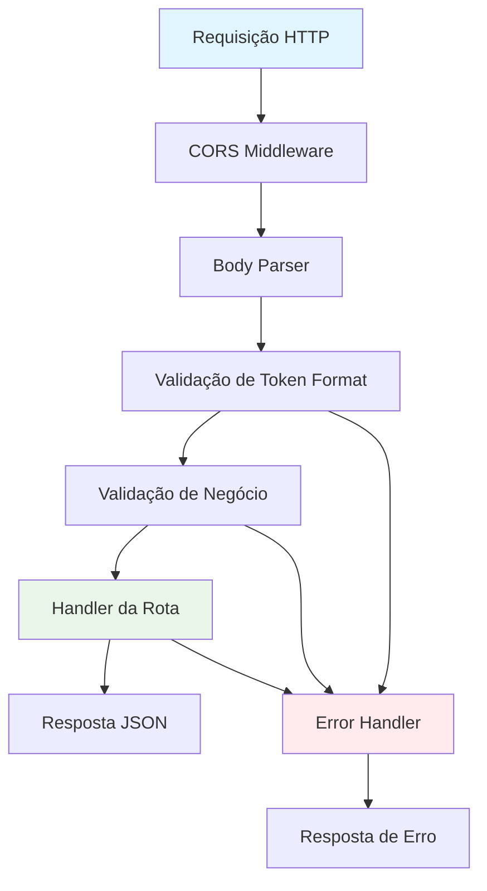

# 🛣️ Guia de Implementação de Rotas - Backend

## Visão Geral

Este guia fornece padrões, templates e melhores práticas para implementação de novas rotas no backend do WUZAPI Manager. O sistema utiliza Express.js com uma arquitetura bem estruturada de middlewares, validadores e tratamento de erros.

## 📋 Índice

- [Arquitetura de Rotas](#arquitetura-de-rotas)
- [Padrões de Implementação](#padrões-de-implementação)
- [Middleware Chain](#middleware-chain)
- [Templates de Rotas](#templates-de-rotas)
- [Validação e Tratamento de Erros](#validação-e-tratamento-de-erros)
- [Logging e Monitoramento](#logging-e-monitoramento)
- [Testes](#testes)
- [Exemplos Práticos](#exemplos-práticos)

## Arquitetura de Rotas

### Estrutura de Diretórios

```
server/
├── routes/                    # Rotas organizadas por domínio
│   ├── adminRoutes.js        # Rotas administrativas
│   ├── sessionRoutes.js      # Rotas de sessão/usuário
│   ├── brandingRoutes.js     # Rotas de personalização
│   └── [newDomain]Routes.js  # Novas rotas por domínio
│
├── middleware/               # Middlewares reutilizáveis
│   ├── errorHandler.js       # Tratamento centralizado de erros
│   └── corsHandler.js        # Configuração CORS
│
├── validators/               # Validadores de dados
│   ├── adminValidator.js     # Validação de tokens admin
│   ├── sessionValidator.js   # Validação de tokens usuário
│   └── [domain]Validator.js  # Validadores específicos
│
└── utils/                    # Utilitários
    ├── logger.js             # Sistema de logging
    └── wuzapiClient.js       # Cliente para integrações
```

### Fluxo de Processamento de Requisições



## Padrões de Implementação

### 1. Estrutura Básica de Arquivo de Rota

```javascript
const express = require('express');
const [domain]Validator = require('../validators/[domain]Validator');
const errorHandler = require('../middleware/errorHandler');
const logger = require('../utils/logger');

const router = express.Router();

/**
 * Documentação da rota
 * METHOD /api/[domain]/[endpoint]
 * 
 * Headers necessários:
 * - Authorization: {token_type}
 * 
 * Body/Query parameters:
 * - param1: tipo (obrigatório/opcional) - descrição
 * 
 * Responses:
 * - 200: Sucesso
 * - 400: Dados inválidos
 * - 401: Token inválido
 * - 500: Erro interno
 */
router.method('/endpoint',
  // Middlewares de validação
  errorHandler.validateTokenFormat.bind(errorHandler),
  
  async (req, res) => {
    const startTime = Date.now();
    
    try {
      // Implementação da rota
      
    } catch (error) {
      // Tratamento de erro
    }
  }
);

module.exports = router;
```

### 2. Padrões de Nomenclatura

#### Arquivos de Rota
- `[domain]Routes.js` - Ex: `userRoutes.js`, `messageRoutes.js`
- Sempre no plural e em camelCase
- Sufixo `Routes` obrigatório

#### Endpoints
- RESTful quando possível: `/users`, `/users/:id`
- Ações específicas: `/users/:id/activate`
- Kebab-case para URLs: `/user-settings`

#### Métodos HTTP
- `GET` - Buscar dados
- `POST` - Criar recursos
- `PUT` - Atualizar recursos completos
- `PATCH` - Atualizar recursos parciais
- `DELETE` - Remover recursos

### 3. Padrões de Resposta

#### Resposta de Sucesso
```javascript
return res.status(200).json({
  success: true,
  code: 200,
  data: responseData,
  message: 'Operação realizada com sucesso', // opcional
  timestamp: new Date().toISOString()
});
```

#### Resposta de Erro
```javascript
return res.status(errorCode).json({
  success: false,
  error: 'Mensagem de erro user-friendly',
  code: errorCode,
  details: 'Detalhes técnicos (opcional)',
  timestamp: new Date().toISOString()
});
```

## Middleware Chain

### 1. Ordem dos Middlewares

```javascript
router.method('/endpoint',
  // 1. Validação de formato de token
  errorHandler.validateTokenFormat.bind(errorHandler),
  
  // 2. Validação de negócio específica (opcional)
  customValidationMiddleware,
  
  // 3. Handler principal
  async (req, res) => {
    // Implementação
  }
);
```

### 2. Middlewares Disponíveis

#### Validação de Token
```javascript
// Para tokens de usuário (header: token)
errorHandler.validateTokenFormat.bind(errorHandler)

// Para tokens de admin (header: authorization)
errorHandler.validateAdminTokenFormat.bind(errorHandler)
```

#### Logging de Requisições
```javascript
errorHandler.logRequest.bind(errorHandler)
```

### 3. Criando Middlewares Customizados

```javascript
const customMiddleware = (req, res, next) => {
  try {
    // Validação ou processamento
    if (validationFails) {
      return res.status(400).json({
        success: false,
        error: 'Validação falhou',
        code: 400,
        timestamp: new Date().toISOString()
      });
    }
    
    // Adicionar dados ao request
    req.customData = processedData;
    next();
  } catch (error) {
    logger.error('Erro no middleware customizado', {
      error_message: error.message,
      url: req.url,
      method: req.method
    });
    
    return res.status(500).json({
      success: false,
      error: 'Erro interno',
      code: 500,
      timestamp: new Date().toISOString()
    });
  }
};
```

## Templates de Rotas

### 1. Template para Rota Administrativa

```javascript
/**
 * Rota administrativa - [DESCRIÇÃO]
 * [METHOD] /api/admin/[endpoint]
 * 
 * Headers necessários:
 * - Authorization: {admin_token}
 * 
 * [PARÂMETROS ESPECÍFICOS]
 * 
 * Responses:
 * - 200: Sucesso
 * - 400: Dados inválidos ou token mal formatado
 * - 401: Token administrativo inválido ou expirado
 * - 403: Token não possui permissões administrativas
 * - 500: Erro interno do servidor
 */
router.[method]('/[endpoint]',
  errorHandler.validateAdminTokenFormat.bind(errorHandler),
  
  async (req, res) => {
    const startTime = Date.now();
    
    try {
      const token = req.headers.authorization;
      
      // Validar formato do token administrativo
      if (!adminValidator.isValidTokenFormat(token)) {
        logger.warn('Token administrativo com formato inválido', {
          url: req.url,
          method: req.method,
          token_length: token ? token.length : 0,
          user_agent: req.get('User-Agent'),
          ip: req.ip
        });
        
        return res.status(400).json({
          success: false,
          error: 'Formato de token administrativo inválido',
          code: 400,
          timestamp: new Date().toISOString()
        });
      }

      // Validar token administrativo na WuzAPI
      const validationResult = await adminValidator.validateAdminToken(token);
      const responseTime = Date.now() - startTime;

      if (validationResult.isValid) {
        // Token administrativo válido - implementar lógica
        
        // [IMPLEMENTAR LÓGICA ESPECÍFICA AQUI]
        
        logger.info('[OPERAÇÃO] realizada com sucesso', {
          url: req.url,
          method: req.method,
          response_time_ms: responseTime,
          user_agent: req.get('User-Agent'),
          ip: req.ip
        });

        return res.status(200).json({
          success: true,
          code: 200,
          data: result,
          timestamp: new Date().toISOString()
        });
      } else {
        return errorHandler.handleValidationError(validationResult, req, res);
      }
    } catch (error) {
      const responseTime = Date.now() - startTime;
      
      logger.error('Erro interno na [OPERAÇÃO]', {
        url: req.url,
        method: req.method,
        response_time_ms: responseTime,
        error_message: error.message,
        error_stack: error.stack,
        user_agent: req.get('User-Agent'),
        ip: req.ip
      });

      return res.status(500).json({
        success: false,
        error: 'Erro interno na [OPERAÇÃO]',
        code: 500,
        timestamp: new Date().toISOString()
      });
    }
  }
);
```

### 2. Template para Rota de Usuário

```javascript
/**
 * Rota de usuário - [DESCRIÇÃO]
 * [METHOD] /api/[domain]/[endpoint]
 * 
 * Headers necessários:
 * - token: {user_token}
 * 
 * [PARÂMETROS ESPECÍFICOS]
 * 
 * Responses:
 * - 200: Sucesso
 * - 400: Dados inválidos ou token mal formatado
 * - 401: Token inválido ou expirado
 * - 500: Erro interno do servidor
 */
router.[method]('/[endpoint]',
  errorHandler.validateTokenFormat.bind(errorHandler),
  
  async (req, res) => {
    const startTime = Date.now();
    
    try {
      const token = req.headers.token;
      
      // Validar formato do token
      if (!sessionValidator.isValidTokenFormat(token)) {
        logger.warn('Token com formato inválido', {
          url: req.url,
          method: req.method,
          token_length: token ? token.length : 0,
          user_agent: req.get('User-Agent'),
          ip: req.ip
        });
        
        return res.status(400).json({
          success: false,
          error: 'Formato de token inválido',
          code: 400,
          timestamp: new Date().toISOString()
        });
      }

      // Validar token na WuzAPI (se necessário)
      const validationResult = await sessionValidator.validateUserToken(token);
      const responseTime = Date.now() - startTime;

      if (validationResult.isValid) {
        // Token válido - implementar lógica
        
        // [IMPLEMENTAR LÓGICA ESPECÍFICA AQUI]
        
        logger.info('[OPERAÇÃO] realizada com sucesso', {
          url: req.url,
          method: req.method,
          response_time_ms: responseTime,
          user_agent: req.get('User-Agent'),
          ip: req.ip
        });

        return res.status(200).json({
          success: true,
          code: 200,
          data: result,
          timestamp: new Date().toISOString()
        });
      } else {
        return errorHandler.handleValidationError(validationResult, req, res);
      }
    } catch (error) {
      const responseTime = Date.now() - startTime;
      
      logger.error('Erro interno na [OPERAÇÃO]', {
        url: req.url,
        method: req.method,
        response_time_ms: responseTime,
        error_message: error.message,
        error_stack: error.stack,
        user_agent: req.get('User-Agent'),
        ip: req.ip
      });

      return res.status(500).json({
        success: false,
        error: 'Erro interno na [OPERAÇÃO]',
        code: 500,
        timestamp: new Date().toISOString()
      });
    }
  }
);
```

### 3. Template para Rota Pública (Health Check)

```javascript
/**
 * Rota pública - [DESCRIÇÃO]
 * GET /api/[domain]/[endpoint]
 * 
 * Não requer autenticação
 * 
 * Responses:
 * - 200: Sucesso
 * - 500: Erro interno
 */
router.get('/[endpoint]', async (req, res) => {
  try {
    // [IMPLEMENTAR LÓGICA ESPECÍFICA AQUI]
    
    logger.info('[OPERAÇÃO] realizada com sucesso', {
      url: req.url,
      method: req.method,
      user_agent: req.get('User-Agent'),
      ip: req.ip
    });

    return res.status(200).json({
      success: true,
      code: 200,
      data: {
        service: '[SERVICE_NAME]',
        status: 'healthy',
        timestamp: new Date().toISOString()
      }
    });
  } catch (error) {
    logger.error('Erro na [OPERAÇÃO]', {
      url: req.url,
      method: req.method,
      error_message: error.message,
      user_agent: req.get('User-Agent'),
      ip: req.ip
    });

    return res.status(500).json({
      success: false,
      error: 'Erro na [OPERAÇÃO]',
      code: 500,
      timestamp: new Date().toISOString()
    });
  }
});
```

### 4. Template para Integração Externa

```javascript
/**
 * Rota com integração externa - [DESCRIÇÃO]
 * [METHOD] /api/[domain]/[endpoint]
 * 
 * Headers necessários:
 * - token: {user_token}
 * 
 * [PARÂMETROS ESPECÍFICOS]
 */
router.[method]('/[endpoint]',
  errorHandler.validateTokenFormat.bind(errorHandler),
  
  async (req, res) => {
    const startTime = Date.now();
    
    try {
      const token = req.headers.token;
      const requestData = req.body;
      
      // Validação de dados de entrada
      if (!requestData || !requestData.requiredField) {
        return res.status(400).json({
          success: false,
          error: 'Dados obrigatórios ausentes',
          code: 400,
          timestamp: new Date().toISOString()
        });
      }

      logger.info('Iniciando [OPERAÇÃO] com integração externa', {
        url: req.url,
        method: req.method,
        user_agent: req.get('User-Agent'),
        ip: req.ip
      });

      // Chamar serviço externo
      const externalClient = require('../utils/[external]Client');
      const result = await externalClient.[method](requestData, token);
      const responseTime = Date.now() - startTime;

      if (result.success) {
        logger.info('[OPERAÇÃO] com integração externa realizada com sucesso', {
          url: req.url,
          method: req.method,
          response_time_ms: responseTime,
          external_status: result.status,
          user_agent: req.get('User-Agent'),
          ip: req.ip
        });

        return res.status(200).json({
          success: true,
          code: 200,
          data: result.data,
          timestamp: new Date().toISOString()
        });
      } else {
        // Tratar diferentes tipos de erro do serviço externo
        let statusCode = 502; // Bad Gateway por padrão
        let errorMessage = 'Erro na comunicação com serviço externo';

        if (result.status === 400) {
          statusCode = 400;
          errorMessage = 'Dados inválidos fornecidos';
        } else if (result.status === 401) {
          statusCode = 401;
          errorMessage = 'Token inválido';
        } else if (result.code === 'TIMEOUT') {
          statusCode = 504;
          errorMessage = 'Timeout na comunicação com serviço externo';
        }

        logger.error('Erro na [OPERAÇÃO] com integração externa', {
          url: req.url,
          method: req.method,
          response_time_ms: responseTime,
          external_status: result.status,
          external_error: result.error,
          user_agent: req.get('User-Agent'),
          ip: req.ip
        });

        return res.status(statusCode).json({
          success: false,
          error: errorMessage,
          code: statusCode,
          details: result.error,
          timestamp: new Date().toISOString()
        });
      }
      
    } catch (error) {
      const responseTime = Date.now() - startTime;
      
      logger.error('Erro interno na [OPERAÇÃO] com integração externa', {
        url: req.url,
        method: req.method,
        response_time_ms: responseTime,
        error_message: error.message,
        error_stack: error.stack,
        user_agent: req.get('User-Agent'),
        ip: req.ip
      });

      return res.status(500).json({
        success: false,
        error: 'Erro interno na [OPERAÇÃO]',
        code: 500,
        timestamp: new Date().toISOString()
      });
    }
  }
);
```

## Validação e Tratamento de Erros

### 1. Validação de Entrada

#### Validação Básica
```javascript
// Validação de campos obrigatórios
if (!requestData.name || !requestData.email) {
  return res.status(400).json({
    success: false,
    error: 'Nome e email são obrigatórios',
    code: 400,
    timestamp: new Date().toISOString()
  });
}

// Validação de formato
if (!/^[^\s@]+@[^\s@]+\.[^\s@]+$/.test(requestData.email)) {
  return res.status(400).json({
    success: false,
    error: 'Formato de email inválido',
    code: 400,
    timestamp: new Date().toISOString()
  });
}
```

#### Validação com Schema (Recomendado)
```javascript
const Joi = require('joi');

const schema = Joi.object({
  name: Joi.string().min(1).max(100).required(),
  email: Joi.string().email().required(),
  age: Joi.number().integer().min(0).max(120).optional()
});

const { error, value } = schema.validate(req.body);
if (error) {
  return res.status(400).json({
    success: false,
    error: 'Dados de entrada inválidos',
    details: error.details[0].message,
    code: 400,
    timestamp: new Date().toISOString()
  });
}
```

### 2. Códigos de Status HTTP

| Código | Uso | Exemplo |
|--------|-----|---------|
| 200 | Sucesso | Operação realizada com sucesso |
| 201 | Criado | Recurso criado com sucesso |
| 400 | Bad Request | Dados inválidos ou ausentes |
| 401 | Unauthorized | Token inválido ou expirado |
| 403 | Forbidden | Token sem permissões necessárias |
| 404 | Not Found | Recurso não encontrado |
| 409 | Conflict | Recurso já existe |
| 500 | Internal Error | Erro interno do servidor |
| 502 | Bad Gateway | Erro na comunicação com serviço externo |
| 504 | Gateway Timeout | Timeout na comunicação externa |

### 3. Tratamento de Erros Específicos

#### Erro de Token
```javascript
if (!validationResult.isValid) {
  return errorHandler.handleValidationError(validationResult, req, res);
}
```

#### Erro de Timeout
```javascript
if (error.code === 'ECONNABORTED') {
  return errorHandler.handleTimeout(req, res);
}
```

#### Erro de Serviço Indisponível
```javascript
if (error.code === 'ECONNREFUSED') {
  return errorHandler.handleServiceUnavailable(req, res);
}
```

## Logging e Monitoramento

### 1. Padrões de Log

#### Log de Início de Operação
```javascript
logger.info('Iniciando [OPERAÇÃO]', {
  url: req.url,
  method: req.method,
  user_agent: req.get('User-Agent'),
  ip: req.ip,
  // Dados específicos da operação (sem dados sensíveis)
});
```

#### Log de Sucesso
```javascript
logger.info('[OPERAÇÃO] realizada com sucesso', {
  url: req.url,
  method: req.method,
  response_time_ms: responseTime,
  // Métricas específicas
  user_agent: req.get('User-Agent'),
  ip: req.ip
});
```

#### Log de Erro
```javascript
logger.error('Erro na [OPERAÇÃO]', {
  url: req.url,
  method: req.method,
  response_time_ms: responseTime,
  error_message: error.message,
  error_stack: error.stack,
  user_agent: req.get('User-Agent'),
  ip: req.ip
});
```

### 2. Métricas de Performance

```javascript
const startTime = Date.now();

// ... processamento ...

const responseTime = Date.now() - startTime;

// Log com métricas
logger.info('Operação concluída', {
  response_time_ms: responseTime,
  memory_usage: process.memoryUsage(),
  // Outras métricas relevantes
});
```

### 3. Mascaramento de Dados Sensíveis

```javascript
// Mascarar tokens em logs
const maskToken = (token) => {
  if (!token) return 'NO_TOKEN';
  return token.substring(0, 8) + '...';
};

logger.info('Token validado', {
  token_prefix: maskToken(token),
  // Nunca logar o token completo
});
```

## Testes

### 1. Estrutura de Teste

```javascript
const request = require('supertest');
const app = require('../index');

describe('[Domain] Routes', () => {
  describe('GET /api/[domain]/[endpoint]', () => {
    it('deve retornar sucesso com token válido', async () => {
      const response = await request(app)
        .get('/api/[domain]/[endpoint]')
        .set('token', 'valid_token')
        .expect(200);
      
      expect(response.body.success).toBe(true);
      expect(response.body.data).toBeDefined();
    });
    
    it('deve retornar erro 401 com token inválido', async () => {
      const response = await request(app)
        .get('/api/[domain]/[endpoint]')
        .set('token', 'invalid_token')
        .expect(401);
      
      expect(response.body.success).toBe(false);
      expect(response.body.error).toContain('inválido');
    });
    
    it('deve retornar erro 400 sem token', async () => {
      const response = await request(app)
        .get('/api/[domain]/[endpoint]')
        .expect(400);
      
      expect(response.body.success).toBe(false);
      expect(response.body.error).toContain('necessário');
    });
  });
});
```

### 2. Mocks para Integrações

```javascript
// Mock do WuzAPI Client
jest.mock('../utils/wuzapiClient', () => ({
  get: jest.fn(),
  post: jest.fn(),
  validateToken: jest.fn()
}));

const wuzapiClient = require('../utils/wuzapiClient');

beforeEach(() => {
  jest.clearAllMocks();
});

it('deve lidar com erro de timeout da WuzAPI', async () => {
  wuzapiClient.get.mockRejectedValue({
    code: 'ECONNABORTED',
    message: 'Timeout'
  });
  
  const response = await request(app)
    .get('/api/session/status')
    .set('token', 'valid_token')
    .expect(504);
  
  expect(response.body.error).toContain('Timeout');
});
```

## Exemplos Práticos

### 1. Implementando Rota de Listagem de Mensagens

```javascript
/**
 * Listar mensagens do usuário
 * GET /api/messages
 * 
 * Headers necessários:
 * - token: {user_token}
 * 
 * Query parameters opcionais:
 * - limit: number (1-100) - limite de mensagens
 * - offset: number - offset para paginação
 * - from: string - filtrar por remetente
 * 
 * Responses:
 * - 200: Lista de mensagens
 * - 400: Parâmetros inválidos
 * - 401: Token inválido
 * - 500: Erro interno
 */
router.get('/',
  errorHandler.validateTokenFormat.bind(errorHandler),
  
  async (req, res) => {
    const startTime = Date.now();
    
    try {
      const token = req.headers.token;
      const { limit = 50, offset = 0, from } = req.query;
      
      // Validar parâmetros
      const limitNum = parseInt(limit);
      const offsetNum = parseInt(offset);
      
      if (isNaN(limitNum) || limitNum < 1 || limitNum > 100) {
        return res.status(400).json({
          success: false,
          error: 'Limite deve ser um número entre 1 e 100',
          code: 400,
          timestamp: new Date().toISOString()
        });
      }
      
      if (isNaN(offsetNum) || offsetNum < 0) {
        return res.status(400).json({
          success: false,
          error: 'Offset deve ser um número não negativo',
          code: 400,
          timestamp: new Date().toISOString()
        });
      }

      // Validar token
      const validationResult = await sessionValidator.validateUserToken(token);
      if (!validationResult.isValid) {
        return errorHandler.handleValidationError(validationResult, req, res);
      }

      // Buscar mensagens
      const db = req.app.locals.db;
      const messages = await db.getMessages(token, {
        limit: limitNum,
        offset: offsetNum,
        from: from
      });
      
      const responseTime = Date.now() - startTime;
      
      logger.info('Mensagens listadas com sucesso', {
        url: req.url,
        method: req.method,
        response_time_ms: responseTime,
        messages_count: messages.length,
        limit: limitNum,
        offset: offsetNum,
        has_filter: !!from,
        user_agent: req.get('User-Agent'),
        ip: req.ip
      });

      return res.status(200).json({
        success: true,
        code: 200,
        data: {
          messages,
          pagination: {
            limit: limitNum,
            offset: offsetNum,
            total: messages.length
          }
        },
        timestamp: new Date().toISOString()
      });
      
    } catch (error) {
      const responseTime = Date.now() - startTime;
      
      logger.error('Erro ao listar mensagens', {
        url: req.url,
        method: req.method,
        response_time_ms: responseTime,
        error_message: error.message,
        error_stack: error.stack,
        user_agent: req.get('User-Agent'),
        ip: req.ip
      });

      return res.status(500).json({
        success: false,
        error: 'Erro interno ao listar mensagens',
        code: 500,
        timestamp: new Date().toISOString()
      });
    }
  }
);
```

### 2. Implementando Rota de Criação com Validação

```javascript
/**
 * Criar nova configuração de webhook
 * POST /api/webhook
 * 
 * Headers necessários:
 * - token: {user_token}
 * 
 * Body:
 * - url: string (URL válida, obrigatório)
 * - events: array (lista de eventos, obrigatório)
 * - enabled: boolean (opcional, default: true)
 * 
 * Responses:
 * - 201: Webhook criado com sucesso
 * - 400: Dados inválidos
 * - 401: Token inválido
 * - 409: Webhook já existe
 * - 500: Erro interno
 */
router.post('/',
  errorHandler.validateTokenFormat.bind(errorHandler),
  
  async (req, res) => {
    const startTime = Date.now();
    
    try {
      const token = req.headers.token;
      const webhookData = req.body;
      
      // Validação de dados obrigatórios
      if (!webhookData.url || !webhookData.events) {
        return res.status(400).json({
          success: false,
          error: 'URL e eventos são obrigatórios',
          code: 400,
          timestamp: new Date().toISOString()
        });
      }
      
      // Validação de URL
      try {
        new URL(webhookData.url);
      } catch {
        return res.status(400).json({
          success: false,
          error: 'URL inválida fornecida',
          code: 400,
          timestamp: new Date().toISOString()
        });
      }
      
      // Validação de eventos
      if (!Array.isArray(webhookData.events) || webhookData.events.length === 0) {
        return res.status(400).json({
          success: false,
          error: 'Lista de eventos deve ser um array não vazio',
          code: 400,
          timestamp: new Date().toISOString()
        });
      }

      // Validar token
      const validationResult = await sessionValidator.validateUserToken(token);
      if (!validationResult.isValid) {
        return errorHandler.handleValidationError(validationResult, req, res);
      }

      logger.info('Iniciando criação de webhook', {
        url: req.url,
        method: req.method,
        webhook_url: webhookData.url,
        events_count: webhookData.events.length,
        user_agent: req.get('User-Agent'),
        ip: req.ip
      });

      // Criar webhook via WuzAPI
      const wuzapiClient = require('../utils/wuzapiClient');
      const createResult = await wuzapiClient.post('/webhook', webhookData, {
        headers: { 'token': token }
      });
      
      const responseTime = Date.now() - startTime;

      if (createResult.success) {
        // Salvar no banco local se necessário
        const db = req.app.locals.db;
        await db.saveWebhookConfig(token, webhookData);
        
        logger.info('Webhook criado com sucesso', {
          url: req.url,
          method: req.method,
          response_time_ms: responseTime,
          webhook_url: webhookData.url,
          events_count: webhookData.events.length,
          user_agent: req.get('User-Agent'),
          ip: req.ip
        });

        return res.status(201).json({
          success: true,
          code: 201,
          data: createResult.data,
          message: 'Webhook criado com sucesso',
          timestamp: new Date().toISOString()
        });
      } else {
        // Tratar erros da WuzAPI
        let statusCode = 502;
        let errorMessage = 'Erro na comunicação com WuzAPI';

        if (createResult.status === 409) {
          statusCode = 409;
          errorMessage = 'Webhook já existe para este usuário';
        } else if (createResult.status === 400) {
          statusCode = 400;
          errorMessage = 'Dados de webhook inválidos';
        }

        logger.error('Erro na criação de webhook via WuzAPI', {
          url: req.url,
          method: req.method,
          response_time_ms: responseTime,
          wuzapi_status: createResult.status,
          wuzapi_error: createResult.error,
          user_agent: req.get('User-Agent'),
          ip: req.ip
        });

        return res.status(statusCode).json({
          success: false,
          error: errorMessage,
          code: statusCode,
          details: createResult.error,
          timestamp: new Date().toISOString()
        });
      }
      
    } catch (error) {
      const responseTime = Date.now() - startTime;
      
      logger.error('Erro interno na criação de webhook', {
        url: req.url,
        method: req.method,
        response_time_ms: responseTime,
        error_message: error.message,
        error_stack: error.stack,
        user_agent: req.get('User-Agent'),
        ip: req.ip
      });

      return res.status(500).json({
        success: false,
        error: 'Erro interno na criação do webhook',
        code: 500,
        timestamp: new Date().toISOString()
      });
    }
  }
);
```

## Checklist para Nova Rota

### ✅ Antes de Implementar
- [ ] Definir domínio e endpoint da rota
- [ ] Escolher método HTTP apropriado
- [ ] Definir estrutura de dados de entrada e saída
- [ ] Identificar middlewares necessários
- [ ] Planejar validações necessárias
- [ ] Definir integrações externas (se houver)

### ✅ Durante a Implementação
- [ ] Seguir template apropriado
- [ ] Implementar validação de entrada
- [ ] Adicionar logging estruturado
- [ ] Implementar tratamento de erros
- [ ] Medir tempo de resposta
- [ ] Documentar a rota com comentários
- [ ] Mascarar dados sensíveis em logs

### ✅ Após a Implementação
- [ ] Escrever testes unitários
- [ ] Testar cenários de erro
- [ ] Validar integração com frontend
- [ ] Verificar logs em ambiente de desenvolvimento
- [ ] Documentar na API documentation
- [ ] Revisar performance e otimizar se necessário

## Melhores Práticas

### 1. Segurança
- Sempre validar tokens antes de processar
- Mascarar dados sensíveis em logs
- Validar e sanitizar entrada do usuário
- Usar HTTPS em produção
- Implementar rate limiting quando necessário

### 2. Performance
- Medir tempo de resposta
- Implementar cache quando apropriado
- Otimizar queries de banco de dados
- Usar paginação para listas grandes
- Implementar timeouts para integrações externas

### 3. Manutenibilidade
- Seguir padrões estabelecidos
- Documentar rotas adequadamente
- Usar nomes descritivos para variáveis e funções
- Separar lógica de negócio em services quando complexa
- Manter middlewares reutilizáveis

### 4. Monitoramento
- Logar operações importantes
- Incluir métricas de performance
- Implementar health checks
- Monitorar erros e alertas
- Coletar métricas de uso

---

## 📚 Próximos Passos

1. **Implemente sua primeira rota** usando os templates fornecidos
2. **Escreva testes** para validar o comportamento
3. **Monitore logs** para identificar problemas
4. **Otimize performance** baseado em métricas
5. **Documente** mudanças e padrões específicos

---

**🛣️ Backend Routes Guide** - Padrões consistentes para APIs robustas  
Desenvolvido para facilitar a criação e manutenção de rotas no WUZAPI Manager.