# Diagnóstico e Resolução - Página de Login Unificada

## Problema Inicial

Ao acessar `http://localhost:8080/`, a aplicação apresentava erro:

```
Failed to resolve import "@supabase/supabase-js" from "src/lib/supabase.ts". Does the file exist?
```

## Diagrama de Diagnóstico

```mermaid
flowchart TB
    subgraph "DIAGNÓSTICO"
        A["Acesso http://localhost:8080/"] --> B{"Erro no Vite"}
        B --> C["@supabase/supabase-js não encontrado"]
        C --> D["npm install @supabase/supabase-js"]
        D --> E{"Novo erro"}
        E --> F["Missing Supabase configuration"]
        F --> G["Adicionar VITE_SUPABASE_URL e VITE_SUPABASE_ANON_KEY no .env"]
        G --> H["✅ Aplicação funcionando"]
    end
    
    subgraph "SOLUÇÃO APLICADA"
        S1["1. Instalar pacote Supabase"] --> S2["npm install @supabase/supabase-js"]
        S2 --> S3["2. Configurar variáveis de ambiente"]
        S3 --> S4["VITE_SUPABASE_URL=https://bdhkfyvyvgfdukdodddr.supabase.co"]
        S4 --> S5["VITE_SUPABASE_ANON_KEY=eyJhbGciOiJIUzI1NiIs..."]
        S5 --> S6["3. Recarregar aplicação"]
    end
    
    subgraph "RESULTADO FINAL"
        R1["/login"] --> R2{"3 Abas de Login"}
        R2 --> R3["Usuário: Email + Senha"]
        R2 --> R4["Agente: Token + Email + Senha"]
        R2 --> R5["Admin: Token + Email + Senha"]
        R3 --> R6["Supabase Auth"]
        R4 --> R6
        R5 --> R6
        R6 --> R7["Reset de senha automático"]
    end
```



## Erros Encontrados

### Erro 1: Pacote não instalado
```
Failed to resolve import "@supabase/supabase-js" from "src/lib/supabase.ts"
```

**Solução:** `npm install @supabase/supabase-js`

### Erro 2: Variáveis de ambiente ausentes
```
Missing Supabase configuration. Please set VITE_SUPABASE_URL and VITE_SUPABASE_ANON_KEY
supabaseUrl is required.
```

**Solução:** Adicionar ao `.env`:
```env
VITE_SUPABASE_URL=https://bdhkfyvyvgfdukdodddr.supabase.co
VITE_SUPABASE_ANON_KEY=eyJhbGciOiJIUzI1NiIsInR5cCI6IkpXVCJ9...
```

## Funcionalidades Testadas

| Funcionalidade | Status |
|----------------|--------|
| Aba Usuário (Email + Senha) | ✅ Funcionando |
| Aba Agente (Token + Email + Senha) | ✅ Funcionando |
| Aba Admin (Token + Email + Senha) | ✅ Funcionando |
| Recuperação de Senha | ✅ Funcionando |
| Link para Cadastro | ✅ Funcionando |
| Link para Superadmin | ✅ Funcionando |

## Screenshots

- `docs/screenshots/unified-login-user.png` - Aba de Usuário
- `docs/screenshots/unified-login-admin.png` - Aba de Admin
- `docs/screenshots/unified-login-password-reset.png` - Tela de Recuperação de Senha

## Arquivos Modificados

1. **`.env`** - Adicionadas variáveis do Supabase
2. **`package.json`** - Adicionado `@supabase/supabase-js`
3. **`src/pages/UnifiedLoginPage.tsx`** - Nova página de login unificada
4. **`src/pages/ResetPasswordPage.tsx`** - Página de reset de senha
5. **`src/App.tsx`** - Rotas atualizadas
