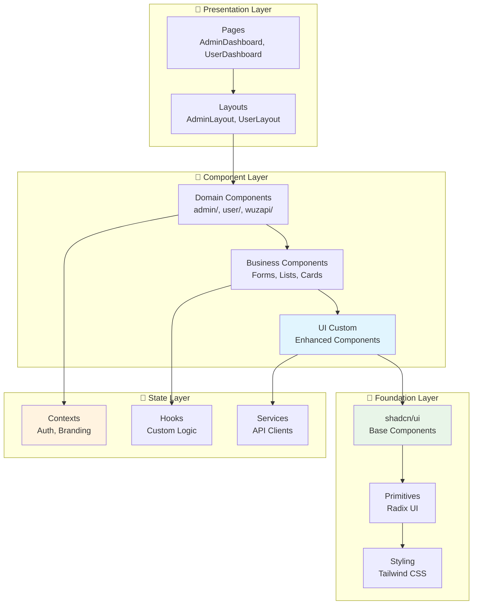

# 🧩 Guia de Componentes Reutilizáveis - Frontend

## Visão Geral

Este guia documenta a biblioteca de componentes reutilizáveis do WUZAPI Manager, incluindo componentes base (shadcn/ui), componentes customizados, padrões de composição e melhores práticas para desenvolvimento frontend consistente e escalável.

## 📋 Índice

- [Arquitetura de Componentes](#arquitetura-de-componentes)
- [Biblioteca Base (shadcn/ui)](#biblioteca-base-shadcnui)
- [Componentes Customizados](#componentes-customizados)
- [Componentes de Layout](#componentes-de-layout)
- [Hooks Customizados](#hooks-customizados)
- [Contextos e Estado Global](#contextos-e-estado-global)
- [Padrões de Composição](#padrões-de-composição)
- [Guia de Estilo](#guia-de-estilo)
- [Exemplos Práticos](#exemplos-práticos)

## Arquitetura de Componentes

### Estrutura Hierárquica



### Estrutura de Diretórios

```
src/components/
├── 📁 ui/                     # Componentes base (shadcn/ui)
│   ├── button.tsx             # Botão base
│   ├── card.tsx               # Card base
│   ├── dialog.tsx             # Modal base
│   ├── form.tsx               # Formulário base
│   ├── input.tsx              # Input base
│   ├── table.tsx              # Tabela base
│   └── ...                    # Outros componentes base
│
├── 📁 ui-custom/              # Componentes customizados
│   ├── Button.tsx             # Botão com funcionalidades extras
│   ├── Card.tsx               # Card com variantes
│   ├── Header.tsx             # Cabeçalho personalizado
│   ├── ThemeToggle.tsx        # Alternador de tema
│   └── ...                    # Outros componentes customizados
│
├── 📁 admin/                  # Componentes administrativos
│   ├── AdminLayout.tsx        # Layout administrativo
│   ├── AdminUsers.tsx         # Gerenciamento de usuários
│   ├── AdminSettings.tsx      # Configurações do sistema
│   └── ...                    # Outros componentes admin
│
├── 📁 user/                   # Componentes do usuário
│   ├── UserLayout.tsx         # Layout do usuário
│   ├── UserMessages.tsx       # Interface de mensagens
│   ├── UserSettings.tsx       # Configurações pessoais
│   └── ...                    # Outros componentes user
│
└── 📁 shared/                 # Componentes compartilhados
    ├── ErrorBoundary.tsx      # Tratamento de erros
    ├── ProtectedRoute.tsx     # Rota protegida
    ├── BrandingLoader.tsx     # Carregador de branding
    └── ...                    # Outros componentes compartilhados
```

## Biblioteca Base (shadcn/ui)

### Componentes Fundamentais

#### 1. Button
```typescript
import { Button } from '@/components/ui/button';

// Variantes disponíveis
<Button variant="default">Padrão</Button>
<Button variant="destructive">Destrutivo</Button>
<Button variant="outline">Contorno</Button>
<Button variant="secondary">Secundário</Button>
<Button variant="ghost">Fantasma</Button>
<Button variant="link">Link</Button>

// Tamanhos disponíveis
<Button size="default">Padrão</Button>
<Button size="sm">Pequeno</Button>
<Button size="lg">Grande</Button>
<Button size="icon">Ícone</Button>

// Como slot (renderiza como outro elemento)
<Button asChild>
  <Link to="/admin">Ir para Admin</Link>
</Button>
```

#### 2. Card
```typescript
import { 
  Card, 
  CardHeader, 
  CardTitle, 
  CardDescription, 
  CardContent, 
  CardFooter 
} from '@/components/ui/card';

<Card>
  <CardHeader>
    <CardTitle>Título do Card</CardTitle>
    <CardDescription>Descrição opcional</CardDescription>
  </CardHeader>
  <CardContent>
    <p>Conteúdo principal do card</p>
  </CardContent>
  <CardFooter>
    <Button>Ação</Button>
  </CardFooter>
</Card>
```

#### 3. Dialog
```typescript
import {
  Dialog,
  DialogContent,
  DialogDescription,
  DialogHeader,
  DialogTitle,
  DialogTrigger,
  DialogFooter,
  DialogClose
} from '@/components/ui/dialog';

<Dialog>
  <DialogTrigger asChild>
    <Button>Abrir Modal</Button>
  </DialogTrigger>
  <DialogContent>
    <DialogHeader>
      <DialogTitle>Título do Modal</DialogTitle>
      <DialogDescription>Descrição do modal</DialogDescription>
    </DialogHeader>
    <div>Conteúdo do modal</div>
    <DialogFooter>
      <DialogClose asChild>
        <Button variant="outline">Cancelar</Button>
      </DialogClose>
      <Button>Confirmar</Button>
    </DialogFooter>
  </DialogContent>
</Dialog>
```

#### 4. Form
```typescript
import { useForm } from 'react-hook-form';
import { zodResolver } from '@hookform/resolvers/zod';
import * as z from 'zod';
import {
  Form,
  FormControl,
  FormDescription,
  FormField,
  FormItem,
  FormLabel,
  FormMessage,
} from '@/components/ui/form';
import { Input } from '@/components/ui/input';

const formSchema = z.object({
  username: z.string().min(2, 'Nome deve ter pelo menos 2 caracteres'),
  email: z.string().email('Email inválido'),
});

const MyForm = () => {
  const form = useForm<z.infer<typeof formSchema>>({
    resolver: zodResolver(formSchema),
    defaultValues: {
      username: '',
      email: '',
    },
  });

  const onSubmit = (values: z.infer<typeof formSchema>) => {
    console.log(values);
  };

  return (
    <Form {...form}>
      <form onSubmit={form.handleSubmit(onSubmit)} className="space-y-8">
        <FormField
          control={form.control}
          name="username"
          render={({ field }) => (
            <FormItem>
              <FormLabel>Nome de usuário</FormLabel>
              <FormControl>
                <Input placeholder="Digite seu nome" {...field} />
              </FormControl>
              <FormDescription>
                Este será seu nome de exibição público.
              </FormDescription>
              <FormMessage />
            </FormItem>
          )}
        />
        <Button type="submit">Enviar</Button>
      </form>
    </Form>
  );
};
```

#### 5. Table
```typescript
import {
  Table,
  TableBody,
  TableCaption,
  TableCell,
  TableHead,
  TableHeader,
  TableRow,
} from '@/components/ui/table';

<Table>
  <TableCaption>Lista de usuários do sistema</TableCaption>
  <TableHeader>
    <TableRow>
      <TableHead>Nome</TableHead>
      <TableHead>Email</TableHead>
      <TableHead>Status</TableHead>
      <TableHead className="text-right">Ações</TableHead>
    </TableRow>
  </TableHeader>
  <TableBody>
    {users.map((user) => (
      <TableRow key={user.id}>
        <TableCell className="font-medium">{user.name}</TableCell>
        <TableCell>{user.email}</TableCell>
        <TableCell>{user.status}</TableCell>
        <TableCell className="text-right">
          <Button variant="ghost" size="sm">Editar</Button>
        </TableCell>
      </TableRow>
    ))}
  </TableBody>
</Table>
```

## Componentes Customizados

### 1. Button Customizado

**Localização**: `src/components/ui-custom/Button.tsx`

**Funcionalidades Extras**:
- Estados de loading
- Ícones com posicionamento
- Variantes de cor customizadas
- Efeitos visuais (gradient, glow, pulse)

```typescript
import Button from '@/components/ui-custom/Button';
import { Save, Send } from 'lucide-react';

// Button com loading
<Button loading={isSubmitting}>
  Salvando...
</Button>

// Button com ícone
<Button icon={<Save />} iconPosition="left">
  Salvar
</Button>

// Button com cores customizadas
<Button color="success">Sucesso</Button>
<Button color="error">Erro</Button>
<Button color="warning">Aviso</Button>

// Button com efeitos
<Button gradient glow pulse>
  Botão Especial
</Button>
```

### 2. Card Customizado

**Localização**: `src/components/ui-custom/Card.tsx`

**Funcionalidades Extras**:
- Efeito glassmorphism
- Variantes de estilo
- Interatividade
- Padding configurável

```typescript
import Card from '@/components/ui-custom/Card';

// Card com efeito glass
<Card glass hover padding="large">
  <h3>Card com Glassmorphism</h3>
  <p>Conteúdo do card</p>
</Card>

// Card interativo
<Card interactive variant="elevated" glow>
  <h3>Card Interativo</h3>
  <p>Clique para interagir</p>
</Card>

// Card com variantes
<Card variant="dark" padding="small">
  <h3>Card Escuro</h3>
</Card>
```

### 3. Header Customizado

**Localização**: `src/components/ui-custom/Header.tsx`

**Funcionalidades**:
- Título e subtítulo
- Ações personalizadas
- Logo integrado
- Centralização opcional

```typescript
import Header from '@/components/ui-custom/Header';
import { Button } from '@/components/ui/button';
import { Plus } from 'lucide-react';

<Header
  title="Gerenciamento de Usuários"
  subtitle="Gerencie todos os usuários do sistema de forma centralizada"
  actions={
    <Button icon={<Plus />}>
      Novo Usuário
    </Button>
  }
/>
```

### 4. ThemeToggle

**Localização**: `src/components/ui-custom/ThemeToggle.tsx`

**Funcionalidades**:
- Alternância entre temas claro/escuro
- Ícones animados
- Integração com sistema de temas

```typescript
import ThemeToggle from '@/components/ui-custom/ThemeToggle';

// Uso simples
<ThemeToggle />

// Em layouts
<div className="flex items-center gap-2">
  <span>Tema:</span>
  <ThemeToggle />
</div>
```

## Componentes de Layout

### 1. AdminLayout

**Localização**: `src/components/admin/AdminLayout.tsx`

**Características**:
- Sidebar responsiva
- Navegação administrativa
- Integração com branding
- Logout integrado

```typescript
import AdminLayout from '@/components/admin/AdminLayout';

const AdminPage = () => {
  return (
    <AdminLayout>
      <div>
        <h1>Conteúdo da página administrativa</h1>
        {/* Conteúdo específico da página */}
      </div>
    </AdminLayout>
  );
};
```

### 2. UserLayout

**Localização**: `src/components/user/UserLayout.tsx`

**Características**:
- Sidebar para usuários
- Navegação específica do usuário
- Informações do token
- Design consistente

```typescript
import UserLayout from '@/components/user/UserLayout';

const UserPage = () => {
  return (
    <UserLayout>
      <div>
        <h1>Dashboard do Usuário</h1>
        {/* Conteúdo específico do usuário */}
      </div>
    </UserLayout>
  );
};
```

### 3. Padrão de Layout Responsivo

```typescript
// Estrutura comum dos layouts
const Layout = ({ children }) => {
  const [sidebarOpen, setSidebarOpen] = useState(false);

  return (
    <div className="min-h-screen bg-background">
      {/* Mobile sidebar */}
      <div className={cn(
        "fixed inset-0 z-50 lg:hidden",
        sidebarOpen ? "block" : "hidden"
      )}>
        {/* Overlay */}
        <div className="fixed inset-0 bg-black/50" onClick={() => setSidebarOpen(false)} />
        
        {/* Sidebar content */}
        <div className="fixed left-0 top-0 h-full w-64 bg-card border-r">
          {/* Navigation */}
        </div>
      </div>

      {/* Desktop sidebar */}
      <div className="hidden lg:fixed lg:inset-y-0 lg:left-0 lg:z-50 lg:block lg:w-64 lg:bg-card lg:border-r">
        {/* Navigation */}
      </div>

      {/* Main content */}
      <div className="lg:pl-64">
        {/* Mobile top bar */}
        <div className="sticky top-0 z-40 bg-background border-b lg:hidden">
          {/* Mobile header */}
        </div>

        {/* Page content */}
        <main className="p-4 lg:p-6">
          {children}
        </main>
      </div>
    </div>
  );
};
```

## Hooks Customizados

### 1. useBranding

**Localização**: `src/hooks/useBranding.ts`

**Funcionalidades**:
- Acesso à configuração de branding
- Métodos de atualização
- Estados de loading e erro

```typescript
import { useBranding, useBrandingConfig, useBrandingActions } from '@/hooks/useBranding';

// Hook completo
const { config, updateConfig, isLoading, error } = useBranding();

// Apenas configuração (mais performático)
const brandingConfig = useBrandingConfig();

// Apenas ações (para componentes admin)
const { updateConfig, refreshConfig, resetToDefault } = useBrandingActions();

// Uso em componente
const MyComponent = () => {
  const brandingConfig = useBrandingConfig();
  
  return (
    <div>
      <h1>{brandingConfig.appName}</h1>
      {brandingConfig.logoUrl && (
        
      )}
    </div>
  );
};
```

### 2. useConfirmDialog

**Localização**: `src/hooks/useConfirmDialog.tsx`

**Funcionalidades**:
- Diálogos de confirmação programáticos
- Configuração flexível
- Promise-based

```typescript
import { useConfirmDialog } from '@/hooks/useConfirmDialog';

const MyComponent = () => {
  const { confirm, ConfirmDialog } = useConfirmDialog();

  const handleDelete = async () => {
    const confirmed = await confirm({
      title: 'Confirmar Exclusão',
      description: 'Esta ação não pode ser desfeita. Deseja continuar?',
      confirmText: 'Excluir',
      cancelText: 'Cancelar',
      variant: 'destructive'
    });

    if (confirmed) {
      // Executar exclusão
      console.log('Item excluído');
    }
  };

  return (
    <div>
      <Button onClick={handleDelete} variant="destructive">
        Excluir Item
      </Button>
      <ConfirmDialog />
    </div>
  );
};
```

### 3. Hook Customizado - Template

```typescript
// Template para criar novos hooks
import { useState, useEffect, useCallback } from 'react';

interface UseCustomHookOptions {
  initialValue?: any;
  onSuccess?: (data: any) => void;
  onError?: (error: Error) => void;
}

export const useCustomHook = (options: UseCustomHookOptions = {}) => {
  const [data, setData] = useState(options.initialValue);
  const [loading, setLoading] = useState(false);
  const [error, setError] = useState<Error | null>(null);

  const execute = useCallback(async (params: any) => {
    setLoading(true);
    setError(null);

    try {
      // Lógica do hook
      const result = await someAsyncOperation(params);
      setData(result);
      options.onSuccess?.(result);
      return result;
    } catch (err) {
      const error = err instanceof Error ? err : new Error('Unknown error');
      setError(error);
      options.onError?.(error);
      throw error;
    } finally {
      setLoading(false);
    }
  }, [options]);

  const reset = useCallback(() => {
    setData(options.initialValue);
    setError(null);
    setLoading(false);
  }, [options.initialValue]);

  return {
    data,
    loading,
    error,
    execute,
    reset,
  };
};
```

## Contextos e Estado Global

### 1. AuthContext

**Localização**: `src/contexts/AuthContext.tsx`

**Funcionalidades**:
- Gerenciamento de autenticação
- Persistência de sessão
- Validação de tokens

```typescript
import { useAuth } from '@/contexts/AuthContext';

const MyComponent = () => {
  const { user, login, logout, isLoading } = useAuth();

  const handleLogin = async () => {
    const success = await login('token_here', 'user');
    if (success) {
      console.log('Login realizado com sucesso');
    }
  };

  if (isLoading) {
    return <div>Carregando...</div>;
  }

  return (
    <div>
      {user ? (
        <div>
          <p>Bem-vindo, {user.name}!</p>
          <Button onClick={logout}>Sair</Button>
        </div>
      ) : (
        <Button onClick={handleLogin}>Entrar</Button>
      )}
    </div>
  );
};
```

### 2. BrandingContext

**Funcionalidades**:
- Configuração visual global
- Cores, logos, nomes
- Atualização dinâmica

```typescript
// Uso através do hook useBranding
const MyComponent = () => {
  const { config, updateConfig } = useBranding();

  const handleUpdateBranding = async () => {
    await updateConfig({
      appName: 'Novo Nome',
      primaryColor: '#007bff',
      logoUrl: 'https://example.com/logo.png'
    });
  };

  return (
    <div style={{ color: config.primaryColor }}>
      <h1>{config.appName}</h1>
      <Button onClick={handleUpdateBranding}>
        Atualizar Branding
      </Button>
    </div>
  );
};
```

### 3. Template para Novo Contexto

```typescript
// Template para criar novos contextos
import React, { createContext, useContext, useState, useEffect } from 'react';

interface MyContextData {
  // Definir dados do contexto
}

interface MyContextType {
  data: MyContextData | null;
  loading: boolean;
  error: string | null;
  // Métodos do contexto
  updateData: (data: Partial<MyContextData>) => Promise<void>;
  refreshData: () => Promise<void>;
}

const MyContext = createContext<MyContextType | undefined>(undefined);

export const useMyContext = () => {
  const context = useContext(MyContext);
  if (!context) {
    throw new Error('useMyContext must be used within a MyContextProvider');
  }
  return context;
};

interface MyContextProviderProps {
  children: React.ReactNode;
}

export const MyContextProvider: React.FC<MyContextProviderProps> = ({ children }) => {
  const [data, setData] = useState<MyContextData | null>(null);
  const [loading, setLoading] = useState(true);
  const [error, setError] = useState<string | null>(null);

  const updateData = async (newData: Partial<MyContextData>) => {
    try {
      setLoading(true);
      // Lógica de atualização
      setData(prev => prev ? { ...prev, ...newData } : null);
    } catch (err) {
      setError(err instanceof Error ? err.message : 'Unknown error');
    } finally {
      setLoading(false);
    }
  };

  const refreshData = async () => {
    try {
      setLoading(true);
      // Lógica de refresh
    } catch (err) {
      setError(err instanceof Error ? err.message : 'Unknown error');
    } finally {
      setLoading(false);
    }
  };

  useEffect(() => {
    // Inicialização do contexto
    refreshData();
  }, []);

  return (
    <MyContext.Provider value={{
      data,
      loading,
      error,
      updateData,
      refreshData,
    }}>
      {children}
    </MyContext.Provider>
  );
};
```

## Padrões de Composição

### 1. Compound Components

```typescript
// Padrão para componentes compostos
interface TabsContextType {
  activeTab: string;
  setActiveTab: (tab: string) => void;
}

const TabsContext = createContext<TabsContextType | undefined>(undefined);

const Tabs = ({ children, defaultTab }: { children: React.ReactNode; defaultTab: string }) => {
  const [activeTab, setActiveTab] = useState(defaultTab);

  return (
    <TabsContext.Provider value={{ activeTab, setActiveTab }}>
      <div className="tabs">{children}</div>
    </TabsContext.Provider>
  );
};

const TabsList = ({ children }: { children: React.ReactNode }) => (
  <div className="tabs-list">{children}</div>
);

const TabsTrigger = ({ value, children }: { value: string; children: React.ReactNode }) => {
  const context = useContext(TabsContext);
  if (!context) throw new Error('TabsTrigger must be used within Tabs');

  const { activeTab, setActiveTab } = context;

  return (
    <button
      className={cn("tab-trigger", activeTab === value && "active")}
      onClick={() => setActiveTab(value)}
    >
      {children}
    </button>
  );
};

const TabsContent = ({ value, children }: { value: string; children: React.ReactNode }) => {
  const context = useContext(TabsContext);
  if (!context) throw new Error('TabsContent must be used within Tabs');

  const { activeTab } = context;

  if (activeTab !== value) return null;

  return <div className="tab-content">{children}</div>;
};

// Uso
<Tabs defaultTab="tab1">
  <TabsList>
    <TabsTrigger value="tab1">Tab 1</TabsTrigger>
    <TabsTrigger value="tab2">Tab 2</TabsTrigger>
  </TabsList>
  <TabsContent value="tab1">Conteúdo da Tab 1</TabsContent>
  <TabsContent value="tab2">Conteúdo da Tab 2</TabsContent>
</Tabs>
```

### 2. Render Props

```typescript
// Padrão render props para lógica reutilizável
interface DataFetcherProps<T> {
  url: string;
  children: (data: {
    data: T | null;
    loading: boolean;
    error: string | null;
    refetch: () => void;
  }) => React.ReactNode;
}

const DataFetcher = <T,>({ url, children }: DataFetcherProps<T>) => {
  const [data, setData] = useState<T | null>(null);
  const [loading, setLoading] = useState(true);
  const [error, setError] = useState<string | null>(null);

  const fetchData = useCallback(async () => {
    try {
      setLoading(true);
      const response = await fetch(url);
      const result = await response.json();
      setData(result);
    } catch (err) {
      setError(err instanceof Error ? err.message : 'Unknown error');
    } finally {
      setLoading(false);
    }
  }, [url]);

  useEffect(() => {
    fetchData();
  }, [fetchData]);

  return <>{children({ data, loading, error, refetch: fetchData })}</>;
};

// Uso
<DataFetcher<User[]> url="/api/users">
  {({ data, loading, error, refetch }) => {
    if (loading) return <div>Carregando...</div>;
    if (error) return <div>Erro: {error}</div>;
    
    return (
      <div>
        <Button onClick={refetch}>Atualizar</Button>
        {data?.map(user => (
          <div key={user.id}>{user.name}</div>
        ))}
      </div>
    );
  }}
</DataFetcher>
```

### 3. Higher-Order Components (HOC)

```typescript
// HOC para adicionar funcionalidades comuns
interface WithLoadingProps {
  loading?: boolean;
}

const withLoading = <P extends object>(
  Component: React.ComponentType<P>
) => {
  return (props: P & WithLoadingProps) => {
    const { loading, ...restProps } = props;

    if (loading) {
      return (
        <div className="flex items-center justify-center p-4">
          <div className="animate-spin rounded-full h-8 w-8 border-b-2 border-primary"></div>
        </div>
      );
    }

    return <Component {...(restProps as P)} />;
  };
};

// Uso
const MyComponent = ({ data }: { data: any[] }) => (
  <div>
    {data.map(item => (
      <div key={item.id}>{item.name}</div>
    ))}
  </div>
);

const MyComponentWithLoading = withLoading(MyComponent);

// Uso final
<MyComponentWithLoading data={users} loading={isLoading} />
```

## Guia de Estilo

### 1. Convenções de Nomenclatura

#### Componentes
```typescript
// PascalCase para componentes
const UserCard = () => { /* ... */ };
const AdminLayout = () => { /* ... */ };
const DatabaseConnectionForm = () => { /* ... */ };
```

#### Props e Interfaces
```typescript
// PascalCase para interfaces, camelCase para props
interface ButtonProps {
  variant?: 'default' | 'destructive' | 'outline';
  size?: 'default' | 'sm' | 'lg' | 'icon';
  loading?: boolean;
  onClick?: () => void;
}

const Button = ({ variant = 'default', size = 'default', loading, onClick }: ButtonProps) => {
  // ...
};
```

#### Hooks e Contextos
```typescript
// camelCase com prefixo 'use' para hooks
const useAuth = () => { /* ... */ };
const useBranding = () => { /* ... */ };
const useConfirmDialog = () => { /* ... */ };

// PascalCase com sufixo 'Context' para contextos
const AuthContext = createContext();
const BrandingContext = createContext();
```

### 2. Estrutura de Arquivos

```typescript
// Estrutura padrão de um componente
// src/components/domain/ComponentName.tsx

import React from 'react';
import { cn } from '@/lib/utils';
import { Button } from '@/components/ui/button';
import { Card } from '@/components/ui/card';

// 1. Interfaces e tipos
interface ComponentNameProps {
  title: string;
  description?: string;
  onAction?: () => void;
  className?: string;
}

// 2. Componente principal
const ComponentName: React.FC<ComponentNameProps> = ({
  title,
  description,
  onAction,
  className,
}) => {
  // 3. Estados e hooks
  const [loading, setLoading] = useState(false);

  // 4. Handlers
  const handleAction = async () => {
    setLoading(true);
    try {
      await onAction?.();
    } finally {
      setLoading(false);
    }
  };

  // 5. Render
  return (
    <Card className={cn('p-6', className)}>
      <h2 className="text-xl font-semibold">{title}</h2>
      {description && (
        <p className="text-muted-foreground mt-2">{description}</p>
      )}
      <Button onClick={handleAction} loading={loading} className="mt-4">
        Executar Ação
      </Button>
    </Card>
  );
};

// 6. Export
export default ComponentName;

// 7. Export de tipos (se necessário)
export type { ComponentNameProps };
```

### 3. Padrões de CSS/Tailwind

```typescript
// Uso consistente de classes Tailwind
const Component = () => {
  return (
    <div className={cn(
      // Layout
      "flex flex-col gap-4 p-6",
      // Responsividade
      "sm:flex-row sm:gap-6 lg:p-8",
      // Estados
      "hover:shadow-md transition-shadow duration-200",
      // Tema
      "bg-card text-card-foreground border border-border",
      // Customização condicional
      isActive && "ring-2 ring-primary",
      className
    )}>
      {/* Conteúdo */}
    </div>
  );
};
```

### 4. Tratamento de Erros

```typescript
// Error Boundary para componentes
import { ErrorBoundary } from '@/components/ErrorBoundary';

const MyPage = () => {
  return (
    <ErrorBoundary>
      <MyComponent />
    </ErrorBoundary>
  );
};

// Tratamento de erro em componentes
const MyComponent = () => {
  const [error, setError] = useState<string | null>(null);

  if (error) {
    return (
      <div className="p-4 border border-destructive rounded-md bg-destructive/10">
        <h3 className="font-semibold text-destructive">Erro</h3>
        <p className="text-sm text-destructive/80">{error}</p>
        <Button 
          variant="outline" 
          size="sm" 
          onClick={() => setError(null)}
          className="mt-2"
        >
          Tentar Novamente
        </Button>
      </div>
    );
  }

  return (
    // Componente normal
    <div>...</div>
  );
};
```

## Exemplos Práticos

### 1. Criando um Componente de Lista Reutilizável

```typescript
// src/components/shared/DataList.tsx
import React from 'react';
import { cn } from '@/lib/utils';
import { Card } from '@/components/ui/card';
import { Button } from '@/components/ui/button';
import { Skeleton } from '@/components/ui/skeleton';

interface DataListProps<T> {
  data: T[];
  loading?: boolean;
  error?: string | null;
  renderItem: (item: T, index: number) => React.ReactNode;
  emptyMessage?: string;
  className?: string;
  onRefresh?: () => void;
}

const DataList = <T extends { id: string | number }>({
  data,
  loading,
  error,
  renderItem,
  emptyMessage = 'Nenhum item encontrado',
  className,
  onRefresh,
}: DataListProps<T>) => {
  if (loading) {
    return (
      <div className={cn('space-y-4', className)}>
        {Array.from({ length: 3 }).map((_, index) => (
          <Card key={index} className="p-4">
            <Skeleton className="h-4 w-3/4 mb-2" />
            <Skeleton className="h-4 w-1/2" />
          </Card>
        ))}
      </div>
    );
  }

  if (error) {
    return (
      <Card className={cn('p-6 text-center', className)}>
        <p className="text-destructive mb-4">{error}</p>
        {onRefresh && (
          <Button onClick={onRefresh} variant="outline">
            Tentar Novamente
          </Button>
        )}
      </Card>
    );
  }

  if (data.length === 0) {
    return (
      <Card className={cn('p-6 text-center', className)}>
        <p className="text-muted-foreground mb-4">{emptyMessage}</p>
        {onRefresh && (
          <Button onClick={onRefresh} variant="outline">
            Atualizar
          </Button>
        )}
      </Card>
    );
  }

  return (
    <div className={cn('space-y-4', className)}>
      {data.map((item, index) => (
        <div key={item.id}>
          {renderItem(item, index)}
        </div>
      ))}
    </div>
  );
};

export default DataList;

// Uso do componente
const UsersList = () => {
  const [users, setUsers] = useState<User[]>([]);
  const [loading, setLoading] = useState(true);
  const [error, setError] = useState<string | null>(null);

  const fetchUsers = async () => {
    try {
      setLoading(true);
      const response = await fetch('/api/users');
      const data = await response.json();
      setUsers(data);
    } catch (err) {
      setError('Erro ao carregar usuários');
    } finally {
      setLoading(false);
    }
  };

  useEffect(() => {
    fetchUsers();
  }, []);

  return (
    <DataList
      data={users}
      loading={loading}
      error={error}
      onRefresh={fetchUsers}
      emptyMessage="Nenhum usuário cadastrado"
      renderItem={(user) => (
        <Card className="p-4">
          <h3 className="font-semibold">{user.name}</h3>
          <p className="text-sm text-muted-foreground">{user.email}</p>
          <div className="flex gap-2 mt-2">
            <Button size="sm" variant="outline">Editar</Button>
            <Button size="sm" variant="destructive">Excluir</Button>
          </div>
        </Card>
      )}
    />
  );
};
```

### 2. Criando um Hook de Formulário Reutilizável

```typescript
// src/hooks/useFormHandler.ts
import { useState, useCallback } from 'react';

interface UseFormHandlerOptions<T> {
  initialValues: T;
  onSubmit: (values: T) => Promise<void>;
  validate?: (values: T) => Record<string, string>;
}

export const useFormHandler = <T extends Record<string, any>>({
  initialValues,
  onSubmit,
  validate,
}: UseFormHandlerOptions<T>) => {
  const [values, setValues] = useState<T>(initialValues);
  const [errors, setErrors] = useState<Record<string, string>>({});
  const [loading, setLoading] = useState(false);
  const [submitError, setSubmitError] = useState<string | null>(null);

  const setValue = useCallback((field: keyof T, value: any) => {
    setValues(prev => ({ ...prev, [field]: value }));
    // Limpar erro do campo quando valor muda
    if (errors[field as string]) {
      setErrors(prev => ({ ...prev, [field]: undefined }));
    }
  }, [errors]);

  const setFieldError = useCallback((field: keyof T, error: string) => {
    setErrors(prev => ({ ...prev, [field]: error }));
  }, []);

  const validateForm = useCallback(() => {
    if (!validate) return true;
    
    const validationErrors = validate(values);
    setErrors(validationErrors);
    return Object.keys(validationErrors).length === 0;
  }, [values, validate]);

  const handleSubmit = useCallback(async (e?: React.FormEvent) => {
    e?.preventDefault();
    
    if (!validateForm()) return;

    setLoading(true);
    setSubmitError(null);

    try {
      await onSubmit(values);
    } catch (error) {
      setSubmitError(error instanceof Error ? error.message : 'Erro desconhecido');
    } finally {
      setLoading(false);
    }
  }, [values, validateForm, onSubmit]);

  const reset = useCallback(() => {
    setValues(initialValues);
    setErrors({});
    setSubmitError(null);
    setLoading(false);
  }, [initialValues]);

  return {
    values,
    errors,
    loading,
    submitError,
    setValue,
    setFieldError,
    handleSubmit,
    reset,
  };
};

// Uso do hook
const UserForm = ({ user, onSave }: { user?: User; onSave: (user: User) => Promise<void> }) => {
  const {
    values,
    errors,
    loading,
    submitError,
    setValue,
    handleSubmit,
  } = useFormHandler({
    initialValues: {
      name: user?.name || '',
      email: user?.email || '',
      role: user?.role || 'user',
    },
    onSubmit: onSave,
    validate: (values) => {
      const errors: Record<string, string> = {};
      
      if (!values.name.trim()) {
        errors.name = 'Nome é obrigatório';
      }
      
      if (!values.email.trim()) {
        errors.email = 'Email é obrigatório';
      } else if (!/\S+@\S+\.\S+/.test(values.email)) {
        errors.email = 'Email inválido';
      }
      
      return errors;
    },
  });

  return (
    <form onSubmit={handleSubmit} className="space-y-4">
      <div>
        <Label htmlFor="name">Nome</Label>
        <Input
          id="name"
          value={values.name}
          onChange={(e) => setValue('name', e.target.value)}
          error={errors.name}
        />
      </div>

      <div>
        <Label htmlFor="email">Email</Label>
        <Input
          id="email"
          type="email"
          value={values.email}
          onChange={(e) => setValue('email', e.target.value)}
          error={errors.email}
        />
      </div>

      {submitError && (
        <div className="text-sm text-destructive">{submitError}</div>
      )}

      <Button type="submit" loading={loading}>
        Salvar
      </Button>
    </form>
  );
};
```

### 3. Criando um Sistema de Notificações

```typescript
// src/components/shared/NotificationSystem.tsx
import React, { createContext, useContext, useState, useCallback } from 'react';
import { toast } from 'sonner';

interface Notification {
  id: string;
  type: 'success' | 'error' | 'warning' | 'info';
  title: string;
  description?: string;
  duration?: number;
}

interface NotificationContextType {
  showNotification: (notification: Omit<Notification, 'id'>) => void;
  showSuccess: (title: string, description?: string) => void;
  showError: (title: string, description?: string) => void;
  showWarning: (title: string, description?: string) => void;
  showInfo: (title: string, description?: string) => void;
}

const NotificationContext = createContext<NotificationContextType | undefined>(undefined);

export const useNotifications = () => {
  const context = useContext(NotificationContext);
  if (!context) {
    throw new Error('useNotifications must be used within a NotificationProvider');
  }
  return context;
};

export const NotificationProvider: React.FC<{ children: React.ReactNode }> = ({ children }) => {
  const showNotification = useCallback((notification: Omit<Notification, 'id'>) => {
    const id = Math.random().toString(36).substr(2, 9);
    
    toast[notification.type](notification.title, {
      description: notification.description,
      duration: notification.duration || 4000,
    });
  }, []);

  const showSuccess = useCallback((title: string, description?: string) => {
    showNotification({ type: 'success', title, description });
  }, [showNotification]);

  const showError = useCallback((title: string, description?: string) => {
    showNotification({ type: 'error', title, description });
  }, [showNotification]);

  const showWarning = useCallback((title: string, description?: string) => {
    showNotification({ type: 'warning', title, description });
  }, [showNotification]);

  const showInfo = useCallback((title: string, description?: string) => {
    showNotification({ type: 'info', title, description });
  }, [showNotification]);

  return (
    <NotificationContext.Provider value={{
      showNotification,
      showSuccess,
      showError,
      showWarning,
      showInfo,
    }}>
      {children}
    </NotificationContext.Provider>
  );
};

// Uso do sistema de notificações
const MyComponent = () => {
  const { showSuccess, showError } = useNotifications();

  const handleSave = async () => {
    try {
      await saveData();
      showSuccess('Sucesso!', 'Dados salvos com sucesso');
    } catch (error) {
      showError('Erro!', 'Não foi possível salvar os dados');
    }
  };

  return (
    <Button onClick={handleSave}>
      Salvar
    </Button>
  );
};
```

## Checklist para Novos Componentes

### ✅ Planejamento
- [ ] Definir responsabilidade única do componente
- [ ] Identificar props necessárias
- [ ] Definir variantes e estados
- [ ] Planejar composição com outros componentes
- [ ] Considerar acessibilidade

### ✅ Implementação
- [ ] Seguir convenções de nomenclatura
- [ ] Implementar TypeScript interfaces
- [ ] Adicionar className prop para customização
- [ ] Implementar estados de loading/error
- [ ] Adicionar forwarding de refs se necessário

### ✅ Qualidade
- [ ] Testar responsividade
- [ ] Validar acessibilidade
- [ ] Testar com diferentes temas
- [ ] Documentar props e uso
- [ ] Criar exemplos de uso

### ✅ Integração
- [ ] Adicionar ao sistema de design
- [ ] Documentar no Storybook (se disponível)
- [ ] Testar integração com outros componentes
- [ ] Validar performance
- [ ] Revisar com equipe

---

## 📚 Próximos Passos

1. **Explore os componentes existentes** para entender os padrões
2. **Crie seus próprios componentes** seguindo os templates
3. **Implemente hooks customizados** para lógica reutilizável
4. **Configure contextos** para estado global
5. **Documente** novos componentes criados

---

**🧩 Frontend Components Guide** - Biblioteca consistente e escalável  
Desenvolvido para acelerar o desenvolvimento frontend no WUZAPI Manager.