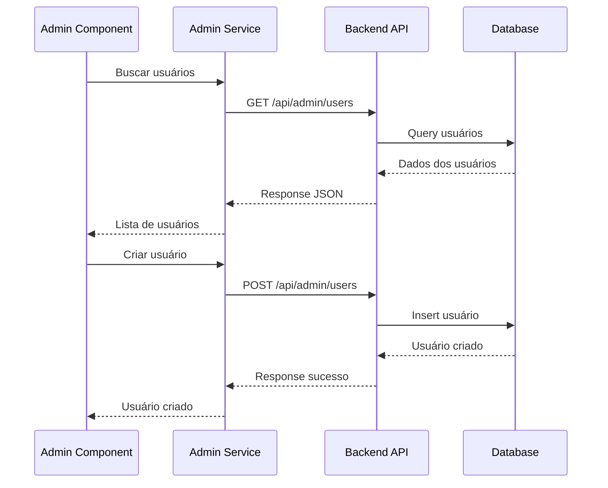
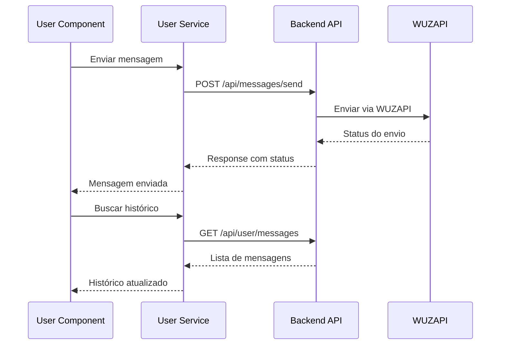
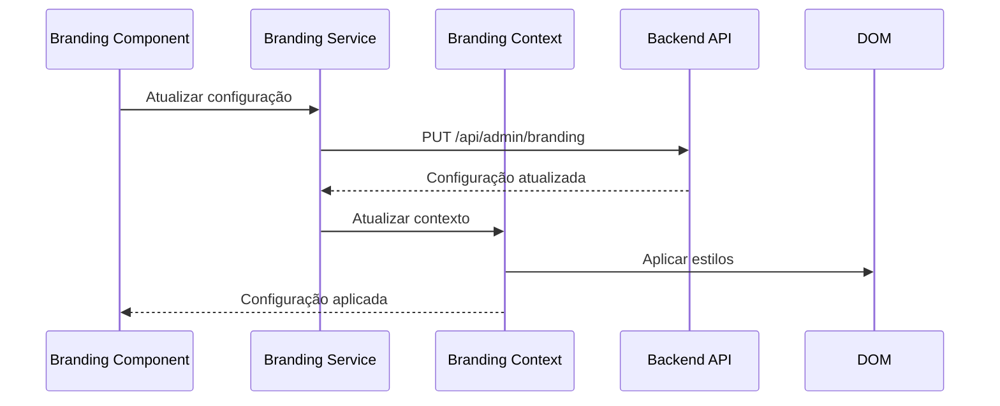

# 🏗️ Guia de Organização por Domínios - Frontend

## Visão Geral

Este guia documenta a organização por domínios do frontend do WUZAPI Manager, incluindo a estrutura de componentes, contextos, hooks, páginas e serviços organizados por responsabilidade funcional. O sistema segue uma arquitetura Domain-Driven Design (DDD) adaptada para React.

## 📋 Índice

- [Arquitetura por Domínios](#arquitetura-por-domínios)
- [Domínio Administrativo](#domínio-administrativo)
- [Domínio do Usuário](#domínio-do-usuário)
- [Domínio de Integração (WUZAPI)](#domínio-de-integração-wuzapi)
- [Camada de Infraestrutura](#camada-de-infraestrutura)
- [Contextos e Estado Global](#contextos-e-estado-global)
- [Serviços por Domínio](#serviços-por-domínio)
- [Padrões de Roteamento](#padrões-de-roteamento)
- [Fluxo de Dados](#fluxo-de-dados)

## Arquitetura por Domínios

### Estrutura Hierárquica por Responsabilidade

```mermaid
graph TB
    subgraph "🎯 Presentation Layer"
        P1[Pages<br/>Rotas principais]
        P2[Layouts<br/>Estruturas de página]
    end
    
    subgraph "🏢 Domain Layer"
        D1[Admin Domain<br/>Gerenciamento]
        D2[User Domain<br/>Funcionalidades usuário]
        D3[WUZAPI Domain<br/>Integração WhatsApp]
        D4[Shared Domain<br/>Componentes compartilhados]
    end
    
    subgraph "🔧 Infrastructure Layer"
        I1[Services<br/>API Clients]
        I2[Contexts<br/>Estado Global]
        I3[Hooks<br/>Lógica Reutilizável]
        I4[Utils<br/>Utilitários]
    end
    
    subgraph "🎨 UI Layer"
        U1[UI Base<br/>shadcn/ui]
        U2[UI Custom<br/>Componentes customizados]
    end
    
    P1 --> P2
    P2 --> D1
    P2 --> D2
    P2 --> D3
    D1 --> D4
    D2 --> D4
    D3 --> D4
    
    D1 --> I1
    D2 --> I2
    D3 --> I3
    D4 --> I4
    
    D1 --> U1
    D2 --> U2
    
    style D1 fill:#ffebee
    style D2 fill:#e8f5e8
    style D3 fill:#e1f5fe
    style D4 fill:#fff3e0
```### 
Estrutura de Diretórios por Domínio

```
src/
├── 📁 components/
│   ├── 📁 admin/                  # Domínio Administrativo
│   │   ├── AdminLayout.tsx        # Layout administrativo
│   │   ├── AdminUsers.tsx         # Gerenciamento de usuários
│   │   ├── AdminSettings.tsx      # Configurações do sistema
│   │   ├── AdminDatabases.tsx     # Gerenciamento de bancos
│   │   ├── BrandingSettings.tsx   # Configurações de marca
│   │   ├── CreateUserPage.tsx     # Criação de usuários
│   │   ├── EditUserPage.tsx       # Edição de usuários
│   │   └── Database*.tsx          # Componentes de banco
│   │
│   ├── 📁 user/                   # Domínio do Usuário
│   │   ├── UserLayout.tsx         # Layout do usuário
│   │   ├── UserMessages.tsx       # Interface de mensagens
│   │   ├── UserSettings.tsx       # Configurações pessoais
│   │   ├── UserDatabase.tsx       # Acesso aos dados
│   │   ├── UserOverview.tsx       # Dashboard do usuário
│   │   └── UserRecordEdit.tsx     # Edição de registros
│   │
│   ├── 📁 wuzapi/                 # Domínio de Integração
│   │   ├── WuzAPIDashboard.tsx    # Dashboard WUZAPI
│   │   ├── auth/                  # Autenticação WUZAPI
│   │   ├── instances/             # Gerenciamento de instâncias
│   │   └── index.ts               # Exports do domínio
│   │
│   ├── 📁 ui/                     # Componentes Base
│   ├── 📁 ui-custom/              # Componentes Customizados
│   └── 📄 [shared components]     # Componentes compartilhados
│
├── 📁 pages/                      # Páginas Principais
│   ├── AdminDashboard.tsx         # Dashboard administrativo
│   ├── UserDashboard.tsx          # Dashboard do usuário
│   ├── LoginPage.tsx              # Página de login
│   └── Index.tsx                  # Página inicial
│
├── 📁 contexts/                   # Estado Global por Domínio
│   ├── AuthContext.tsx            # Autenticação global
│   ├── BrandingContext.tsx        # Configuração visual
│   ├── WuzAPIAuthContext.tsx      # Auth WUZAPI
│   └── WuzAPIInstancesContext.tsx # Instâncias WUZAPI
│
├── 📁 services/                   # Serviços por Domínio
│   ├── wuzapi.ts                  # Serviço WUZAPI
│   ├── database-connections.ts    # Conexões de banco
│   ├── branding.ts                # Serviço de branding
│   └── api-client.ts              # Cliente base
│
├── 📁 hooks/                      # Hooks por Funcionalidade
│   ├── useBranding.ts             # Hook de branding
│   ├── useConfirmDialog.tsx       # Hook de confirmação
│   └── use-mobile.tsx             # Hook de responsividade
│
├── 📁 types/                      # Tipos por Domínio
│   └── branding.ts                # Tipos de branding
│
└── 📁 lib/                        # Utilitários
    ├── utils.ts                   # Utilitários gerais
    ├── api.ts                     # Configurações de API
    └── wuzapi-*.ts                # Utilitários WUZAPI
```

## Domínio Administrativo

### Responsabilidades
- Gerenciamento de usuários do sistema
- Configurações globais da aplicação
- Administração de conexões de banco de dados
- Configurações de branding e personalização
- Monitoramento e relatórios do sistema

### Componentes Principais

#### 1. AdminLayout
**Localização**: `src/components/admin/AdminLayout.tsx`

**Responsabilidades**:
- Layout base para todas as páginas administrativas
- Navegação lateral com menu administrativo
- Integração com sistema de branding
- Responsividade mobile/desktop

```typescript
// Estrutura de navegação administrativa
const navigation = [
  { name: 'Overview', href: '/admin', icon: BarChart3 },
  { name: 'Usuários', href: '/admin/users', icon: Users },
  { name: 'Bancos de Dados', href: '/admin/databases', icon: Database },
  { name: 'Configurações', href: '/admin/settings', icon: Settings },
];

// Uso do layout
<AdminLayout>
  <AdminUsers />
</AdminLayout>
```

#### 2. AdminUsers
**Localização**: `src/components/admin/AdminUsers.tsx`

**Responsabilidades**:
- Listagem de usuários do sistema
- Criação de novos usuários
- Edição e exclusão de usuários
- Visualização de status de conexão

**Funcionalidades**:
- Busca e filtros
- Paginação
- Estados de loading
- Integração com WUZAPI Service

#### 3. AdminDatabases
**Localização**: `src/components/admin/AdminDatabases.tsx`

**Responsabilidades**:
- Gerenciamento de conexões de banco
- Configuração de integrações (NocoDB, MySQL, etc.)
- Teste de conectividade
- Mapeamento de campos

#### 4. BrandingSettings
**Localização**: `src/components/admin/BrandingSettings.tsx`

**Responsabilidades**:
- Configuração visual da aplicação
- Upload de logos
- Definição de cores primárias/secundárias
- Preview em tempo real

### Padrões do Domínio Administrativo

```typescript
// Padrão de componente administrativo
const AdminComponent = () => {
  const [data, setData] = useState([]);
  const [loading, setLoading] = useState(true);
  const [error, setError] = useState(null);
  const brandingConfig = useBrandingConfig();

  // Buscar dados
  const fetchData = async () => {
    try {
      setLoading(true);
      const result = await adminService.getData();
      setData(result);
    } catch (err) {
      setError(err.message);
      toast.error('Erro ao carregar dados');
    } finally {
      setLoading(false);
    }
  };

  // Ações administrativas
  const handleCreate = () => navigate('/admin/resource/new');
  const handleEdit = (id) => navigate(`/admin/resource/edit/${id}`);
  const handleDelete = async (id) => {
    const confirmed = await confirm({
      title: 'Confirmar Exclusão',
      description: 'Esta ação não pode ser desfeita.',
      variant: 'destructive'
    });
    
    if (confirmed) {
      await adminService.delete(id);
      fetchData();
    }
  };

  return (
    <div className="space-y-6">
      <Header
        title="Gerenciamento"
        subtitle="Gerencie recursos do sistema"
        actions={
          <Button onClick={handleCreate}>
            <Plus className="h-4 w-4 mr-2" />
            Novo
          </Button>
        }
      />
      
      {/* Conteúdo do componente */}
    </div>
  );
};
```

## Domínio do Usuário

### Responsabilidades
- Interface para usuários finais
- Envio e gerenciamento de mensagens
- Configurações pessoais
- Acesso aos dados do usuário
- Configuração de webhooks

### Componentes Principais

#### 1. UserLayout
**Localização**: `src/components/user/UserLayout.tsx`

**Responsabilidades**:
- Layout base para páginas do usuário
- Navegação específica do usuário
- Exibição de informações do token
- Menu contextual do usuário

```typescript
// Estrutura de navegação do usuário
const navigation = [
  { name: 'Dashboard', href: '/user', icon: BarChart3 },
  { name: 'Mensagens', href: '/user/messages', icon: MessageSquare },
  { name: 'Meu Banco', href: '/user/database', icon: Database },
  { name: 'Configurações', href: '/user/settings', icon: Settings },
];
```

#### 2. UserMessages
**Localização**: `src/components/user/UserMessages.tsx`

**Responsabilidades**:
- Interface de envio de mensagens
- Histórico de mensagens enviadas
- Templates de mensagem
- Validação de números

**Funcionalidades**:
- Envio de mensagens de texto
- Histórico com status de entrega
- Modelos pré-definidos
- Validação de formato de telefone

#### 3. UserDatabase
**Localização**: `src/components/user/UserDatabase.tsx`

**Responsabilidades**:
- Visualização de dados do usuário
- Edição de registros
- Filtros e busca
- Paginação de dados

#### 4. UserSettings
**Localização**: `src/components/user/UserSettings.tsx`

**Responsabilidades**:
- Configurações pessoais do usuário
- Configuração de webhook
- Preferências de notificação
- Informações da conta

### Padrões do Domínio do Usuário

```typescript
// Padrão de componente do usuário
const UserComponent = () => {
  const { user } = useAuth();
  const [data, setData] = useState([]);
  const [loading, setLoading] = useState(false);

  // Operações específicas do usuário
  const handleUserAction = async (actionData) => {
    try {
      setLoading(true);
      await userService.performAction(actionData, user.token);
      toast.success('Ação realizada com sucesso');
    } catch (error) {
      toast.error('Erro ao realizar ação');
    } finally {
      setLoading(false);
    }
  };

  return (
    <div className="space-y-4">
      <Card>
        <CardHeader>
          <CardTitle>Funcionalidade do Usuário</CardTitle>
          <CardDescription>
            Gerencie suas configurações pessoais
          </CardDescription>
        </CardHeader>
        <CardContent>
          {/* Conteúdo específico do usuário */}
        </CardContent>
      </Card>
    </div>
  );
};
```

## Domínio de Integração (WUZAPI)

### Responsabilidades
- Integração com API do WhatsApp Business
- Gerenciamento de instâncias
- Autenticação WUZAPI
- Configuração de webhooks
- Monitoramento de conexões

### Estrutura do Domínio

```
src/components/wuzapi/
├── WuzAPIDashboard.tsx           # Dashboard principal
├── auth/                         # Autenticação WUZAPI
│   ├── WuzAPILogin.tsx          # Login WUZAPI
│   └── WuzAPIStatus.tsx         # Status da conexão
├── instances/                    # Gerenciamento de instâncias
│   ├── InstancesList.tsx        # Lista de instâncias
│   ├── InstanceCard.tsx         # Card de instância
│   └── CreateInstance.tsx       # Criação de instância
└── index.ts                     # Exports do domínio
```

### Contextos Específicos

#### 1. WuzAPIAuthContext
**Localização**: `src/contexts/WuzAPIAuthContext.tsx`

**Responsabilidades**:
- Gerenciamento de autenticação WUZAPI
- Tokens de acesso
- Status de conexão
- Refresh automático

#### 2. WuzAPIInstancesContext
**Localização**: `src/contexts/WuzAPIInstancesContext.tsx`

**Responsabilidades**:
- Estado das instâncias
- Operações CRUD em instâncias
- Monitoramento de status
- Cache de dados

### Padrões do Domínio WUZAPI

```typescript
// Padrão de componente WUZAPI
const WuzAPIComponent = () => {
  const { instances, loading, error, refreshInstances } = useWuzAPIInstances();
  const { isAuthenticated, token } = useWuzAPIAuth();

  if (!isAuthenticated) {
    return <WuzAPILogin />;
  }

  return (
    <div className="space-y-6">
      <div className="flex justify-between items-center">
        <h2 className="text-2xl font-bold">Instâncias WUZAPI</h2>
        <Button onClick={refreshInstances}>
          <RefreshCw className="h-4 w-4 mr-2" />
          Atualizar
        </Button>
      </div>

      {loading ? (
        <InstancesSkeleton />
      ) : (
        <InstancesList instances={instances} />
      )}
    </div>
  );
};
```

## Camada de Infraestrutura

### Serviços por Domínio

#### 1. WuzAPIService
**Localização**: `src/services/wuzapi.ts`

**Responsabilidades**:
- Comunicação com API WUZAPI
- Gerenciamento de usuários
- Envio de mensagens
- Configuração de webhooks

```typescript
export class WuzAPIService {
  private baseURL: string;
  private timeout: number;

  // Gerenciamento de usuários
  async getUsers(): Promise<WuzAPIUser[]> { /* ... */ }
  async createUser(userData: CreateUserRequest): Promise<WuzAPIUser> { /* ... */ }
  async updateUser(userId: string, userData: UpdateUserRequest): Promise<WuzAPIUser> { /* ... */ }
  async deleteUser(userId: string): Promise<void> { /* ... */ }

  // Mensagens
  async sendMessage(messageData: SendMessageRequest): Promise<MessageResponse> { /* ... */ }
  async getMessageHistory(userId: string): Promise<Message[]> { /* ... */ }

  // Webhooks
  async configureWebhook(webhookData: WebhookConfig): Promise<void> { /* ... */ }
  async testWebhook(webhookUrl: string): Promise<boolean> { /* ... */ }
}
```

#### 2. DatabaseConnectionsService
**Localização**: `src/services/database-connections.ts`

**Responsabilidades**:
- Gerenciamento de conexões de banco
- Integração com NocoDB
- Operações CRUD em dados
- Validação de conexões

```typescript
export class DatabaseConnectionsService {
  // Conexões
  async getConnections(): Promise<DatabaseConnection[]> { /* ... */ }
  async createConnection(connection: DatabaseConnection): Promise<DatabaseConnection> { /* ... */ }
  async testConnection(connectionId: number): Promise<boolean> { /* ... */ }

  // Dados
  async getTableData(connectionId: number, userToken: string): Promise<any[]> { /* ... */ }
  async createRecord(connectionId: number, data: any): Promise<any> { /* ... */ }
  async updateRecord(connectionId: number, recordId: string, data: any): Promise<any> { /* ... */ }
}
```

#### 3. BrandingService
**Localização**: `src/services/branding.ts`

**Responsabilidades**:
- Configuração visual da aplicação
- Cache local de configurações
- Aplicação de temas
- Validação de configurações

```typescript
export class BrandingService {
  // Configuração
  async getBrandingConfig(): Promise<ApiResponse<BrandingConfig>> { /* ... */ }
  async updateBrandingConfig(config: BrandingConfigUpdate): Promise<ApiResponse<BrandingConfig>> { /* ... */ }

  // Cache local
  getLocalConfig(): BrandingConfig | null { /* ... */ }
  setLocalConfig(config: BrandingConfig): void { /* ... */ }
  clearLocalConfig(): void { /* ... */ }

  // Aplicação de tema
  applyBrandingToDOM(config: BrandingConfig): void { /* ... */ }
  resetBrandingInDOM(): void { /* ... */ }
}
```

## Contextos e Estado Global

### Organização por Responsabilidade

#### 1. AuthContext - Autenticação Global
```typescript
interface AuthContextType {
  user: User | null;
  login: (token: string, role: 'admin' | 'user') => Promise<boolean>;
  logout: () => void;
  isLoading: boolean;
}

// Uso em componentes
const { user, login, logout, isLoading } = useAuth();
```

#### 2. BrandingContext - Configuração Visual
```typescript
interface BrandingContextType {
  config: BrandingConfig;
  isLoading: boolean;
  error: string | null;
  updateConfig: (updates: BrandingConfigUpdate) => Promise<boolean>;
  refreshConfig: () => Promise<void>;
  resetToDefault: () => void;
}

// Uso em componentes
const { config, updateConfig } = useBranding();
```

#### 3. Contextos Específicos de Domínio
```typescript
// WUZAPI Auth Context
const WuzAPIAuthContext = createContext<WuzAPIAuthContextType>();

// WUZAPI Instances Context
const WuzAPIInstancesContext = createContext<WuzAPIInstancesContextType>();
```

### Padrão de Criação de Contextos

```typescript
// Template para novos contextos de domínio
interface DomainContextType {
  data: DomainData | null;
  loading: boolean;
  error: string | null;
  // Métodos específicos do domínio
  fetchData: () => Promise<void>;
  updateData: (data: Partial<DomainData>) => Promise<void>;
  deleteData: (id: string) => Promise<void>;
}

const DomainContext = createContext<DomainContextType | undefined>(undefined);

export const useDomain = () => {
  const context = useContext(DomainContext);
  if (!context) {
    throw new Error('useDomain must be used within a DomainProvider');
  }
  return context;
};

export const DomainProvider: React.FC<{ children: React.ReactNode }> = ({ children }) => {
  const [data, setData] = useState<DomainData | null>(null);
  const [loading, setLoading] = useState(false);
  const [error, setError] = useState<string | null>(null);

  // Implementação dos métodos
  const fetchData = async () => { /* ... */ };
  const updateData = async (updates: Partial<DomainData>) => { /* ... */ };
  const deleteData = async (id: string) => { /* ... */ };

  return (
    <DomainContext.Provider value={{
      data,
      loading,
      error,
      fetchData,
      updateData,
      deleteData,
    }}>
      {children}
    </DomainContext.Provider>
  );
};
```

## Padrões de Roteamento

### Estrutura de Rotas por Domínio

```typescript
// src/lib/utils.ts - Definição de rotas
export const navigationPaths = {
  admin: {
    dashboard: '/admin',
    users: '/admin/users',
    newUser: '/admin/users/new',
    editUser: (userId: string) => `/admin/users/edit/${userId}`,
    databases: '/admin/databases',
    newDatabase: '/admin/databases/new',
    editDatabase: (id: string) => `/admin/databases/edit/${id}`,
    settings: '/admin/settings',
  },
  user: {
    dashboard: '/user',
    messages: '/user/messages',
    settings: '/user/settings',
    database: '/user/database',
    editRecord: (connectionId: string, recordId: string) => 
      `/user/database/edit/${connectionId}/${recordId}`,
  },
  auth: {
    login: '/login',
    home: '/',
  }
} as const;
```

### Implementação de Rotas

```typescript
// src/pages/AdminDashboard.tsx
const AdminDashboard = () => {
  return (
    <AdminLayout>
      <Routes>
        <Route path="/" element={<AdminOverview />} />
        <Route path="/users" element={<AdminUsers />} />
        <Route path="/users/new" element={<CreateUserPage />} />
        <Route path="/users/edit/:userId" element={<EditUserPage />} />
        <Route path="/databases" element={<AdminDatabases />} />
        <Route path="/databases/new" element={<DatabaseConnectionNew />} />
        <Route path="/databases/edit/:id" element={<DatabaseConnectionEdit />} />
        <Route path="/settings" element={<AdminSettings />} />
      </Routes>
    </AdminLayout>
  );
};

// src/pages/UserDashboard.tsx
const UserDashboard = () => {
  return (
    <UserLayout>
      <Routes>
        <Route path="/" element={<UserOverview />} />
        <Route path="/messages" element={<UserMessages />} />
        <Route path="/settings" element={<UserSettings />} />
        <Route path="/database" element={<UserDatabase />} />
        <Route path="/database/edit/:connectionId/:recordId" element={<UserRecordEdit />} />
      </Routes>
    </UserLayout>
  );
};
```

### Navegação Programática

```typescript
// Hook para navegação tipada
const useNavigation = () => {
  const navigate = useNavigate();

  return {
    // Navegação administrativa
    goToAdminUsers: () => navigate(navigationPaths.admin.users),
    goToEditUser: (userId: string) => navigate(navigationPaths.admin.editUser(userId)),
    goToAdminDatabases: () => navigate(navigationPaths.admin.databases),

    // Navegação do usuário
    goToUserMessages: () => navigate(navigationPaths.user.messages),
    goToUserSettings: () => navigate(navigationPaths.user.settings),
    goToEditRecord: (connectionId: string, recordId: string) => 
      navigate(navigationPaths.user.editRecord(connectionId, recordId)),

    // Navegação de autenticação
    goToLogin: () => navigate(navigationPaths.auth.login),
    goToHome: () => navigate(navigationPaths.auth.home),
  };
};

// Uso em componentes
const MyComponent = () => {
  const { goToEditUser, goToUserMessages } = useNavigation();

  return (
    <div>
      <Button onClick={() => goToEditUser('123')}>
        Editar Usuário
      </Button>
      <Button onClick={goToUserMessages}>
        Ver Mensagens
      </Button>
    </div>
  );
};
```

## Fluxo de Dados

### Fluxo por Domínio

#### 1. Fluxo Administrativo


#### 2. Fluxo do Usuário


#### 3. Fluxo de Branding


### Padrões de Comunicação

#### 1. Componente → Serviço → API
```typescript
// Componente
const AdminUsers = () => {
  const [users, setUsers] = useState([]);
  const wuzapi = new WuzAPIService();

  const fetchUsers = async () => {
    try {
      const usersData = await wuzapi.getUsers(); // Serviço
      setUsers(usersData);
    } catch (error) {
      toast.error('Erro ao carregar usuários');
    }
  };

  return (
    // JSX do componente
  );
};

// Serviço
export class WuzAPIService {
  async getUsers(): Promise<WuzAPIUser[]> {
    const response = await fetch('/api/admin/users', { // API
      headers: { 'Authorization': adminToken }
    });
    
    if (!response.ok) {
      throw new Error('Erro ao buscar usuários');
    }
    
    const data = await response.json();
    return data.data || [];
  }
}
```

#### 2. Contexto → Componente
```typescript
// Contexto
const BrandingProvider = ({ children }) => {
  const [config, setConfig] = useState(DEFAULT_BRANDING_CONFIG);

  const updateConfig = async (updates) => {
    const response = await brandingService.updateBrandingConfig(updates);
    if (response.success) {
      setConfig(response.data);
      brandingService.applyBrandingToDOM(response.data);
    }
  };

  return (
    <BrandingContext.Provider value={{ config, updateConfig }}>
      {children}
    </BrandingContext.Provider>
  );
};

// Componente
const BrandingSettings = () => {
  const { config, updateConfig } = useBranding();

  const handleSave = async (formData) => {
    await updateConfig(formData);
    toast.success('Configuração salva com sucesso');
  };

  return (
    // JSX do componente
  );
};
```

## Checklist para Novos Domínios

### ✅ Planejamento
- [ ] Definir responsabilidades do domínio
- [ ] Identificar componentes necessários
- [ ] Mapear fluxos de dados
- [ ] Definir interfaces e tipos
- [ ] Planejar integração com outros domínios

### ✅ Estrutura
- [ ] Criar diretório do domínio em `components/`
- [ ] Definir layout específico (se necessário)
- [ ] Criar componentes principais
- [ ] Implementar contexto do domínio (se necessário)
- [ ] Criar serviço específico

### ✅ Integração
- [ ] Adicionar rotas no sistema de navegação
- [ ] Integrar com contextos globais
- [ ] Configurar comunicação com API
- [ ] Implementar tratamento de erros
- [ ] Adicionar testes

### ✅ Documentação
- [ ] Documentar responsabilidades
- [ ] Criar exemplos de uso
- [ ] Documentar padrões específicos
- [ ] Atualizar guias de desenvolvimento

---

## 📚 Próximos Passos

1. **Analise a estrutura atual** dos domínios existentes
2. **Identifique padrões** de organização e comunicação
3. **Implemente novos domínios** seguindo os padrões estabelecidos
4. **Refatore componentes** para melhor organização por domínio
5. **Documente** mudanças e novos padrões

---

**🏗️ Domain Organization Guide** - Estrutura escalável e bem organizada  
Desenvolvido para facilitar o desenvolvimento e manutenção do WUZAPI Manager.