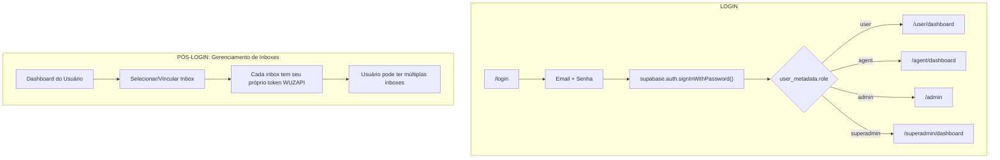

# Login Unificado com Supabase Auth

## Arquitetura: Contas de Usuário Independentes

O sistema foi redesenhado para suportar **contas de usuário independentes** que não dependem de tokens WUZAPI no momento do login.

### Princípios Fundamentais

1. **Usuários são independentes** - Autenticam apenas com email/senha via Supabase Auth
2. **Sem token no login** - A vinculação com caixas de entrada (inboxes) é feita DEPOIS do login
3. **Múltiplas caixas por usuário** - Um usuário pode ter várias inboxes, cada uma com seu próprio token WUZAPI

## Fluxo de Autenticação



## Estrutura de Dados

### user_metadata (Supabase Auth)

```json
{
  "role": "user" | "agent" | "admin" | "superadmin",
  "name": "Nome do Usuário",
  "tenant_id": "uuid-do-tenant"
}
```

### Tabela user_inboxes (Vinculação)

```sql
CREATE TABLE user_inboxes (
  id UUID PRIMARY KEY,
  user_id UUID REFERENCES auth.users(id),
  inbox_id UUID REFERENCES inboxes(id),
  is_primary BOOLEAN DEFAULT false,
  created_at TIMESTAMP DEFAULT NOW()
);
```

## Página de Login

### URL
- `/login` - Página única de login

### Campos
- **Email** - Email do usuário
- **Senha** - Senha do usuário

### Funcionalidades
- Login com email/senha
- Recuperação de senha via Supabase
- Link para cadastro
- Link para acesso superadmin

## Roles e Redirecionamentos

| Role | Destino após login |
|------|-------------------|
| `user` | `/user/dashboard` |
| `agent` | `/agent/dashboard` |
| `admin` | `/admin` |
| `superadmin` | `/superadmin/dashboard` |

## Diferenças do Sistema Anterior

### Antes (Incorreto)
- Login com 3 tabs: Usuário, Agente, Admin
- Agente/Admin precisavam informar "Token da Conta"
- Token validado durante o login

### Agora (Correto)
- Login único com email/senha
- Role determinado pelo `user_metadata.role` no Supabase
- Vinculação com inboxes feita no dashboard após login
- Um usuário pode ter múltiplas inboxes

## Migração de Usuários Existentes

Para migrar usuários existentes para Supabase Auth:

```javascript
const { data, error } = await supabase.auth.admin.createUser({
  email: 'usuario@exemplo.com',
  password: 'senha-temporaria',
  email_confirm: true,
  user_metadata: {
    role: 'user', // ou 'agent', 'admin'
    name: 'Nome do Usuário',
    tenant_id: 'uuid-do-tenant'
  }
});
```

## Configuração do Supabase

### Variáveis de Ambiente

```env
VITE_SUPABASE_URL=https://seu-projeto.supabase.co
VITE_SUPABASE_ANON_KEY=sua-anon-key
```

### Configurações no Dashboard Supabase

1. **Authentication > URL Configuration**
   - Site URL: `http://localhost:8080` (dev) ou URL de produção
   - Redirect URLs: Adicionar URLs permitidas

2. **Authentication > Email Templates**
   - Personalizar templates de confirmação e reset de senha

## Arquivos Relacionados

- `src/pages/UnifiedLoginPage.tsx` - Página de login
- `src/pages/ResetPasswordPage.tsx` - Página de reset de senha
- `src/lib/supabase.ts` - Cliente Supabase
- `src/App.tsx` - Rotas da aplicação
