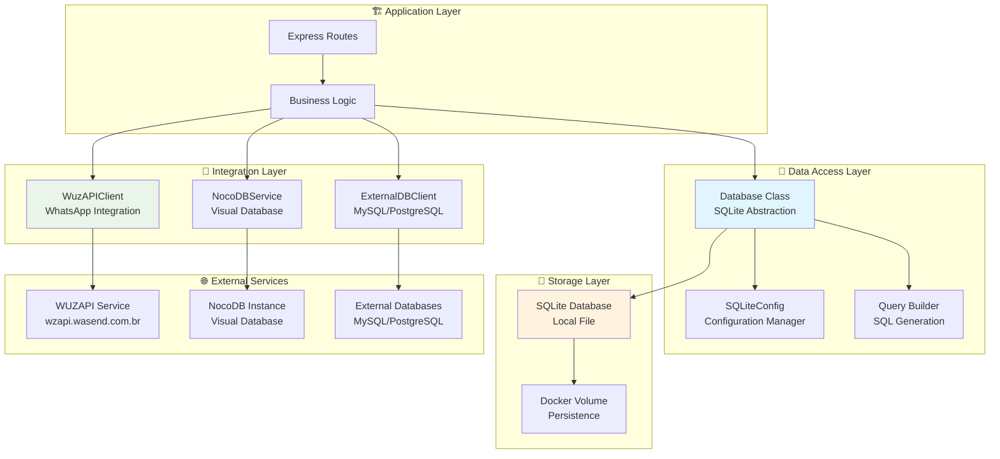

# 💾 Guia da Camada de Dados e Integrações - Backend

## Visão Geral

Este guia documenta a camada de dados do WUZAPI Manager, incluindo operações com SQLite, integrações externas (WUZAPI, NocoDB) e padrões para validação e tratamento de erros. O sistema utiliza SQLite como banco principal com otimizações específicas para produção.

## 📋 Índice

- [Arquitetura da Camada de Dados](#arquitetura-da-camada-de-dados)
- [Configuração SQLite](#configuração-sqlite)
- [Operações de Banco de Dados](#operações-de-banco-de-dados)
- [Integrações Externas](#integrações-externas)
- [Padrões de Validação](#padrões-de-validação)
- [Tratamento de Erros](#tratamento-de-erros)
- [Performance e Otimização](#performance-e-otimização)
- [Backup e Manutenção](#backup-e-manutenção)
- [Exemplos Práticos](#exemplos-práticos)

## Arquitetura da Camada de Dados

### Estrutura de Componentes



### Estrutura de Arquivos

```
server/
├── database.js              # Classe principal de abstração SQLite
├── config/
│   └── sqlite.js            # Configurações específicas SQLite
├── utils/
│   ├── wuzapiClient.js      # Cliente para integração WUZAPI
│   └── logger.js            # Sistema de logging
├── validators/
│   ├── adminValidator.js    # Validação de tokens admin
│   └── sessionValidator.js  # Validação de tokens usuário
└── middleware/
    └── errorHandler.js      # Tratamento centralizado de erros
```

## Configuração SQLite

### 1. Classe SQLiteConfig

A configuração do SQLite é centralizada na classe `SQLiteConfig`:

```javascript
// server/config/sqlite.js
class SQLiteConfig {
  constructor() {
    this.config = this.loadConfig();
  }

  loadConfig() {
    return {
      // Caminho do banco
      dbPath: process.env.SQLITE_DB_PATH || './wuzapi.db',
      
      // Performance
      walMode: process.env.SQLITE_WAL_MODE === 'true' || true,
      timeout: parseInt(process.env.SQLITE_TIMEOUT) || 5000,
      cacheSize: parseInt(process.env.SQLITE_CACHE_SIZE) || 2000,
      
      // Sincronização
      synchronous: process.env.SQLITE_SYNCHRONOUS || 'NORMAL',
      
      // Memória
      tempStore: process.env.SQLITE_TEMP_STORE || 'MEMORY',
      mmapSize: parseInt(process.env.SQLITE_MMAP_SIZE) || 268435456,
      
      // Segurança
      foreignKeys: process.env.SQLITE_FOREIGN_KEYS !== 'false',
      recursiveTriggers: process.env.SQLITE_RECURSIVE_TRIGGERS !== 'false'
    };
  }
}
```

### 2. Variáveis de Ambiente

#### Desenvolvimento
```env
# Banco de dados
SQLITE_DB_PATH=./wuzapi.db
SQLITE_WAL_MODE=true
SQLITE_TIMEOUT=5000
SQLITE_CACHE_SIZE=2000
SQLITE_SYNCHRONOUS=NORMAL
```

#### Produção
```env
# Banco de dados (Docker)
SQLITE_DB_PATH=/app/data/wuzapi.db
SQLITE_WAL_MODE=true
SQLITE_TIMEOUT=5000
SQLITE_CACHE_SIZE=4000
SQLITE_SYNCHRONOUS=NORMAL
SQLITE_TEMP_STORE=MEMORY
SQLITE_MMAP_SIZE=268435456
```

### 3. Otimizações Aplicadas

```javascript
// Configurações automáticas aplicadas na inicialização
const optimizations = [
  'PRAGMA journal_mode = WAL',        // Write-Ahead Logging
  'PRAGMA synchronous = NORMAL',      // Balanceamento performance/segurança
  'PRAGMA cache_size = 4000',         // Cache de 4MB
  'PRAGMA temp_store = MEMORY',       // Tabelas temp em memória
  'PRAGMA mmap_size = 268435456',     // Memory-mapped I/O 256MB
  'PRAGMA foreign_keys = ON',         // Integridade referencial
  'PRAGMA recursive_triggers = ON'    // Triggers recursivos
];
```

## Operações de Banco de Dados

### 1. Classe Database - Métodos Principais

#### Inicialização
```javascript
const Database = require('./database');

// Instanciar e inicializar
const db = new Database();
await db.init();

// Verificar se está inicializado
await db.ensureInitialized();
```

#### Query Genérica
```javascript
// SELECT queries
const result = await db.query('SELECT * FROM database_connections WHERE status = ?', ['active']);
console.log(result.rows); // Array de resultados
console.log(result.rowCount); // Número de linhas

// INSERT/UPDATE/DELETE queries
const result = await db.query('INSERT INTO table (name) VALUES (?)', ['value']);
console.log(result.lastID); // ID do registro inserido
console.log(result.rowCount); // Número de linhas afetadas
```

### 2. Operações CRUD - Conexões de Banco

#### Listar Conexões
```javascript
// Buscar todas as conexões
const connections = await db.getAllConnections();

// Buscar conexão específica
const connection = await db.getConnectionById(1);

// Buscar conexões do usuário
const userConnections = await db.getUserConnections(userToken);
```

#### Criar Conexão
```javascript
const connectionData = {
  name: 'Banco de Produção',
  type: 'NOCODB',
  host: 'nocodb.example.com',
  port: 443,
  database_name: 'production_db',
  username: 'user',
  password: 'password',
  table_name: 'customers',
  assigned_users: ['user1', 'user2'],
  nocodb_token: 'token_here',
  nocodb_project_id: 'project_id',
  nocodb_table_id: 'table_id',
  field_mappings: {
    'name': 'customer_name',
    'email': 'customer_email'
  }
};

const newConnection = await db.createConnection(connectionData);
```

#### Atualizar Conexão
```javascript
const updateData = {
  name: 'Banco Atualizado',
  status: 'active',
  assigned_users: ['user1', 'user2', 'user3']
};

const updated = await db.updateConnection(connectionId, updateData);
```

#### Deletar Conexão
```javascript
const deleted = await db.deleteConnection(connectionId);
```

#### Atualizar Status
```javascript
await db.updateConnectionStatus(connectionId, 'connected');
```

### 3. Operações CRUD - Configuração de Branding

#### Buscar Configuração
```javascript
const brandingConfig = await db.getBrandingConfig();
console.log(brandingConfig.appName);
console.log(brandingConfig.logoUrl);
console.log(brandingConfig.primaryColor);
```

#### Atualizar Configuração
```javascript
const brandingData = {
  appName: 'Minha Empresa',
  logoUrl: 'https://example.com/logo.png',
  primaryColor: '#007bff',
  secondaryColor: '#6c757d'
};

const updated = await db.updateBrandingConfig(brandingData);
```

### 4. Operações com Dados de Tabelas

#### Buscar Dados de Tabela
```javascript
// Buscar dados para usuário específico
const tableData = await db.getUserTableData(userToken, connectionId);

// Dados incluem:
// - records: array de registros
// - pagination: informações de paginação
// - connection: detalhes da conexão
// - metadata: metadados da tabela
```

#### Criar Registro
```javascript
const recordData = {
  name: 'João Silva',
  email: 'joao@example.com',
  phone: '+5511999999999'
};

const newRecord = await db.createUserTableRecord(userToken, connectionId, recordData);
```

#### Atualizar Registro
```javascript
const updateData = {
  name: 'João Santos',
  email: 'joao.santos@example.com'
};

const updated = await db.updateUserTableRecord(userToken, connectionId, recordId, updateData);
```

#### Deletar Registro
```javascript
const deleted = await db.deleteUserTableRecord(userToken, connectionId, recordId);
```

### 5. Schema e Migrações

#### Estrutura das Tabelas

```sql
-- Tabela principal de conexões
CREATE TABLE database_connections (
  id INTEGER PRIMARY KEY AUTOINCREMENT,
  name VARCHAR(255) NOT NULL,
  type VARCHAR(50) NOT NULL,
  host VARCHAR(255),
  port INTEGER,
  database_name VARCHAR(255),
  username VARCHAR(255),
  password TEXT,
  table_name VARCHAR(255),
  status VARCHAR(50) DEFAULT 'inactive',
  assigned_users TEXT DEFAULT '[]',
  nocodb_token TEXT,
  nocodb_project_id VARCHAR(255),
  nocodb_table_id VARCHAR(255),
  user_link_field VARCHAR(255),
  field_mappings TEXT DEFAULT '[]',
  created_at DATETIME DEFAULT CURRENT_TIMESTAMP,
  updated_at DATETIME DEFAULT CURRENT_TIMESTAMP
);

-- Tabela de configuração de branding
CREATE TABLE branding_config (
  id INTEGER PRIMARY KEY AUTOINCREMENT,
  app_name VARCHAR(50) NOT NULL DEFAULT 'WUZAPI',
  logo_url TEXT,
  primary_color VARCHAR(7),
  secondary_color VARCHAR(7),
  created_at DATETIME DEFAULT CURRENT_TIMESTAMP,
  updated_at DATETIME DEFAULT CURRENT_TIMESTAMP
);

-- Tabela de metadados do sistema
CREATE TABLE system_metadata (
  key VARCHAR(255) PRIMARY KEY,
  value TEXT,
  created_at DATETIME DEFAULT CURRENT_TIMESTAMP,
  updated_at DATETIME DEFAULT CURRENT_TIMESTAMP
);
```

#### Índices para Performance
```sql
-- Índices automáticos criados
CREATE INDEX idx_database_connections_type ON database_connections(type);
CREATE INDEX idx_database_connections_status ON database_connections(status);
CREATE INDEX idx_database_connections_created_at ON database_connections(created_at);
CREATE INDEX idx_database_connections_name ON database_connections(name);
```

## Integrações Externas

### 1. WuzAPIClient - Integração WhatsApp

#### Configuração
```javascript
// server/utils/wuzapiClient.js
class WuzAPIClient {
  constructor() {
    this.baseURL = process.env.WUZAPI_BASE_URL || 'https://wzapi.wasend.com.br';
    this.timeout = parseInt(process.env.REQUEST_TIMEOUT) || 10000;
    
    this.client = axios.create({
      baseURL: this.baseURL,
      timeout: this.timeout,
      headers: { 'Content-Type': 'application/json' }
    });
  }
}
```

#### Métodos Disponíveis

##### Requisições Básicas
```javascript
const wuzapiClient = require('./utils/wuzapiClient');

// GET request
const response = await wuzapiClient.get('/session/status', {
  headers: { 'token': userToken }
});

// POST request
const response = await wuzapiClient.post('/send-text', {
  number: '+5511999999999',
  message: 'Olá!'
}, {
  headers: { 'token': userToken }
});

// DELETE request
const response = await wuzapiClient.delete('/webhook', {
  headers: { 'token': userToken }
});
```

##### Métodos Administrativos
```javascript
// Listar usuários (admin)
const users = await wuzapiClient.getAdmin('/admin/users', adminToken);

// Criar usuário (admin)
const userData = {
  name: 'Nova Instância',
  token: 'user_token_here',
  webhook: 'https://webhook.example.com',
  events: ['message.received', 'message.sent']
};
const newUser = await wuzapiClient.postAdmin('/admin/users', userData, adminToken);

// Deletar usuário (admin)
const deleted = await wuzapiClient.deleteUser(userId, adminToken);

// Deletar usuário completo (admin)
const deletedFull = await wuzapiClient.deleteUserFull(userId, adminToken);
```

##### Health Check
```javascript
// Verificar se WUZAPI está disponível
const isHealthy = await wuzapiClient.isHealthy();
console.log('WUZAPI Status:', isHealthy ? 'Online' : 'Offline');

// Obter configurações
const config = wuzapiClient.getConfig();
console.log('Base URL:', config.baseURL);
console.log('Timeout:', config.timeout);
```

#### Tratamento de Erros
```javascript
// Estrutura de resposta padronizada
const response = await wuzapiClient.get('/endpoint');

if (response.success) {
  console.log('Dados:', response.data);
  console.log('Status:', response.status);
} else {
  console.log('Erro:', response.error);
  console.log('Status:', response.status);
  console.log('Código:', response.code); // TIMEOUT, CONNECTION_ERROR, etc.
}
```

### 2. Integração NocoDB

#### Configuração de Conexão
```javascript
const nocodbConnection = {
  type: 'NOCODB',
  host: 'https://nocodb.example.com',
  nocodb_token: 'xc-token-here',
  nocodb_project_id: 'project_id',
  nocodb_table_id: 'table_id',
  field_mappings: {
    'user_field': 'nocodb_field',
    'email': 'Email',
    'name': 'Name'
  }
};
```

#### Operações CRUD
```javascript
// Buscar dados
const data = await db.getNocoDBTableData(connection, userToken);

// Criar registro
const newRecord = await db.createNocoDBRecord(connection, {
  Name: 'João Silva',
  Email: 'joao@example.com'
}, userToken);

// Atualizar registro
const updated = await db.updateNocoDBRecord(connection, recordId, {
  Name: 'João Santos'
}, userToken);

// Deletar registro
const deleted = await db.deleteNocoDBRecord(connection, recordId, userToken);
```

#### Headers e Autenticação
```javascript
// Headers automáticos para NocoDB
const headers = {
  'xc-token': connection.nocodb_token,
  'Content-Type': 'application/json'
};

// URL construída automaticamente
const url = `${connection.host}/api/v1/db/data/v1/${connection.nocodb_project_id}/${connection.nocodb_table_id}`;
```

### 3. Integração com Bancos Externos

#### Suporte Planejado
```javascript
// MySQL/PostgreSQL (implementação futura)
const externalConnection = {
  type: 'MYSQL', // ou 'POSTGRESQL'
  host: 'database.example.com',
  port: 3306,
  database_name: 'production',
  username: 'user',
  password: 'password',
  table_name: 'customers'
};

// Métodos placeholder
await db.createExternalDBRecord(connection, recordData, userToken);
await db.updateExternalDBRecord(connection, recordId, updateData, userToken);
await db.deleteExternalDBRecord(connection, recordId, userToken);
```

## Padrões de Validação

### 1. Validação de Dados de Conexão

```javascript
// Método interno da classe Database
validateConnectionData(data) {
  const errors = [];
  
  // Validações obrigatórias
  if (!data.name || data.name.trim() === '') {
    errors.push('Nome da conexão é obrigatório');
  }
  
  if (!data.type || !['SQLITE', 'NOCODB', 'MYSQL', 'POSTGRESQL'].includes(data.type)) {
    errors.push('Tipo de conexão inválido');
  }
  
  // Validações específicas por tipo
  if (data.type === 'NOCODB') {
    if (!data.nocodb_token) {
      errors.push('Token NocoDB é obrigatório');
    }
    if (!data.nocodb_project_id) {
      errors.push('ID do projeto NocoDB é obrigatório');
    }
  }
  
  // Validar JSON fields
  try {
    if (data.assigned_users) {
      JSON.parse(typeof data.assigned_users === 'string' ? data.assigned_users : JSON.stringify(data.assigned_users));
    }
  } catch (error) {
    errors.push('Campo assigned_users deve ser um JSON válido');
  }
  
  if (errors.length > 0) {
    throw new Error(`Dados de conexão inválidos: ${errors.join(', ')}`);
  }
  
  return {
    ...data,
    assigned_users: JSON.stringify(data.assigned_users || []),
    field_mappings: JSON.stringify(data.field_mappings || {}),
    updated_at: new Date().toISOString()
  };
}
```

### 2. Validação de Branding

```javascript
validateBrandingData(data) {
  const errors = [];
  
  // Validar app_name
  if (!data.appName || typeof data.appName !== 'string') {
    errors.push('Nome da aplicação é obrigatório');
  } else if (data.appName.length < 1 || data.appName.length > 50) {
    errors.push('Nome da aplicação deve ter entre 1 e 50 caracteres');
  }
  
  // Validar logo_url
  if (data.logoUrl && typeof data.logoUrl === 'string') {
    try {
      new URL(data.logoUrl);
    } catch {
      errors.push('URL do logo deve ser uma URL válida');
    }
  }
  
  // Validar cores (formato #RRGGBB)
  const colorRegex = /^#[0-9A-Fa-f]{6}$/;
  
  if (data.primaryColor && !colorRegex.test(data.primaryColor)) {
    errors.push('Cor primária deve estar no formato #RRGGBB');
  }
  
  if (data.secondaryColor && !colorRegex.test(data.secondaryColor)) {
    errors.push('Cor secundária deve estar no formato #RRGGBB');
  }
  
  if (errors.length > 0) {
    throw new Error(`Dados de branding inválidos: ${errors.join(', ')}`);
  }
  
  return {
    app_name: data.appName,
    logo_url: data.logoUrl || null,
    primary_color: data.primaryColor || null,
    secondary_color: data.secondaryColor || null,
    updated_at: new Date().toISOString()
  };
}
```

### 3. Validação de Tokens

```javascript
// Validação de formato de token
const isValidTokenFormat = (token) => {
  return token && 
         typeof token === 'string' && 
         token.length >= 8 && 
         token.length <= 256 &&
         !/\s/.test(token); // Não deve conter espaços
};

// Validação de token administrativo
const isValidAdminTokenFormat = (token) => {
  return token && 
         typeof token === 'string' && 
         token.length >= 16 && // Tokens admin são mais longos
         token.length <= 256 &&
         !/\s/.test(token);
};
```

## Tratamento de Erros

### 1. Hierarquia de Erros

```javascript
// Tipos de erro por categoria
const ErrorTypes = {
  // Erros de validação
  VALIDATION_ERROR: 'VALIDATION_ERROR',
  INVALID_TOKEN: 'INVALID_TOKEN',
  MISSING_REQUIRED_FIELD: 'MISSING_REQUIRED_FIELD',
  
  // Erros de banco de dados
  DATABASE_ERROR: 'DATABASE_ERROR',
  CONNECTION_FAILED: 'CONNECTION_FAILED',
  QUERY_FAILED: 'QUERY_FAILED',
  
  // Erros de integração
  INTEGRATION_ERROR: 'INTEGRATION_ERROR',
  WUZAPI_ERROR: 'WUZAPI_ERROR',
  NOCODB_ERROR: 'NOCODB_ERROR',
  TIMEOUT_ERROR: 'TIMEOUT_ERROR',
  
  // Erros de sistema
  SYSTEM_ERROR: 'SYSTEM_ERROR',
  FILE_SYSTEM_ERROR: 'FILE_SYSTEM_ERROR',
  PERMISSION_ERROR: 'PERMISSION_ERROR'
};
```

### 2. Tratamento de Erros SQLite

```javascript
// Tratamento específico por código de erro SQLite
const handleSQLiteError = (error) => {
  switch (error.code) {
    case 'SQLITE_CANTOPEN':
      return {
        type: 'DATABASE_ERROR',
        message: 'Não foi possível abrir o banco de dados',
        suggestion: 'Verifique se o diretório existe e tem permissões adequadas'
      };
      
    case 'SQLITE_PERM':
      return {
        type: 'PERMISSION_ERROR',
        message: 'Permissão negada para acessar o banco de dados',
        suggestion: 'Verifique as permissões do arquivo e diretório'
      };
      
    case 'SQLITE_BUSY':
      return {
        type: 'DATABASE_ERROR',
        message: 'Banco de dados está ocupado',
        suggestion: 'Tente novamente em alguns segundos'
      };
      
    case 'SQLITE_CORRUPT':
      return {
        type: 'DATABASE_ERROR',
        message: 'Banco de dados corrompido',
        suggestion: 'Execute verificação de integridade ou restaure backup'
      };
      
    default:
      return {
        type: 'DATABASE_ERROR',
        message: error.message || 'Erro desconhecido no banco de dados',
        suggestion: 'Verifique os logs para mais detalhes'
      };
  }
};
```

### 3. Tratamento de Erros de Integração

```javascript
// Tratamento de erros WUZAPI
const handleWuzAPIError = (error) => {
  if (error.response) {
    // Erro com resposta da API
    const status = error.response.status;
    const data = error.response.data;
    
    switch (status) {
      case 401:
        return {
          type: 'INVALID_TOKEN',
          message: 'Token inválido ou expirado',
          suggestion: 'Verifique se o token está correto'
        };
        
      case 403:
        return {
          type: 'PERMISSION_ERROR',
          message: 'Token não possui permissões necessárias',
          suggestion: 'Use um token com permissões administrativas'
        };
        
      case 429:
        return {
          type: 'RATE_LIMIT_ERROR',
          message: 'Muitas requisições',
          suggestion: 'Aguarde alguns segundos antes de tentar novamente'
        };
        
      default:
        return {
          type: 'WUZAPI_ERROR',
          message: data?.error || 'Erro na comunicação com WUZAPI',
          suggestion: 'Verifique se o serviço está disponível'
        };
    }
  } else if (error.code === 'ECONNABORTED') {
    return {
      type: 'TIMEOUT_ERROR',
      message: 'Timeout na comunicação com WUZAPI',
      suggestion: 'Verifique a conexão de rede'
    };
  } else {
    return {
      type: 'CONNECTION_ERROR',
      message: 'Não foi possível conectar com WUZAPI',
      suggestion: 'Verifique se o serviço está disponível'
    };
  }
};
```

### 4. Logging de Erros

```javascript
// Padrão de logging para erros
const logError = (error, context = {}) => {
  const errorInfo = {
    timestamp: new Date().toISOString(),
    error_type: error.type || 'UNKNOWN_ERROR',
    error_message: error.message,
    error_stack: error.stack,
    context: {
      method: context.method,
      url: context.url,
      user_token: context.userToken ? 'present' : 'absent',
      user_agent: context.userAgent,
      ip: context.ip,
      ...context.additional
    }
  };
  
  logger.error('Database/Integration Error', errorInfo);
  
  // Alertas para erros críticos
  if (['DATABASE_ERROR', 'CORRUPTION_ERROR'].includes(error.type)) {
    logger.critical('Critical Database Error', errorInfo);
  }
};
```

## Performance e Otimização

### 1. Configurações de Performance

```javascript
// Configurações otimizadas para produção
const productionConfig = {
  // WAL mode para melhor concorrência
  walMode: true,
  
  // Cache maior para produção
  cacheSize: 4000, // 4MB
  
  // Sincronização balanceada
  synchronous: 'NORMAL',
  
  // Tabelas temporárias em memória
  tempStore: 'MEMORY',
  
  // Memory-mapped I/O
  mmapSize: 268435456, // 256MB
  
  // Checkpoint automático
  walAutocheckpoint: 1000
};
```

### 2. Índices de Performance

```javascript
// Índices automáticos criados
const performanceIndexes = [
  // Índices básicos
  'CREATE INDEX IF NOT EXISTS idx_connections_type ON database_connections(type)',
  'CREATE INDEX IF NOT EXISTS idx_connections_status ON database_connections(status)',
  
  // Índices compostos para queries complexas
  'CREATE INDEX IF NOT EXISTS idx_connections_type_status ON database_connections(type, status)',
  'CREATE INDEX IF NOT EXISTS idx_connections_user_lookup ON database_connections(type, status, assigned_users)',
  
  // Índices para ordenação
  'CREATE INDEX IF NOT EXISTS idx_connections_created_desc ON database_connections(created_at DESC)',
  'CREATE INDEX IF NOT EXISTS idx_connections_name_asc ON database_connections(name ASC)'
];
```

### 3. Cache de Validação

```javascript
// Cache em memória para validações de token
class ValidationCache {
  constructor(ttl = 300000) { // 5 minutos
    this.cache = new Map();
    this.ttl = ttl;
  }
  
  set(token, validationResult) {
    const key = this.hashToken(token);
    this.cache.set(key, {
      result: validationResult,
      timestamp: Date.now()
    });
  }
  
  get(token) {
    const key = this.hashToken(token);
    const cached = this.cache.get(key);
    
    if (!cached) return null;
    
    if (Date.now() - cached.timestamp > this.ttl) {
      this.cache.delete(key);
      return null;
    }
    
    return cached.result;
  }
  
  hashToken(token) {
    // Hash simples para não armazenar tokens completos
    return require('crypto')
      .createHash('sha256')
      .update(token)
      .digest('hex')
      .substring(0, 16);
  }
}
```

### 4. Monitoramento de Performance

```javascript
// Métricas de performance do banco
async getDatabaseStats() {
  const stats = {};
  
  // Estatísticas básicas
  const basicStats = await this.query(`
    SELECT 
      (SELECT COUNT(*) FROM database_connections) as total_connections,
      (SELECT COUNT(*) FROM database_connections WHERE status = 'active') as active_connections,
      (SELECT COUNT(*) FROM branding_config) as branding_configs
  `);
  
  stats.records = basicStats.rows[0];
  
  // Estatísticas do arquivo
  const fs = require('fs');
  try {
    const dbStats = fs.statSync(this.dbPath);
    stats.file = {
      size_bytes: dbStats.size,
      size_mb: Math.round(dbStats.size / 1024 / 1024 * 100) / 100,
      modified: dbStats.mtime
    };
  } catch (error) {
    stats.file = { error: 'Unable to read file stats' };
  }
  
  // Estatísticas SQLite
  const sqliteStats = await this.query('PRAGMA database_list');
  stats.sqlite = {
    databases: sqliteStats.rows,
    wal_mode: await this.query('PRAGMA journal_mode'),
    cache_size: await this.query('PRAGMA cache_size'),
    page_size: await this.query('PRAGMA page_size')
  };
  
  return stats;
}
```

## Backup e Manutenção

### 1. Backup Automático

```javascript
// Método de backup da classe Database
async createBackup(backupPath = null) {
  if (!backupPath) {
    const timestamp = new Date().toISOString().replace(/[:.]/g, '-');
    backupPath = `${this.dbPath}.backup.${timestamp}`;
  }
  
  return new Promise((resolve, reject) => {
    const fs = require('fs');
    
    // Usar VACUUM INTO para criar backup consistente
    this.db.run(`VACUUM INTO '${backupPath}'`, (err) => {
      if (err) {
        logger.error('Erro ao criar backup:', err.message);
        reject(err);
      } else {
        const stats = fs.statSync(backupPath);
        logger.info(`Backup criado: ${backupPath} (${stats.size} bytes)`);
        resolve({
          path: backupPath,
          size: stats.size,
          created: new Date().toISOString()
        });
      }
    });
  });
}
```

### 2. Verificação de Integridade

```javascript
// Verificação automática na inicialização
async checkDatabaseIntegrity() {
  return new Promise((resolve, reject) => {
    this.db.get('PRAGMA integrity_check', (err, row) => {
      if (err) {
        logger.error('Erro na verificação de integridade:', err.message);
        reject(err);
      } else if (row && row.integrity_check === 'ok') {
        logger.info('✅ Integridade do banco verificada');
        resolve(true);
      } else {
        const error = new Error(`Falha na verificação de integridade: ${row?.integrity_check}`);
        logger.error('❌ Banco de dados corrompido:', error.message);
        reject(error);
      }
    });
  });
}
```

### 3. Manutenção Periódica

```javascript
// Script de manutenção (executar periodicamente)
async performMaintenance() {
  logger.info('🔧 Iniciando manutenção do banco de dados');
  
  try {
    // 1. Verificar integridade
    await this.checkDatabaseIntegrity();
    
    // 2. Executar VACUUM se necessário
    const stats = await this.getDatabaseStats();
    if (stats.file.size_mb > 100) { // Se maior que 100MB
      logger.info('🗜️ Executando VACUUM para otimizar espaço');
      await this.query('VACUUM');
    }
    
    // 3. Atualizar estatísticas
    await this.query('ANALYZE');
    
    // 4. Checkpoint WAL
    await this.query('PRAGMA wal_checkpoint(TRUNCATE)');
    
    // 5. Limpar cache de validação
    this.clearUserValidationCache();
    
    logger.info('✅ Manutenção concluída com sucesso');
    
  } catch (error) {
    logger.error('❌ Erro durante manutenção:', error.message);
    throw error;
  }
}
```

## Exemplos Práticos

### 1. Implementando Nova Integração

```javascript
// Exemplo: Integração com Airtable
class AirtableService {
  constructor(connection) {
    this.connection = connection;
    this.baseUrl = `https://api.airtable.com/v0/${connection.airtable_base_id}`;
    this.headers = {
      'Authorization': `Bearer ${connection.airtable_api_key}`,
      'Content-Type': 'application/json'
    };
  }
  
  async getRecords(userToken) {
    try {
      const response = await axios.get(
        `${this.baseUrl}/${this.connection.table_name}`,
        { headers: this.headers }
      );
      
      return {
        success: true,
        records: response.data.records.map(record => ({
          id: record.id,
          ...record.fields
        }))
      };
    } catch (error) {
      return {
        success: false,
        error: error.message
      };
    }
  }
  
  async createRecord(recordData, userToken) {
    try {
      const response = await axios.post(
        `${this.baseUrl}/${this.connection.table_name}`,
        {
          fields: recordData
        },
        { headers: this.headers }
      );
      
      return {
        success: true,
        record: {
          id: response.data.id,
          ...response.data.fields
        }
      };
    } catch (error) {
      return {
        success: false,
        error: error.message
      };
    }
  }
}

// Adicionar ao Database.js
async getAirtableTableData(connection, userToken) {
  const airtableService = new AirtableService(connection);
  return await airtableService.getRecords(userToken);
}
```

### 2. Implementando Cache Inteligente

```javascript
// Cache com invalidação automática
class SmartCache {
  constructor() {
    this.cache = new Map();
    this.dependencies = new Map(); // Rastrear dependências
  }
  
  set(key, value, dependencies = []) {
    this.cache.set(key, {
      value,
      timestamp: Date.now(),
      dependencies
    });
    
    // Registrar dependências reversas
    dependencies.forEach(dep => {
      if (!this.dependencies.has(dep)) {
        this.dependencies.set(dep, new Set());
      }
      this.dependencies.get(dep).add(key);
    });
  }
  
  get(key) {
    const cached = this.cache.get(key);
    if (!cached) return null;
    
    // Verificar TTL (5 minutos)
    if (Date.now() - cached.timestamp > 300000) {
      this.delete(key);
      return null;
    }
    
    return cached.value;
  }
  
  invalidate(dependency) {
    // Invalidar todas as chaves que dependem desta entidade
    const dependentKeys = this.dependencies.get(dependency);
    if (dependentKeys) {
      dependentKeys.forEach(key => this.delete(key));
      this.dependencies.delete(dependency);
    }
  }
  
  delete(key) {
    const cached = this.cache.get(key);
    if (cached) {
      // Limpar dependências reversas
      cached.dependencies.forEach(dep => {
        const deps = this.dependencies.get(dep);
        if (deps) {
          deps.delete(key);
          if (deps.size === 0) {
            this.dependencies.delete(dep);
          }
        }
      });
    }
    this.cache.delete(key);
  }
}

// Uso no Database.js
const smartCache = new SmartCache();

async getUserConnections(userToken) {
  const cacheKey = `user_connections_${this.hashToken(userToken)}`;
  
  // Tentar cache primeiro
  const cached = smartCache.get(cacheKey);
  if (cached) {
    logger.info('Cache hit para conexões do usuário');
    return cached;
  }
  
  // Buscar do banco
  const connections = await this.getAllConnections();
  const userConnections = connections.filter(conn => 
    conn.assigned_users.includes(userToken)
  );
  
  // Cachear com dependências
  smartCache.set(cacheKey, userConnections, ['database_connections']);
  
  return userConnections;
}

// Invalidar cache quando conexões mudarem
async updateConnection(id, data) {
  const result = await this.query(/* ... */);
  
  // Invalidar cache relacionado
  smartCache.invalidate('database_connections');
  
  return result;
}
```

### 3. Monitoramento em Tempo Real

```javascript
// Sistema de métricas em tempo real
class DatabaseMetrics {
  constructor(database) {
    this.db = database;
    this.metrics = {
      queries: { total: 0, by_type: {} },
      performance: { avg_response_time: 0, slow_queries: 0 },
      errors: { total: 0, by_type: {} },
      connections: { active: 0, total: 0 }
    };
    
    this.startMetricsCollection();
  }
  
  recordQuery(sql, duration, success = true) {
    this.metrics.queries.total++;
    
    const queryType = sql.trim().split(' ')[0].toUpperCase();
    this.metrics.queries.by_type[queryType] = 
      (this.metrics.queries.by_type[queryType] || 0) + 1;
    
    // Atualizar tempo médio de resposta
    this.updateAverageResponseTime(duration);
    
    // Registrar queries lentas (> 1 segundo)
    if (duration > 1000) {
      this.metrics.performance.slow_queries++;
      logger.warn('Slow query detected', {
        sql: sql.substring(0, 100),
        duration,
        type: queryType
      });
    }
    
    if (!success) {
      this.metrics.errors.total++;
      this.metrics.errors.by_type[queryType] = 
        (this.metrics.errors.by_type[queryType] || 0) + 1;
    }
  }
  
  updateAverageResponseTime(duration) {
    const total = this.metrics.queries.total;
    const current = this.metrics.performance.avg_response_time;
    this.metrics.performance.avg_response_time = 
      (current * (total - 1) + duration) / total;
  }
  
  async updateConnectionMetrics() {
    try {
      const stats = await this.db.getDatabaseStats();
      this.metrics.connections = {
        active: stats.records.active_connections,
        total: stats.records.total_connections
      };
    } catch (error) {
      logger.error('Erro ao atualizar métricas de conexão:', error.message);
    }
  }
  
  startMetricsCollection() {
    // Atualizar métricas a cada 30 segundos
    setInterval(() => {
      this.updateConnectionMetrics();
    }, 30000);
    
    // Log de métricas a cada 5 minutos
    setInterval(() => {
      logger.info('Database Metrics', this.getMetricsSummary());
    }, 300000);
  }
  
  getMetricsSummary() {
    return {
      timestamp: new Date().toISOString(),
      queries: {
        total: this.metrics.queries.total,
        avg_response_time: Math.round(this.metrics.performance.avg_response_time),
        slow_queries: this.metrics.performance.slow_queries,
        error_rate: this.metrics.queries.total > 0 ? 
          (this.metrics.errors.total / this.metrics.queries.total * 100).toFixed(2) + '%' : '0%'
      },
      connections: this.metrics.connections,
      top_query_types: Object.entries(this.metrics.queries.by_type)
        .sort(([,a], [,b]) => b - a)
        .slice(0, 5)
    };
  }
}

// Integrar com Database.js
const metrics = new DatabaseMetrics(this);

// Modificar método query para coletar métricas
async query(sql, params = []) {
  const start = Date.now();
  let success = true;
  
  try {
    const result = await this.originalQuery(sql, params);
    return result;
  } catch (error) {
    success = false;
    throw error;
  } finally {
    const duration = Date.now() - start;
    metrics.recordQuery(sql, duration, success);
  }
}
```

## Checklist para Novas Integrações

### ✅ Planejamento
- [ ] Definir tipo de integração (API REST, GraphQL, Database)
- [ ] Identificar métodos de autenticação necessários
- [ ] Mapear endpoints e operações CRUD
- [ ] Definir estrutura de dados de entrada/saída
- [ ] Planejar tratamento de erros específicos

### ✅ Implementação
- [ ] Criar classe de serviço específica
- [ ] Implementar métodos CRUD básicos
- [ ] Adicionar validação de dados
- [ ] Implementar tratamento de erros
- [ ] Adicionar logging estruturado
- [ ] Implementar cache se necessário

### ✅ Integração com Database
- [ ] Adicionar métodos na classe Database
- [ ] Atualizar validação de tipos de conexão
- [ ] Adicionar campos específicos na tabela
- [ ] Criar migração se necessário
- [ ] Atualizar documentação

### ✅ Testes e Validação
- [ ] Escrever testes unitários
- [ ] Testar cenários de erro
- [ ] Validar performance
- [ ] Testar integração end-to-end
- [ ] Documentar exemplos de uso

---

## 📚 Próximos Passos

1. **Explore a estrutura atual** do banco de dados
2. **Implemente sua primeira integração** usando os padrões
3. **Configure monitoramento** para acompanhar performance
4. **Implemente backup automático** para dados críticos
5. **Otimize queries** baseado em métricas coletadas

---

**💾 Data & Integrations Guide** - Fundação sólida para dados e integrações  
Desenvolvido para facilitar operações robustas e escaláveis no WUZAPI Manager.