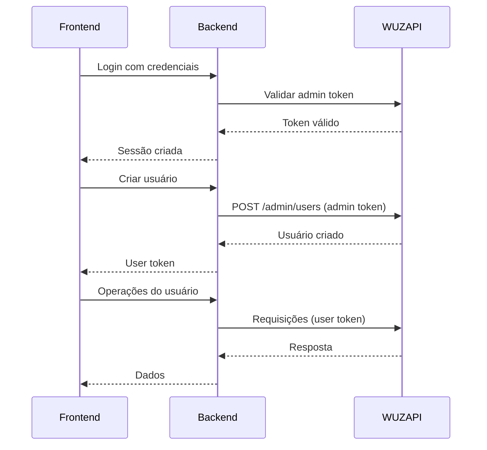

# Documentação WUZAPI

Documentação completa para integração com a API WUZAPI no projeto WUZAPI Manager.

## 📚 Índice da Documentação

### Documentos Principais

- **[Guia de Integração](./integration-guide.md)** - Guia completo de todos os métodos e funcionalidades
- **[Comparação com Evolution API](./evolution-api-comparison.md)** - Diferenças e migração entre APIs
- **[Troubleshooting](./troubleshooting.md)** - Resolução de problemas comuns

## 🚀 Início Rápido

### 1. Configuração Básica

```bash
# Variáveis de ambiente
WUZAPI_BASE_URL=https://wzapi.wasend.com.br
WUZAPI_TIMEOUT=10000
VITE_ADMIN_TOKEN=UeH7cZ2c1K3zVUBFi7SginSC
```

### 2. Verificar Conectividade

```bash
# Teste básico
curl https://wzapi.wasend.com.br/health

# Teste com token admin
curl -H "Authorization: UeH7cZ2c1K3zVUBFi7SginSC" \
     https://wzapi.wasend.com.br/admin/users
```

### 3. Exemplo de Uso

#### Backend (Node.js)
```javascript
const wuzapiClient = require('../utils/wuzapiClient');

// Listar usuários
const users = await wuzapiClient.getAdmin('/admin/users', adminToken);

// Criar usuário
const newUser = await wuzapiClient.createUser({
  name: 'João Silva',
  token: 'abc123',
  webhook: 'https://meusite.com/webhook'
}, adminToken);
```

#### Frontend (TypeScript)
```typescript
import { WuzAPIService } from '@/services/wuzapi';

const wuzapi = new WuzAPIService();

// Verificar status da sessão
const status = await wuzapi.getSessionStatus(userToken);

// Enviar mensagem
const result = await wuzapi.sendTextMessage(userToken, '5511999999999', 'Olá!');
```

## 🏗️ Arquitetura

### Visão Geral
```
┌─────────────────┐    ┌─────────────────┐    ┌─────────────────┐
│   Frontend      │    │   Backend       │    │   WUZAPI        │
│   (React/TS)    │◄──►│   (Node.js)     │◄──►│   (External)    │
│                 │    │                 │    │                 │
│ WuzAPIService   │    │ WuzAPIClient    │    │ WhatsApp API    │
│ Components      │    │ Routes/Handlers │    │ Multi-user      │
└─────────────────┘    └─────────────────┘    └─────────────────┘
```

### Componentes

#### Backend
- **`server/utils/wuzapiClient.js`** - Cliente base para comunicação
- **`server/routes/adminRoutes.js`** - Rotas administrativas
- **`server/routes/sessionRoutes.js`** - Rotas de sessão
- **`server/validators/`** - Validadores de token

#### Frontend
- **`src/services/wuzapi.ts`** - Serviço principal
- **`src/lib/wuzapi-client.ts`** - Cliente avançado
- **`src/lib/wuzapi-types.ts`** - Definições de tipos
- **`src/lib/wuzapi-utils.ts`** - Utilitários

## 🔐 Autenticação

### Tipos de Token

| Tipo | Header | Uso | Escopo |
|------|--------|-----|--------|
| **Admin** | `Authorization: {token}` | Gerenciar usuários | Sistema completo |
| **User** | `token: {token}` | Operações do usuário | Recursos específicos |

### Fluxo de Autenticação



## 📋 Funcionalidades Principais

### Gerenciamento de Usuários
- ✅ Criar/editar/remover usuários
- ✅ Listar usuários com filtros
- ✅ Estatísticas por usuário
- ✅ Gerenciamento de tokens

### Sessões WhatsApp
- ✅ Conectar/desconectar sessões
- ✅ Obter QR Code para login
- ✅ Monitorar status de conexão
- ✅ Logout de sessões ativas

### Mensagens
- ✅ Enviar texto, mídia, localização
- ✅ Histórico de mensagens
- ✅ Status de entrega
- ✅ Reações e respostas

### Webhooks
- ✅ Configurar URLs de webhook
- ✅ Eventos personalizáveis
- ✅ Retry automático
- ✅ Logs de webhook

### Grupos e Contatos
- ✅ Gerenciar grupos
- ✅ Adicionar/remover participantes
- ✅ Lista de contatos
- ✅ Bloquear/desbloquear

## 🔧 Configuração Avançada

### Variáveis de Ambiente

```bash
# Servidor
PORT=3001
NODE_ENV=development

# WUZAPI
WUZAPI_BASE_URL=https://wzapi.wasend.com.br
WUZAPI_TIMEOUT=10000
REQUEST_TIMEOUT=15000

# Autenticação
VITE_ADMIN_TOKEN=UeH7cZ2c1K3zVUBFi7SginSC

# Logs
LOG_LEVEL=info
DEBUG=wuzapi:*

# CORS
CORS_ORIGIN=http://localhost:3000
CORS_CREDENTIALS=true
```

### Configuração de Proxy

```javascript
// vite.config.ts
export default defineConfig({
  server: {
    proxy: {
      '/api': {
        target: 'http://localhost:3001',
        changeOrigin: true,
        secure: false
      }
    }
  }
});
```

### Configuração de Timeout

```javascript
// Backend
const wuzapiClient = require('../utils/wuzapiClient');
wuzapiClient.timeout = 30000; // 30 segundos

// Frontend
const controller = new AbortController();
setTimeout(() => controller.abort(), 15000);

fetch('/api/endpoint', {
  signal: controller.signal
});
```

## 📊 Monitoramento

### Health Checks

```bash
# Verificação geral
curl http://localhost:3001/health

# Serviços específicos
curl http://localhost:3001/api/admin/health
curl http://localhost:3001/api/session/health

# WUZAPI externa
curl https://wzapi.wasend.com.br/health
```

### Métricas de Performance

```javascript
// Monitor básico
class WuzAPIMonitor {
  constructor() {
    this.metrics = {
      requests: 0,
      errors: 0,
      avgResponseTime: 0
    };
  }
  
  record(duration, success) {
    this.metrics.requests++;
    if (!success) this.metrics.errors++;
    
    // Calcular média móvel
    this.metrics.avgResponseTime = 
      (this.metrics.avgResponseTime + duration) / 2;
  }
  
  getStats() {
    return {
      ...this.metrics,
      errorRate: (this.metrics.errors / this.metrics.requests) * 100
    };
  }
}
```

### Alertas

Configure alertas para:
- Taxa de erro > 5%
- Tempo de resposta > 10s
- WUZAPI indisponível
- Tokens expirados
- Webhooks falhando

## 🧪 Testes

### Testes Unitários

```bash
# Backend
npm test server/tests/wuzapi-client.test.js

# Frontend
npm test src/test/wuzapi.test.tsx
```

### Testes de Integração

```bash
# E2E com WUZAPI real
npm run test:e2e:wuzapi

# Testes de webhook
npm run test:webhook
```

### Testes Manuais

```bash
# Script de teste completo
./scripts/test-wuzapi.sh

# Postman collection
postman run docs/wuzapi/postman-collection.json
```

## 🚨 Troubleshooting Rápido

### Problemas Comuns

| Problema | Solução Rápida |
|----------|----------------|
| "Token inválido" | Verificar `VITE_ADMIN_TOKEN` |
| "Timeout" | Aumentar `WUZAPI_TIMEOUT` |
| "Conexão recusada" | Verificar `WUZAPI_BASE_URL` |
| "QR Code não carrega" | Reconectar sessão |
| "Webhook não funciona" | Verificar URL pública |

### Debug Rápido

```bash
# Verificar configuração
echo $WUZAPI_BASE_URL
echo $VITE_ADMIN_TOKEN

# Testar conectividade
curl -I $WUZAPI_BASE_URL/health

# Logs em tempo real
tail -f server/logs/wuzapi.log
```

## 📈 Performance

### Otimizações

#### Cache
```javascript
// Cache de usuários por 5 minutos
const userCache = new Map();
const CACHE_TTL = 5 * 60 * 1000;

async function getCachedUsers() {
  const cached = userCache.get('users');
  
  if (cached && Date.now() - cached.timestamp < CACHE_TTL) {
    return cached.data;
  }
  
  const users = await wuzapi.getUsers();
  userCache.set('users', {
    data: users,
    timestamp: Date.now()
  });
  
  return users;
}
```

#### Batch Operations
```javascript
// Enviar múltiplas mensagens
async function sendBulkMessages(messages) {
  const results = [];
  
  for (const msg of messages) {
    try {
      const result = await wuzapi.sendTextMessage(
        msg.userToken, 
        msg.phone, 
        msg.message
      );
      results.push({ ...msg, success: true, result });
      
      // Delay para evitar rate limiting
      await new Promise(resolve => setTimeout(resolve, 1000));
      
    } catch (error) {
      results.push({ ...msg, success: false, error: error.message });
    }
  }
  
  return results;
}
```

#### Connection Pooling
```javascript
// Reutilizar conexões HTTP
const axios = require('axios');

const httpAgent = new axios.defaults.httpAgent({
  keepAlive: true,
  maxSockets: 10,
  maxFreeSockets: 5
});

const wuzapiClient = axios.create({
  baseURL: process.env.WUZAPI_BASE_URL,
  timeout: 10000,
  httpAgent
});
```

## 🔒 Segurança

### Boas Práticas

1. **Tokens**
   - Rotacionar tokens regularmente
   - Não expor tokens no frontend
   - Usar HTTPS sempre

2. **Webhooks**
   - Validar origem dos webhooks
   - Usar HTTPS para URLs de webhook
   - Implementar rate limiting

3. **Dados**
   - Não logar tokens completos
   - Sanitizar dados de entrada
   - Validar números de telefone

### Implementação

```javascript
// Validação de webhook
function validateWebhook(req, res, next) {
  const signature = req.headers['x-wuzapi-signature'];
  const payload = JSON.stringify(req.body);
  
  const expectedSignature = crypto
    .createHmac('sha256', process.env.WEBHOOK_SECRET)
    .update(payload)
    .digest('hex');
  
  if (signature !== expectedSignature) {
    return res.status(401).json({ error: 'Invalid signature' });
  }
  
  next();
}

// Rate limiting
const rateLimit = require('express-rate-limit');

const webhookLimiter = rateLimit({
  windowMs: 1 * 60 * 1000, // 1 minuto
  max: 100, // máximo 100 requests por minuto
  message: 'Too many webhook requests'
});

app.use('/webhook', webhookLimiter, validateWebhook);
```

## 📚 Recursos Adicionais

### Documentação Externa
- [WUZAPI Official Docs](https://wzapi.wasend.com.br/docs)
- [WhatsApp Business API](https://developers.facebook.com/docs/whatsapp)
- [Webhook Best Practices](https://webhooks.fyi/)

### Ferramentas Úteis
- [Postman](https://www.postman.com/) - Testes de API
- [ngrok](https://ngrok.com/) - Túneis para webhooks locais
- [Webhook.site](https://webhook.site/) - Teste de webhooks

### Comunidade
- GitHub Issues para bugs
- Discussions para dúvidas
- Wiki para documentação adicional

## 🔄 Atualizações

### Changelog

#### v1.0.0 (2024-01-15)
- ✨ Implementação inicial da integração WUZAPI
- 🔐 Sistema de autenticação dupla
- 📱 Suporte completo a mensagens e mídia
- 🔗 Sistema de webhooks
- 📊 Monitoramento e métricas
- 📚 Documentação completa

### Roadmap

#### v1.1.0 (Planejado)
- 🚀 Performance improvements
- 🔄 Auto-retry para falhas
- 📈 Métricas avançadas
- 🛡️ Melhorias de segurança

#### v1.2.0 (Futuro)
- 🤖 Chatbot integration
- 📊 Analytics dashboard
- 🔌 Plugin system
- 🌐 Multi-language support

---

**Última atualização**: 15 de Janeiro de 2024  
**Versão WUZAPI**: 2.0.0  
**Versão da Documentação**: 1.0.0

**Mantenedores**: Equipe WUZAPI Manager  
**Licença**: MIT